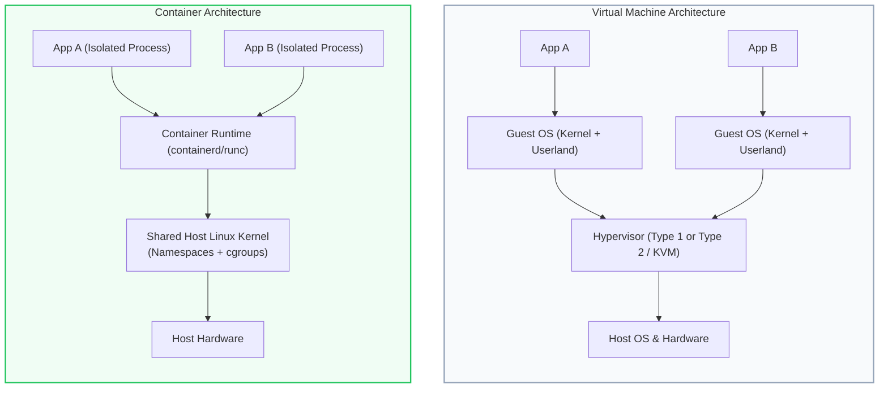
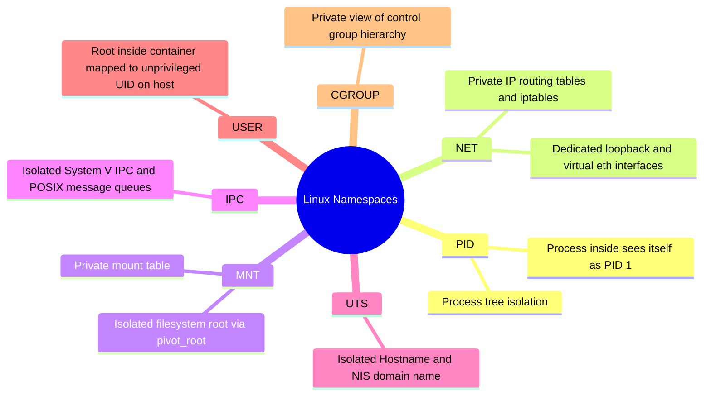
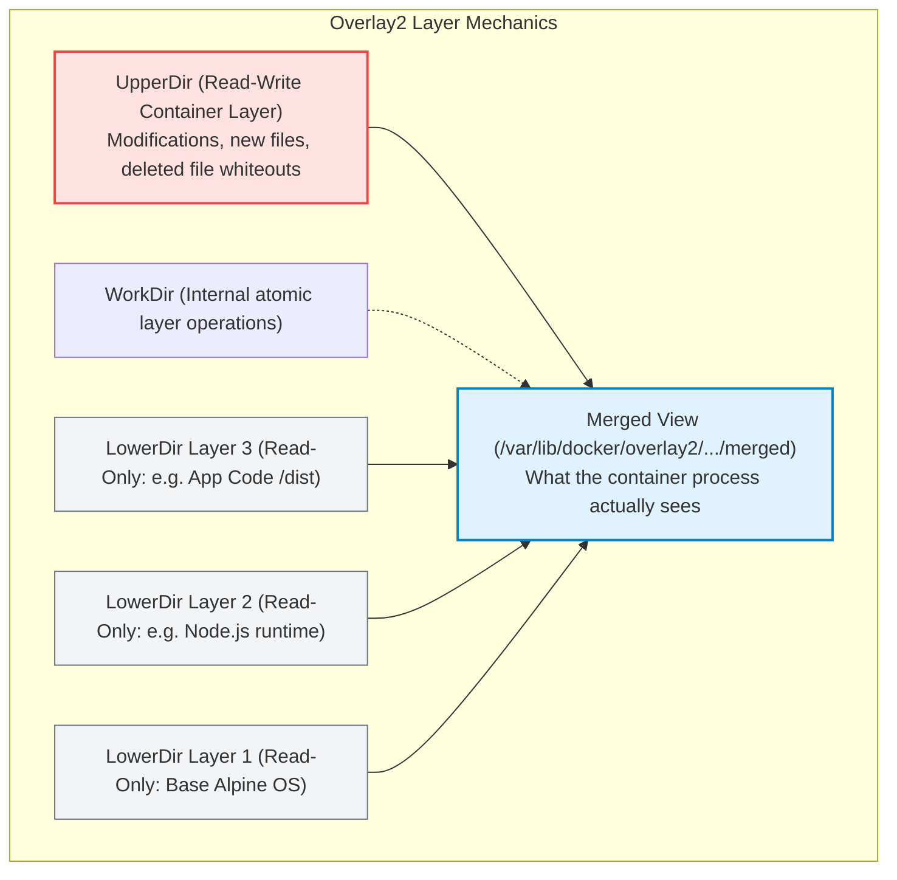

# Docker: Core Concepts, Internals & Architecture

> **Cluster 01 — Module 01**  
> Focus: How containers work at the Linux OS kernel level, Container Runtimes (OCI, runc, containerd), Union Filesystems (Overlay2), and Resource Isolation.

---

## 1. What is a Container? (Containers vs Virtual Machines)

A **container** is not a lightweight virtual machine. A container is simply a **regular Linux process** with restricted visibility into the rest of the operating system (via **Namespaces**) and hard limits on resource consumption (via **Control Groups / cgroups**).

### Key Differences Table

| Feature | Virtual Machine (VM) | Container (Docker) |
| :--- | :--- | :--- |
| **Kernel** | Separate guest kernel per VM | Shares host Linux kernel |
| **Startup Time** | Minutes (boots full OS kernel) | Milliseconds to seconds (spawns a process) |
| **Resource Overhead** | High (RAM allocated for entire OS) | Negligible (native process execution) |
| **Isolation Level** | Hardware-level isolation (VT-x, AMD-V) | Process-level isolation (Kernel primitives) |
| **Portability** | Heavy VM images (tens of Gigabytes) | Layered OCI images (Megabytes) |
| **Security Surface** | Stronger default boundary | Weaker default boundary (kernel exploit impacts host) |

---

## 2. Linux Kernel Primitives: The Secret Sauce

Containers are made possible by two primary Linux kernel primitives:

### A. Linux Namespaces (Isolation: What a process can *see*)

Namespaces partition system resources so that a process inside a namespace believes it has its own dedicated copy of the resource.

1. **PID Namespace**: A container process sees itself as `PID 1` (the init process), even though on the host it might be `PID 14205`. Killing `PID 1` inside the container terminates the container.
2. **NET Namespace**: Gives the container its own virtual network stack: loopback device, private IP address, port binding space, and routing table.
3. **MNT (Mount) Namespace**: Provides an isolated file system view. The process can mount and unmount filesystems without affecting the host.
4. **IPC (Inter-Process Communication) Namespace**: Prevents processes in different containers from communicating via shared memory (`shmget()`) or semaphores.
5. **UTS (Unix Timesharing System) Namespace**: Allows the container to have its own hostname (e.g., `web-container-01`) separate from the host node.
6. **USER Namespace**: Allows a process to have UID `0` (root) inside the container while mapping to UID `10001` (an unprivileged user) on the host system. This is a critical security layer.

---

### B. Linux Control Groups (cgroups v1 & v2) (Throttling: What a process can *use*)

While namespaces isolate what a process can *see*, **cgroups** restrict and meter what a process can *consume*.

- **CPU limits**: Configured via CFS (Completely Fair Scheduler) quota and period. E.g., `cpu.cfs_quota_us = 200000` with `cpu.cfs_period_us = 100000` allows the container up to 2 full CPU cores.
- **Memory limits**: Enforces hard and soft memory boundaries. If a container exceeds its hard memory limit (`memory.max` in cgroups v2), the Linux kernel's **OOM (Out-Of-Memory) Killer** terminates the highest consuming process (Exit Code `137`).
- **Block I/O (blkio)**: Limits read/write IOPS or throughput to disk.
- **PIDs limit**: Restricts maximum number of child processes to protect against fork-bombs (`--pids-limit 100`).

---

## 3. Storage Internals: UnionFS & Overlay2

Docker uses a **Union File System (UnionFS)** to stack multiple read-only image layers on top of each other and present them as a single unified directory structure. The default and industry-standard driver is **Overlay2**.

### The Copy-on-Write (CoW) Strategy
1. **Reading a file**: The driver checks the UpperDir (container layer). If not present, it scans LowerDirs from top to bottom. Once found, it reads directly from the read-only layer (zero duplication).
2. **Modifying an existing file**: The driver copies the file from the lower read-only layer up into the read-write `UpperDir`, where the edit occurs. The underlying image layer remains pristine.
3. **Deleting a file**: A special **whiteout** file (or character device) is created in the `UpperDir`, masking the lower layer file so it appears deleted to the container.

---

## 4. Docker Architecture: Engine, Containerd & Runc

Modern Docker is not a monolithic binary. It is split into modular components adhering to OCI (Open Container Initiative) standards:

```mermaid
flowchart LR
    CLI["Docker CLI\n(docker run ...)"] -->|REST API over unix:///var/run/docker.sock| Daemon["Docker Daemon\n(dockerd)"]
    Daemon -->|gRPC| Containerd["containerd\n(Core Container Lifecycle Manager)"]
    Containerd --> Shim["containerd-shim"]
    Shim --> Runc["runc\n(OCI Reference Runtime)"]
    Runc -->|Linux syscalls: clone, pivot_root| ContainerProcess["Running Container Process"]

    style Daemon fill:#eff6ff,stroke:#3b82f6,stroke-width:2px
    style Containerd fill:#f5f3ff,stroke:#8b5cf6,stroke-width:2px
    style Runc fill:#ecfdf5,stroke:#10b981,stroke-width:2px
```

- **`dockerd`**: High-level daemon handling image building, volume management, authentication, and Docker CLI API requests.
- **`containerd`**: Supervises container lifecycles, manages image distribution, and coordinates container networking.
- **`containerd-shim`**: Stays alive alongside the container process so that `containerd` or `dockerd` can be restarted or upgraded without terminating running containers. It also handles stdout/stderr file descriptors.
- **`runc`**: A lightweight CLI tool implementing the OCI specification. It executes `clone()` system calls with namespace flags (`CLONE_NEWPID`, `CLONE_NEWNET`, etc.), configures cgroups, mounts root filesystems (`pivot_root`), and exits once the process is running.

---

## 5. Official References & Deep Reads

- [Linux Namespaces Manual (`man 7 namespaces`)](https://man7.org/linux/man-pages/man7/namespaces.7.html)
- [Linux Control Groups v2 Documentation](https://www.kernel.org/doc/html/latest/admin-guide/cgroup-v2.html)
- [Docker Storage Drivers: Overlay2 Internals](https://docs.docker.com/storage/storagedriver/overlayfs-driver/)
- [OCI Runtime Specification (Open Container Initiative)](https://github.com/opencontainers/runtime-spec)
