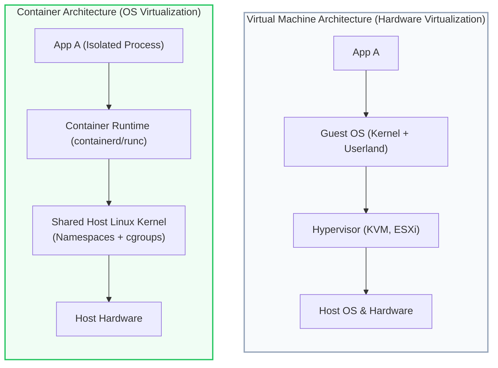
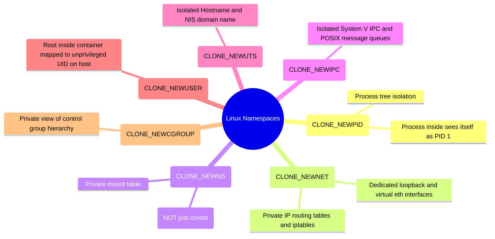
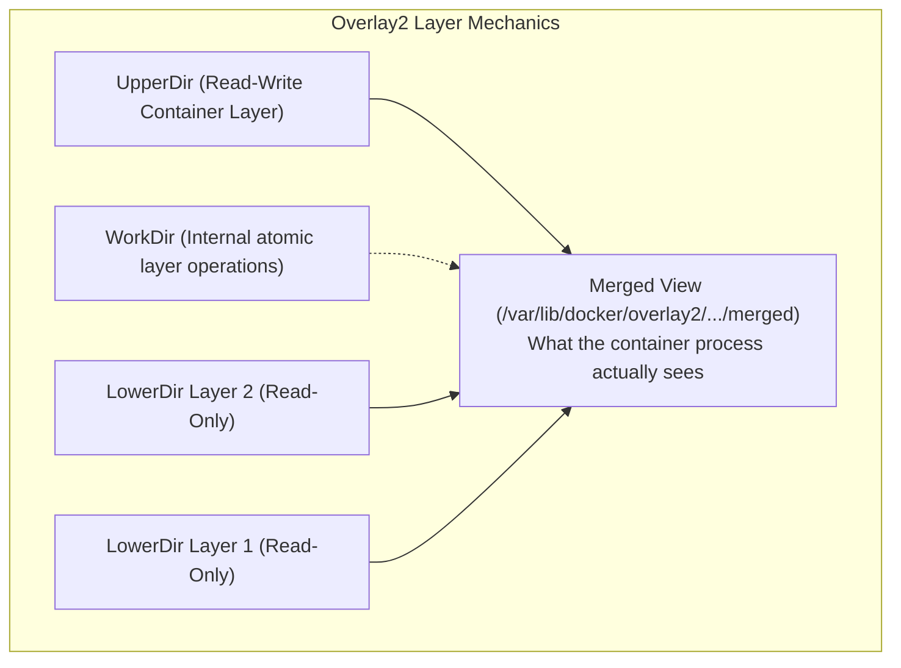
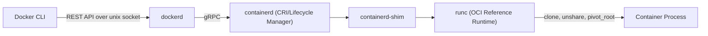

# Docker: Core Concepts, Internals & Architecture (Pro-Level)

> **Cluster 01 — Module 01**  
> Focus: Deep dive into Linux kernel primitives, Container Runtimes (OCI, runc, containerd, CRI), Union Filesystems (Overlay2 internals), Resource Isolation, and low-level execution mechanics.

---

## 1. What is a Container? (The Kernel Perspective)

A **container** is merely a conceptual boundary. It is not a VM; it is a **standard Linux process** restricted by specific kernel primitives. When we execute a container, we are essentially making `clone()` system calls with namespace flags and setting up cgroup directories.

### VM vs Container: Deep Technical Differences
- **Memory Footprint**: VMs allocate full memory blocks to the guest OS (which manages its own page cache). Containers share the host's page cache.
- **Syscall Translation**: VMs require the hypervisor to translate hardware instructions (using Intel VT-x/AMD-V). Containers make native system calls directly to the host kernel (with minor overhead from `seccomp` or `AppArmor`).

---

## 2. Linux Kernel Primitives: The Real Engine

### A. Linux Namespaces (Isolation)

Created via the `clone()`, `unshare()`, and `setns()` system calls, namespaces isolate global system resources.

**Deep Insight: `pivot_root` vs `chroot`**
Early containers used `chroot` to change the root directory. However, `chroot` is insecure and easily escapable. Modern runtimes use `pivot_root` to completely swap out the mount namespace's root filesystem, ensuring the container cannot break out to the host filesystem.

### B. Linux Control Groups (cgroups v1 vs v2)

Control groups regulate and meter resource consumption.

- **cgroups v1**: Hierarchies were split by controller (one tree for memory, one for cpu). This caused inconsistencies and complex routing rules.
- **cgroups v2 (Unified Hierarchy)**: A single unified tree structure (`/sys/fs/cgroup/`). A process belongs to exactly one cgroup, and all controllers (cpu, memory, io, pids) apply to that cgroup.

**OOM Mechanics**: If a container surpasses `memory.max` (v2), the kernel's OOM Killer triggers. It computes an `oom_score` based on memory usage and `oom_score_adj`, then sends `SIGKILL` (Exit Code 137).

---

## 3. Storage Internals: Overlay2 at the Inode Level

Docker's default storage driver is **OverlayFS (overlay2)**. It implements a Union File System.

**The Copy-on-Write (CoW) Operation (`copy_up`)**:
When a container modifies a file in a lower layer, OverlayFS performs a `copy_up` operation: it copies the file from the read-only lower directory to the read-write upper directory. 
- *Caveat*: If you modify a 5GB file, the entire 5GB file is copied to the upper layer first. This is why databases should always use Volumes, not the container filesystem.
- **Whiteouts**: Deleting a file in a lower layer creates a character device in the upper layer with 0/0 device numbers, instructing OverlayFS to hide the file from the merged view.

---

## 4. Architecture: Containerd, runc, and the OCI

Docker is a decoupled ecosystem based on the Open Container Initiative (OCI).

- **`containerd-shim`**: This is crucial. `runc` exits immediately after the container starts. The `containerd-shim` stays alive as the parent of the container process. This allows `containerd` or `dockerd` to crash or be upgraded without killing the running containers (Live Restore).
