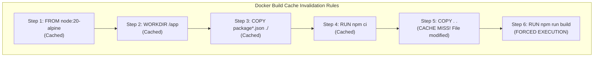
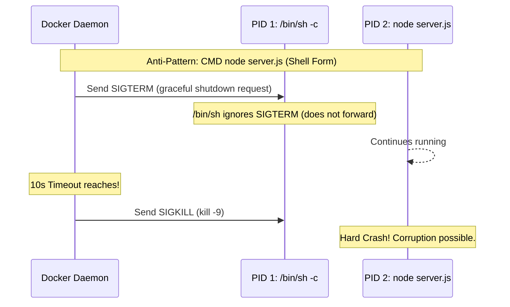
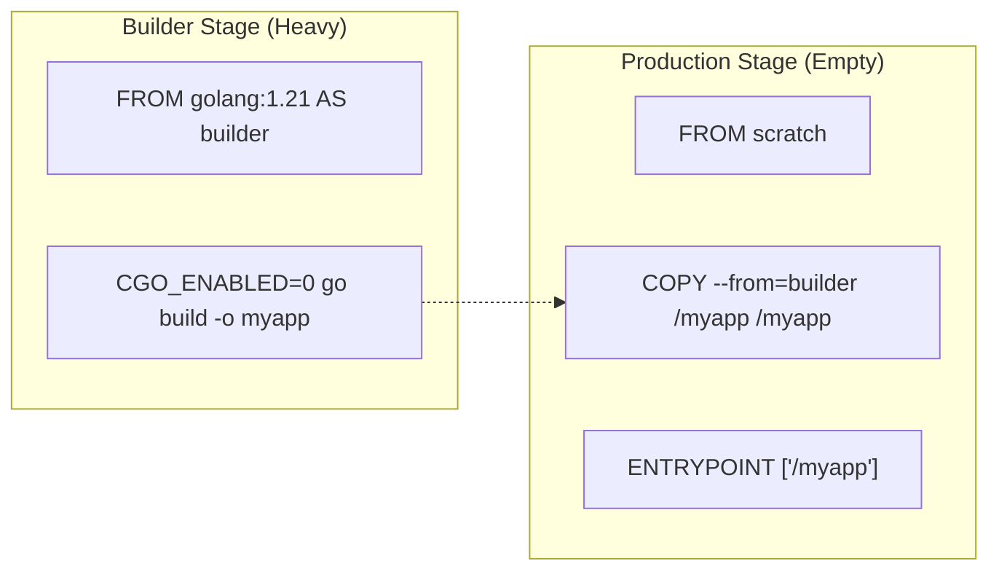

# Dockerfile Mastery: Deep Dive, BuildKit & Security (Pro-Level)

> **Cluster 01 — Module 02**  
> Focus: Advanced BuildKit features, layer caching mechanics, multi-stage builds, PID 1 signaling, seccomp/AppArmor, and reproducible builds.

---

## 1. Advanced Layer Caching & Instruction Mechanics

Each command that mutates the filesystem (`RUN`, `COPY`, `ADD`) generates a new layer, represented by a cryptographic SHA256 digest of the layer's tarball.

### The BuildKit Engine
Modern Docker uses **BuildKit** as the backend engine. BuildKit builds concurrent dependency graphs, skipping unused stages and parallelizing independent instructions.



### BuildKit Cache Mounts (Advanced)
Instead of relying purely on layer caching for package managers (like `npm` or `pip`), use BuildKit cache mounts. This keeps a persistent cache folder across builds, speeding up cache-miss scenarios.
```dockerfile
# syntax=docker/dockerfile:1.4
RUN --mount=type=cache,target=/root/.npm npm ci
```

---

## 2. Process Management: The PID 1 Trap

The container's main process runs as PID 1. In Linux, PID 1 has special responsibilities: reaping zombies and forwarding signals.



**Solution:** Always use the `Exec` form (`CMD ["node", "server.js"]`) so the app becomes PID 1. Better yet, use a dedicated init system like `tini`:
```dockerfile
RUN apk add --no-cache tini
ENTRYPOINT ["/sbin/tini", "--"]
CMD ["node", "server.js"]
```

---

## 3. Multi-Stage Builds & Distroless / Scratch

To minimize attack surface, use multi-stage builds. To take it to the extreme, use Google's `distroless` images or the special `scratch` image.


The `scratch` image has literally nothing in it (no `ls`, no `sh`, no `libc`). Only statically compiled binaries (like Go or Rust) can run here. This makes container escape and remote code execution virtually impossible.

---

## 4. Pro-Grade Dockerfile Example

```dockerfile
# syntax=docker/dockerfile:1.4
# Stage 1: Build
FROM python:3.11-slim AS builder
WORKDIR /app
# Use BuildKit cache mounts and bind mounts to avoid copying unnecessary files
RUN --mount=type=cache,target=/root/.cache/pip \
    --mount=type=bind,source=requirements.txt,target=requirements.txt \
    pip wheel --no-deps --wheel-dir /app/wheels -r requirements.txt

# Stage 2: Runtime
FROM python:3.11-slim AS runtime
WORKDIR /app
# Run as non-root
RUN useradd --create-home appuser
USER appuser
# Install wheels built in previous stage
COPY --from=builder /app/wheels /wheels
RUN pip install --no-cache /wheels/*
COPY --chown=appuser:appuser src/ .

# Security profiles and healthchecks
HEALTHCHECK --interval=30s --timeout=5s CMD curl -f http://localhost:8000/health || exit 1
ENTRYPOINT ["python", "-m", "uvicorn", "main:app"]
```

---

## 5. Kernel Security Hardening

| Feature | Concept | Implementation |
| :--- | :--- | :--- |
| **Capabilities** | Granular Linux root privileges. | `docker run --cap-drop=ALL --cap-add=NET_BIND_SERVICE` |
| **Seccomp** | Restricts which Linux system calls the container can make. | `docker run --security-opt seccomp=custom.json` |
| **AppArmor/SELinux** | Mandatory Access Control (MAC) profiles to restrict file and network access. | `docker run --security-opt apparmor=docker-default` |
| **Read-Only FS** | Prevents modifying the root filesystem. | `docker run --read-only --tmpfs /tmp` |
