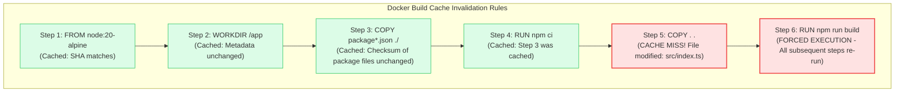
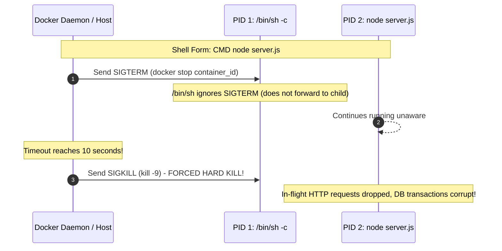
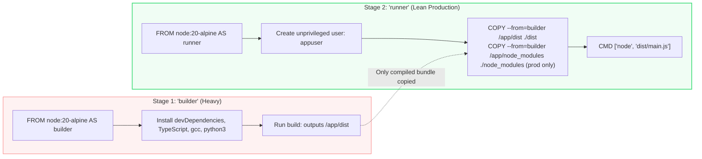

# Dockerfile Mastery: Deep Dive, Optimization & Best Practices

> **Cluster 01 — Module 02**  
> Focus: Build mechanics, layer caching, Multi-Stage builds, security hardening, signal forwarding, and production anti-patterns.

---

## 1. Instruction Anatomy & Layer Caching Mechanics

Each instruction in a Dockerfile that creates or modifies files (`RUN`, `COPY`, `ADD`) creates an **immutable read-only layer**. Instructions like `ENV`, `EXPOSE`, and `WORKDIR` modify metadata without adding layer storage overhead.



### Golden Rule of Layer Caching
> **Order instructions from least frequently changed to most frequently changed.**
> 
> Never write `COPY . .` before installing dependencies! Doing so causes every single line-of-code change to invalidate the cache for `npm install` or `pip install`, causing massive build slowdowns.

---

## 2. CMD vs ENTRYPOINT & Signal Forwarding (PID 1 Pitfall)

Understanding `CMD` and `ENTRYPOINT` is one of the most common interview traps.

### Exec Form vs Shell Form

| Form | Syntax | Execution Details |
| :--- | :--- | :--- |
| **Exec Form (Preferred)** | `CMD ["node", "server.js"]` | Spawns `node` directly as **PID 1**. Receives Unix signals (`SIGTERM`, `SIGINT`). |
| **Shell Form (Anti-Pattern)** | `CMD node server.js` | Runs `/bin/sh -c "node server.js"`. The shell is **PID 1**; does **not** forward signals to `node`. |



> [!CAUTION]
> If you use the shell form, your application will never gracefully shut down when Kubernetes or Docker terminates the pod/container. It will hang for 10-30 seconds until the kernel delivers a ruthless `SIGKILL`. **Always use Exec form.**

---

## 3. Multi-Stage Builds: From 1.2 GB to 48 MB

Multi-stage builds allow you to use intermediate container images containing compilers, package managers, and header files, then copy *only* the compiled binary/artifacts into a lean, pristine production image.



---

## 4. Production-Grade Dockerfile Example

Below is an enterprise-grade multi-stage Dockerfile adhering to all security and performance standards:

```dockerfile
# ==========================================
# Stage 1: Build & Dependency Resolution
# ==========================================
FROM node:20-alpine AS builder

WORKDIR /usr/src/app

# Install package descriptors first for layer caching
COPY package*.json ./

# npm ci provides deterministic, reproducible builds from package-lock.json
RUN npm ci

# Copy application source code
COPY . .

# Compile TypeScript / bundle assets
RUN npm run build

# Prune devDependencies to keep node_modules minimal
RUN npm prune --production

# ==========================================
# Stage 2: Final Minimal Runtime Environment
# ==========================================
# Using distroless or minimal alpine
FROM node:20-alpine AS runner

WORKDIR /usr/src/app

# Define production environment
ENV NODE_ENV=production \
    PORT=3000

# Security: Create non-root system group and user
RUN addgroup -S appgroup && adduser -S appuser -G appgroup

# Copy only production dependencies and compiled artifacts from builder stage
COPY --from=builder --chown=appuser:appgroup /usr/src/app/node_modules ./node_modules
COPY --from=builder --chown=appuser:appgroup /usr/src/app/dist ./dist
COPY --from=builder --chown=appuser:appgroup /usr/src/app/package.json ./package.json

# Drop root privileges! Container runs as unprivileged UID
USER appuser

# Document exposed port
EXPOSE 3000

# Built-in health check for orchestration healthiness monitoring
HEALTHCHECK --interval=30s --timeout=3s --start-period=5s --retries=3 \
  CMD wget --no-verbose --tries=1 --spider http://localhost:3000/health || exit 1

# Exec form ensures proper PID 1 signal forwarding
ENTRYPOINT ["node", "dist/index.js"]
```

---

## 5. Security Hardening Checklist

| Rule | Rationale | Implementation |
| :--- | :--- | :--- |
| **Never run as root** | Prevents container breakout attacks from compromising the host root namespace. | `USER 10001` or `USER appuser` |
| **Use `.dockerignore`** | Prevents leaking credentials (`.env`, `id_rsa`), git history (`.git`), and local builds. | Add `.git`, `.env*`, `node_modules`, `tests` to `.dockerignore` |
| **Pin exact base image digests** | Protects against supply chain tampering or upstream breaking updates. | `FROM node:20.11.0-alpine@sha256:...` |
| **Read-Only Root Filesystem** | Prevents malware or attackers from dropping binaries inside the container. | Run with `docker run --read-only --tmpfs /tmp` |
| **Drop Linux Capabilities** | Linux processes have 40+ kernel capabilities (`CAP_NET_RAW`, `CAP_SYS_ADMIN`). Drop them. | `docker run --cap-drop ALL --cap-add NET_BIND_SERVICE` |

---

## 6. Official References
- [Docker Best Practices Guide](https://docs.docker.com/develop/develop-images/dockerfile_best-practices/)
- [Google Distroless Images Repository](https://github.com/GoogleContainerTools/distroless)
- [OWASP Docker Security Cheat Sheet](https://cheatsheetseries.owasp.org/cheatsheets/Docker_Security_Cheat_Sheet.html)
