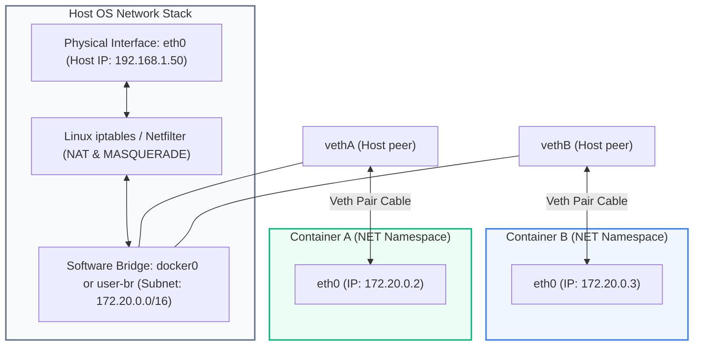
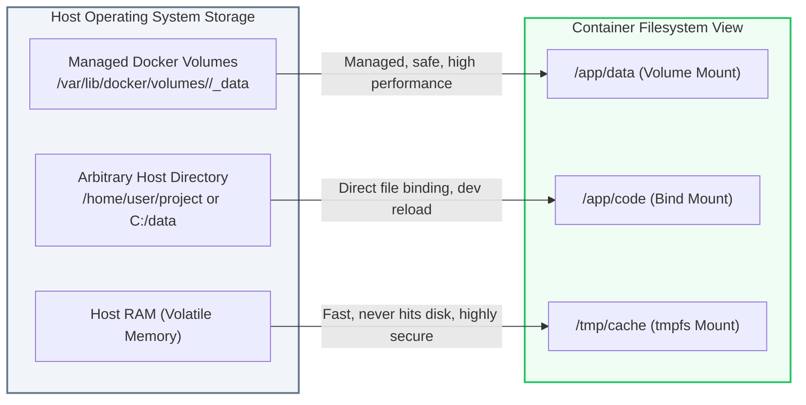

# Docker: Networking, Storage Volumes & Docker Compose

> **Cluster 01 — Module 03**  
> Focus: Linux veth pairs, iptables NAT, user-defined bridge networks, volume persistence types, and Docker Compose orchestration.

---

## 1. Docker Networking Internals

Docker creates isolated network stacks using the Linux **NET namespace**. To connect containers together and to the outside world, Docker uses virtual ethernet interfaces (`veth`) attached to a software bridge.



### The 5 Core Network Drivers

| Driver | Description | Common Use Case |
| :--- | :--- | :--- |
| **`bridge`** | Default driver. Creates a virtual switch on the host. Containers get private IPs and communicate over this switch. | Standalone multi-container apps on a single host. |
| **`host`** | Bypasses container network isolation. Container shares the host's network namespace directly (no port mapping needed). | Extreme low-latency, high-throughput network workloads (e.g. streaming, game servers). |
| **`none`** | Disables all network interfaces except the loopback (`127.0.0.1`). | Batch processing, offline air-gapped security computations. |
| **`overlay`** | Creates a multi-host distributed virtual network using VXLAN encapsulation. | Docker Swarm or distributed overlay networking across multiple nodes. |
| **`macvlan`** | Assigns a real MAC address to the container, making it appear as a physical hardware device on the LAN. | Legacy enterprise applications requiring direct physical IP addressing. |

### Default Bridge vs User-Defined Bridge (Critical Interview Concept)

| Feature | Default `bridge` (`docker0`) | User-Defined Bridge (`docker network create my-net`) |
| :--- | :--- | :--- |
| **Automatic DNS Resolution** | ❌ **No**. Containers can only communicate via hardcoded IP addresses. | ✅ **Yes**. Docker runs an embedded DNS server at `127.0.0.11` resolving container names. |
| **Isolation** | ❌ All containers connect here by default; no security boundary. | ✅ Strict network boundary. Only containers attached to the same network can communicate. |
| **Live Reconfiguration** | ❌ Requires container recreation to change networks. | ✅ Connect or disconnect containers on the fly (`docker network connect`). |

---

## 2. Storage & Persistence: Volumes vs Bind Mounts vs tmpfs

Container filesystems are ephemeral: when a container is removed, all writes in its read-write layer are permanently erased. Docker offers three mechanisms for persistence:



| Type | Managed By | Speed / Performance | Best For |
| :--- | :--- | :--- | :--- |
| **Named Volume** | Docker Engine (`/var/lib/docker/volumes`) | Native disk performance | Databases, stateful production workloads, backup-friendly. |
| **Bind Mount** | Host filesystem path | Dependent on host storage | Development (live code reload like hot-reloading Vite/React/Node). |
| **`tmpfs` Mount** | Host Memory (RAM) | Memory bus speeds (fastest) | Secrets, tokens, non-persistent cache, high-speed temporary buffers. |

---

## 3. Docker Compose Orchestration

Docker Compose is a tool for defining and running multi-container Docker applications via declarative YAML files.

### Key Compose Concepts
- **`depends_on` with `condition: service_healthy`**: Never rely on simple `depends_on`! A database container starting up does **not** mean it is ready to accept TCP connections. You must configure health checks.
- **Service Discovery**: Compose automatically creates a user-defined bridge network named `<project_name>_default`. Every service is resolvable by its service name as a DNS hostname.

### Production Docker Compose Blueprint

```yaml
version: "3.8"

services:
  # ---------------------------------------------
  # 1. Message Broker (Apache Kafka in KRaft Mode)
  # ---------------------------------------------
  kafka:
    image: bitnami/kafka:3.7.0
    container_name: kafka-broker
    environment:
      - KAFKA_CFG_NODE_ID=0
      - KAFKA_CFG_PROCESS_ROLES=controller,broker
      - KAFKA_CFG_CONTROLLERS=0@kafka:9093
      - KAFKA_CFG_LISTENERS=PLAINTEXT://:9092,CONTROLLER://:9093
      - KAFKA_CFG_ADVERTISED_LISTENERS=PLAINTEXT://kafka:9092
      - KAFKA_CFG_LISTENER_SECURITY_PROTOCOL_MAP=CONTROLLER:PLAINTEXT,PLAINTEXT:PLAINTEXT
      - KAFKA_CFG_CONTROLLER_LISTENER_NAMES=CONTROLLER
      - KAFKA_CFG_INTER_BROKER_LISTENER_NAME=PLAINTEXT
    volumes:
      - kafka_data:/bitnami/kafka
    networks:
      - internal-net
    healthcheck:
      test: ["CMD-SHELL", "/opt/bitnami/kafka/bin/kafka-topics.sh --bootstrap-server 127.0.0.1:9092 --list"]
      interval: 10s
      timeout: 5s
      retries: 5
      start_period: 15s

  # ---------------------------------------------
  # 2. Producer Backend Service
  # ---------------------------------------------
  order-producer:
    build:
      context: ./producer-service
      dockerfile: Dockerfile
    container_name: order-producer-app
    ports:
      - "3000:3000"
    environment:
      - PORT=3000
      - KAFKA_BROKER=kafka:9092
    networks:
      - internal-net
    depends_on:
      kafka:
        condition: service_healthy
    restart: unless-stopped

networks:
  internal-net:
    driver: bridge

volumes:
  kafka_data:
    driver: local
```

---

## 4. Official References
- [Docker Network Architecture](https://docs.docker.com/network/)
- [Docker Storage Volumes Guide](https://docs.docker.com/storage/volumes/)
- [Docker Compose Specification](https://docs.docker.com/compose/compose-file/)
