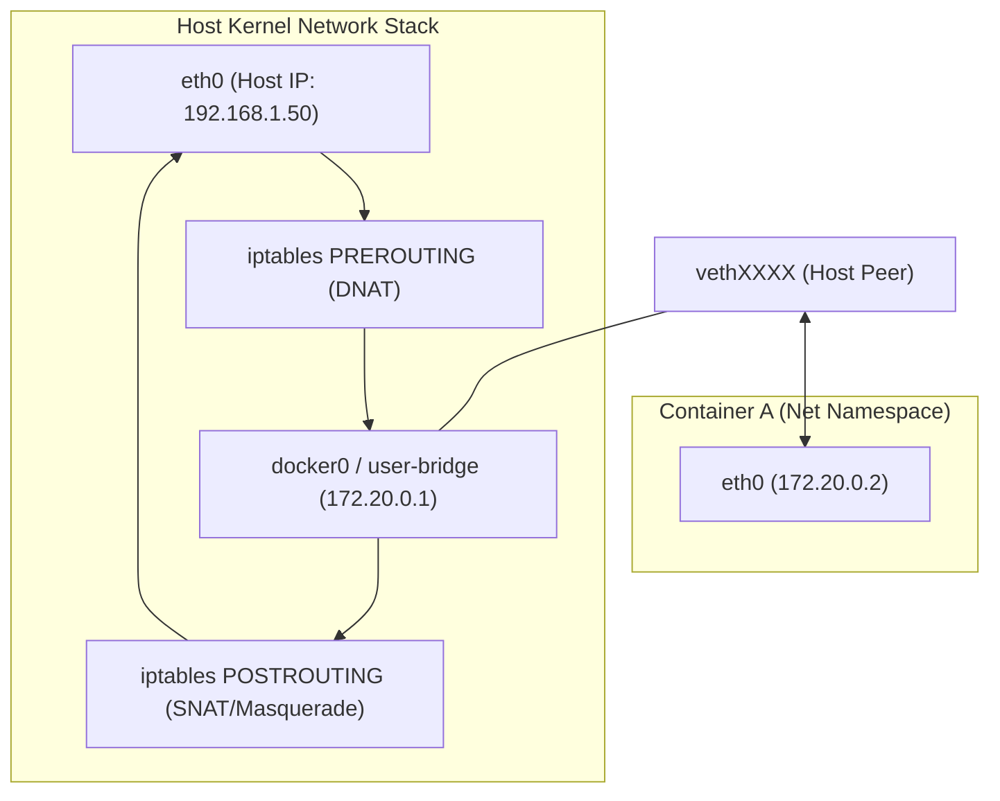
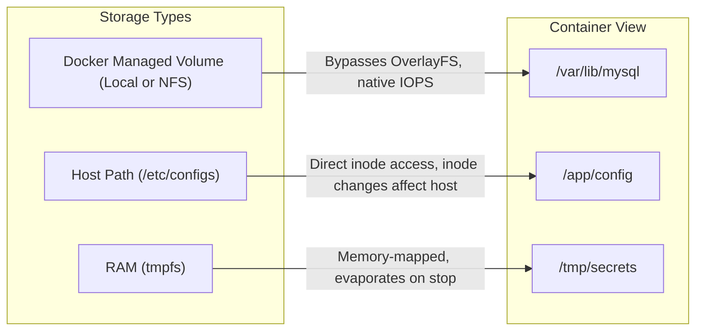

# Docker: Networking, Volumes, & Compose (Pro-Level)

> **Cluster 01 — Module 03**  
> Focus: Netfilter/iptables rules, L2 vs L3 networking (macvlan/ipvlan), Volume drivers, overlay networking, and advanced Compose orchestration.

---

## 1. Deep Dive into Network Isolation (iptables & veth)

Docker networking relies heavily on Linux `veth` pairs and the `iptables` NAT tables.



### Advanced Network Drivers

| Driver | Mechanics & Use Case |
| :--- | :--- |
| **macvlan** | Assigns a real MAC address directly to the container virtual interface. Works at Layer 2. Used when legacy apps require being on the physical subnet without NAT. Containers cannot communicate with the Docker host directly due to kernel security restrictions. |
| **ipvlan** | Similar to macvlan, but shares the host's MAC address (Layer 3). Ideal for environments where switches restrict multiple MACs per port (port security). |
| **overlay** | Cross-host networking using VXLAN encapsulation. Requires a key-value store (like Consul, etcd, or Swarm's built-in Raft). Creates a distributed Layer 2 network over a Layer 3 infrastructure. |
| **host** | No network namespace. Container binds directly to host ports. Zero overhead, highest performance. |

---

## 2. Storage: Persistence & Driver Mechanics

Volumes bypass the UnionFS overlay. They are directly mounted into the container namespace via the kernel's `mount` mechanism.



**Advanced Volume Drivers**: You can use external volume plugins to mount cloud block storage (EBS), distributed file systems (NFS/EFS, GlusterFS), or Ceph block devices directly into containers transparently.

---

## 3. Advanced Docker Compose Orchestration

Compose YAML has evolved beyond simple `depends_on`. 

### Advanced Healthchecks and Readiness
Using `service_healthy` ensures dependent services don't start until the database is fully initialized and accepting connections.

### Compose Watch (Hot Reloading natively)
Modern Compose supports `x-develop` and `watch` to sync code changes into containers without rebuilding images.

```yaml
version: "3.9"

services:
  backend:
    build: .
    develop:
      watch:
        # Sync Python files directly into the container
        - action: sync
          path: ./src
          target: /app/src
        # Rebuild the image entirely if requirements change
        - action: rebuild
          path: ./requirements.txt
    environment:
      - DB_HOST=postgres
    depends_on:
      postgres:
        condition: service_healthy

  postgres:
    image: postgres:15
    volumes:
      - pgdata:/var/lib/postgresql/data
    healthcheck:
      test: ["CMD-SHELL", "pg_isready -U postgres"]
      interval: 5s
      timeout: 5s
      retries: 5

volumes:
  pgdata:
```
