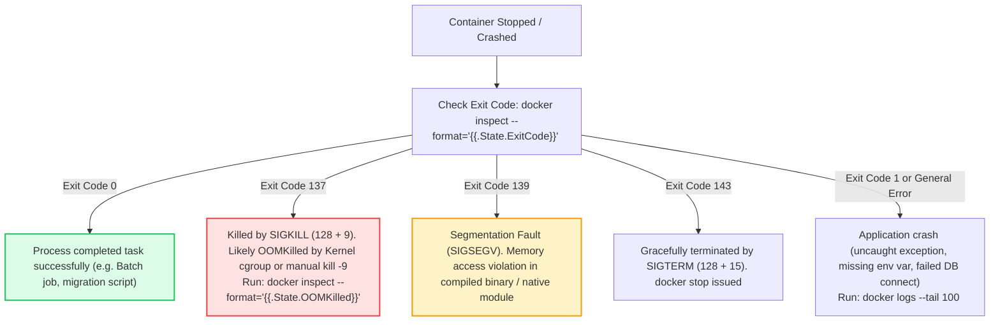

# Docker: Top 20 Interview Questions & Troubleshooting Runbook

> **Cluster 01 — Module 04**  
> Focus: FAANG & enterprise interview questions, exit codes breakdown, PID 1 zombie problem, and systematic failure diagnostics.

---

## 1. Container Triage Flowchart: Why Did My Container Crash?



---

## 2. Top 20 Docker Interview Questions (With Deep Technical Answers)

### Q1: What is the exact difference between an Image and a Container?
**Answer:** An **image** is an immutable, read-only template consisting of stacked UnionFS filesystem layers and metadata (environment variables, entrypoint, default commands). A **container** is an active, running instance of an image with an isolated execution environment (Linux namespaces, cgroups) and a thin read-write layer stacked on top of the image.

### Q2: What is the PID 1 Zombie Reaping Problem in Containers?
**Answer:** In Unix, PID 1 (traditionally `init` or `systemd`) has two critical duties:
1. Reaping orphaned child processes (preventing zombie processes from exhausting the host's PID table).
2. Forwarding Unix signals (`SIGTERM`, `SIGINT`) down to child processes.
If an application (like Node.js or Python) runs directly as PID 1 without an init system, it often lacks child-reaping logic. If it forks subprocesses that exit, they become zombies. Furthermore, Linux treats PID 1 specially: signals without an explicit signal handler are dropped, preventing graceful shutdowns.  
**Fix:** Pass `--init` to `docker run`, or use a lightweight init binary like `tini` inside the Dockerfile: `ENTRYPOINT ["/sbin/tini", "--", "node", "server.js"]`.

### Q3: What is the difference between `COPY` and `ADD`?
**Answer:** 
- `COPY` is straightforward: it copies local files/directories from the build context into the container filesystem.
- `ADD` has two additional behaviors: it can fetch files from remote URLs, and it automatically extracts recognized local tar archives (`.tar.gz`, `.tar.bz2`).  
**Best Practice:** Always use `COPY` for predictability and security. Use `ADD` exclusively when you deliberately need automatic local tar extraction.

### Q4: Explain the Copy-on-Write (CoW) strategy in Overlay2.
**Answer:** In Overlay2, base image layers (`lowerdir`) are strictly read-only. When a container process reads a file, it reads directly from the lower image layer. If the process modifies that file, the storage driver copies the file up into the container's writable layer (`upperdir`) before modifying it. Subsequent reads reference this modified upper copy. This minimizes disk space and memory footprint because identical files are shared across containers in the Linux page cache.

### Q5: How do user-defined bridge networks differ from the default `bridge` network?
**Answer:**
1. **Automatic DNS:** User-defined bridges provide built-in DNS resolution via `127.0.0.11` (containers communicate by name). Default bridge requires legacy `--link` or IP addresses.
2. **Network Isolation:** Default bridge puts all unassigned containers in one shared broadcast domain. User-defined bridges provide segmented isolation.
3. **Hot-plugging:** Containers can be attached or detached from user-defined networks while running.

### Q6: What happens when a container runs out of memory (OOM)?
**Answer:** The Linux kernel's cgroup memory subsystem detects that `memory.current` has exceeded `memory.max`. The kernel invokes the **OOM Killer**, selects the process with the highest `oom_score`, and sends an uncatchable `SIGKILL` (Exit Code 137). Docker records this in container metadata: `docker inspect <id>` will show `"OOMKilled": true`.

### Q7: Why should containers not run as the root user?
**Answer:** By default, UID 0 inside a container is UID 0 on the host kernel. If an attacker exploits a container breakout vulnerability (e.g. kernel vulnerability or Docker socket mount), they immediately acquire root privileges over the entire host machine. Running as an unprivileged user (`USER 10001`) limits the blast radius.

### Q8: What is the difference between `CMD` and `ENTRYPOINT`?
**Answer:**
- `ENTRYPOINT` defines the executable binary that will always be invoked when the container starts.
- `CMD` provides the default arguments passed to the `ENTRYPOINT`.  
If both are specified: `ENTRYPOINT ["executable"]` and `CMD ["param1", "param2"]`, the final execution is `executable param1 param2`. Running `docker run my-image param3` overrides `CMD` with `param3`, but keeps `executable`.

### Q9: What is the difference between Docker Bind Mounts and Named Volumes?
**Answer:**
- **Named Volumes**: Completely managed by Docker (`/var/lib/docker/volumes`), decoupled from host directory structures, optimized for performance, and isolated from host modifications.
- **Bind Mounts**: Mount arbitrary host file paths directly into the container. Dependent on host directory paths and host file permissions. Great for development live-reloading.

### Q10: What is a Multi-Stage Docker build and why is it essential?
**Answer:** Multi-stage builds utilize multiple `FROM` instructions in a single Dockerfile. Early stages compile code, pull large SDKs, and run test suites. The final stage copies only the built binary or minimal production assets from previous stages. This keeps the attack surface tiny, minimizes security vulnerabilities (CVEs), and reduces image size from gigabytes to tens of megabytes.

### Q11: How does Docker allocate CPU resources?
**Answer:** Using Linux CFS (Completely Fair Scheduler):
- `--cpus="1.5"`: Guarantees up to 1.5 CPU cores of compute time every scheduling period (`cpu.cfs_quota_us / cpu.cfs_period_us`).
- `--cpu-shares="1024"`: Soft proportional weight used only when CPU is under contention.

### Q12: How do you troubleshoot a container that crashes immediately upon startup?
**Answer:**
1. Check exit code: `docker inspect <container-id> --format='{{.State.ExitCode}}'`
2. Read logs: `docker logs <container-id>`
3. Run container interactively with an alternate shell entrypoint:  
   `docker run -it --rm --entrypoint /bin/sh <image-name>`
4. Inspect environment variables and mount paths.

### Q13: What is the security risk of mounting `/var/run/docker.sock` inside a container?
**Answer:** The Docker daemon runs as root on the host. Exposing `/var/run/docker.sock` grants the container full API control over the host Docker daemon. A malicious container can spawn a privileged container mounted to the host root filesystem (`/`), granting full root control of the host node.

### Q14: What is the difference between Exec form and Shell form in Dockerfile instructions?
**Answer:** Exec form `["cmd", "arg"]` parses as a JSON array and invokes the binary directly as PID 1. Shell form `cmd arg` invokes `/bin/sh -c "cmd arg"`, making the shell PID 1. The shell does not propagate OS signals, preventing graceful application shutdown.

### Q15: What is `distroless` and why use it?
**Answer:** Distroless images (maintained by Google) contain only your application and its direct runtime dependencies (e.g. Node, Python, Java). They contain **no package managers, no shells (`/bin/sh`, `/bin/bash`), and no standard Unix utilities**. If an attacker gains remote code execution, they cannot execute shell scripts or download reverse-shell binaries.

### Q16: How do you reduce Docker image build times in CI/CD?
**Answer:**
1. Order Dockerfile commands to maximize layer cache hits (put dependency definitions before source code).
2. Use `.dockerignore` to avoid transferring unnecessary context.
3. Utilize Docker BuildKit cache mounts (`RUN --mount=type=cache,target=/root/.cache`).
4. Pull remote cache images via `--cache-from`.

### Q17: What is the Docker daemon attack surface and how does Rootless Docker help?
**Answer:** Standard `dockerd` requires root privileges. A flaw in Docker can compromise the host. **Rootless Docker** runs both the Docker daemon and containers inside a Linux user namespace without root privileges, neutralizing host root escalation attacks.

### Q18: What is a Dangling Image?
**Answer:** A dangling image is an image layer that has no tag and is no longer associated with any named image (usually caused by rebuilding an image with the same tag). Clean them up with `docker image prune`.

### Q19: How does Docker port mapping (`-p 8080:80`) work under the hood?
**Answer:** Docker inserts rules into the Linux kernel `iptables` NAT table (specifically the `DOCKER` chain). Incoming packets to host port `8080` undergo Destination NAT (DNAT), rewriting the destination IP to the container's private bridge IP and destination port `80`.

### Q20: What is the difference between `docker stop` and `docker kill`?
**Answer:**
- `docker stop`: Sends `SIGTERM`, waits a grace period (default 10 seconds) for the container to gracefully terminate, and sends `SIGKILL` if it has not exited.
- `docker kill`: Sends `SIGKILL` immediately, abruptly halting the process with zero cleanup.

---

## 3. Production Debugging Runbook Commands

```bash
# 1. View live resource usage (CPU, Memory, Net I/O, Block I/O) across all containers
docker stats --no-stream

# 2. View running processes inside a specific container from the host perspective
docker top <container_id>

# 3. Inspect container state, mounts, network settings, and exit reasons
docker inspect --format='Status: {{.State.Status}} | ExitCode: {{.State.ExitCode}} | OOMKilled: {{.State.OOMKilled}}' <container_id>

# 4. View real-time system events (container dies, OOM, pause, destroy)
docker events --filter 'event=die'

# 5. Execute an interactive debugging shell in a running container
docker exec -it <container_id> /bin/sh
```
