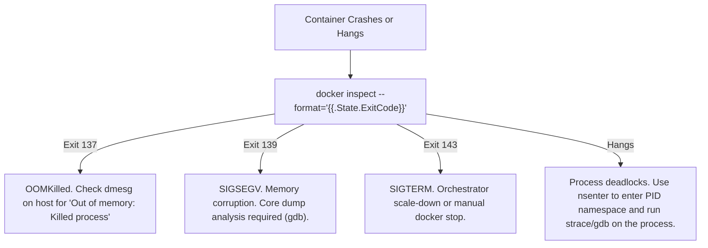

# Docker: FAANG Interview Questions & Advanced Troubleshooting (Pro-Level)

> **Cluster 01 — Module 04**  
> Focus: Senior/Staff level interview questions, container escapes, rootless Docker, eBPF debugging, and deep system diagnostics.

---

## 1. Deep Diagnostics & System Troubleshooting

When containers crash or behave anomalously, simple log reading isn't enough.



### Using `nsenter` for Pro Debugging
When a container lacks debugging tools (e.g., `distroless` or `scratch` images), you can use `nsenter` from the host to attach your host's debugging tools (like `strace`, `tcpdump`, `htop`) to the container's namespaces.
```bash
PID=$(docker inspect --format '{{.State.Pid}}' my_container)
# Enter the Network namespace of the container and run host's tcpdump
sudo nsenter --target $PID --net tcpdump -i eth0
```

---

## 2. Top Tier / Senior Interview Questions

### Q1: Detail the process of a container breakout (escape) via the Docker socket.
**Answer:** If `/var/run/docker.sock` is mounted inside a container, the container can issue HTTP API requests to the host's Docker daemon. An attacker can use this socket to spin up a new, privileged container with the host's root filesystem mounted at `/host`. They can then chroot into `/host` or edit `/host/etc/crontab` to execute arbitrary code on the host kernel as root.

### Q2: What is Rootless Docker, and how does it utilize user namespaces?
**Answer:** Rootless Docker runs the Docker daemon (`dockerd`) and the containers as an unprivileged user on the host. It utilizes the Linux `USER` namespace (via `newuidmap`/`newgidmap`), which maps UID 0 (root) *inside* the container to an unprivileged UID (e.g., 100000) *outside* on the host. If a container breakout occurs, the attacker only gains the privileges of UID 100000 on the host, neutralizing the threat.

### Q3: Explain how `tmpfs` mounts work under the hood.
**Answer:** `tmpfs` is a filesystem that resides purely in volatile memory (RAM) and the kernel's swap space, rather than on persistent block devices. It bypasses the OverlayFS driver completely, meaning reads and writes happen at memory-bus speeds. It is heavily utilized for injecting sensitive secrets (like Vault tokens) that must not be written to disk, preventing forensic recovery after the container terminates.

### Q4: How would you debug an application inside a scratch container that crashes on startup?
**Answer:** Since a scratch container has no shell, `docker exec` will fail. I would:
1. Copy the core binary out and run it locally.
2. Use `docker debug` (or similar Buildx tools) which injects a sidecar with debugging tools.
3. Use `nsenter` on the host to attach to the container's PID and mount namespaces to run `strace` on the binary execution path.
4. Utilize `eBPF` (Extended Berkeley Packet Filter) tools like `bcc` or `bpftrace` on the host to trace system calls made by the container's PID without needing any tools inside the container.

### Q5: What is the significance of the `CAP_SYS_ADMIN` capability?
**Answer:** `CAP_SYS_ADMIN` is the "catch-all" superuser capability in Linux. It allows processes to perform highly privileged operations like mounting filesystems (`mount()`), changing namespaces (`setns()`), and configuring namespaces. Granting a container `--privileged` essentially adds `CAP_SYS_ADMIN` (among others), which completely negates container isolation. If an attacker compromises a privileged container, they can trivial mount host devices and escape.

### Q6: How does Docker resolve container names on user-defined networks?
**Answer:** Docker runs an embedded DNS server located at `127.0.0.11` inside the container's network namespace. This DNS server resolves container names and aliases to their dynamic virtual IPs on that specific network. The `iptables` rules intercept traffic destined for `127.0.0.11:53` and redirect it to the Docker daemon's DNS resolver.

---

## 3. Advanced Troubleshooting Commands

```bash
# 1. Advanced Namespace Tracing with eBPF (BCC tools)
# (Requires host root) Trace all exec() calls inside a container's PID namespace
sudo execsnoop-bpf -c CGROUP_ID

# 2. Extracting filesystem delta natively
# Shows exactly what files have been created/modified/deleted in the container's writable layer
docker diff <container_id>

# 3. Viewing native Linux cgroup memory stats
# For cgroups v2
cat /sys/fs/cgroup/system.slice/docker-<container_id>.scope/memory.current
```
