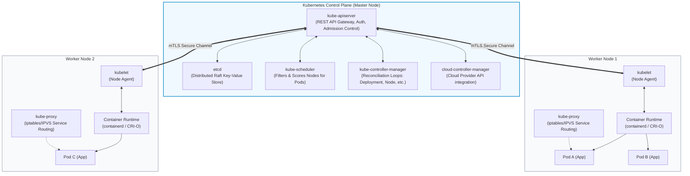
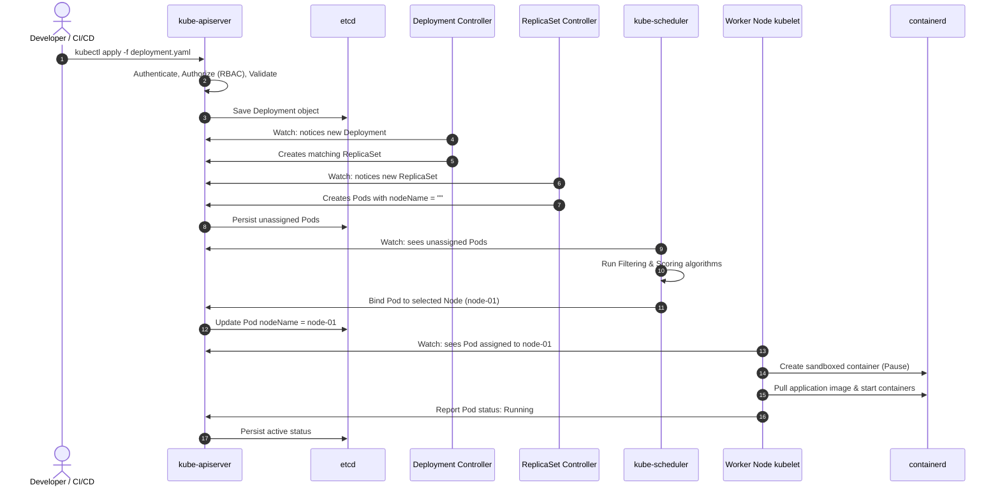

# Kubernetes: Architecture, Control Plane & Node Internals

> **Cluster 02 — Module 01**  
> Focus: Kubernetes components, the reconciliation loop, etcd consensus, Kubelet internals, CRI/CNI/CSI standards, and request lifecycle.

---

## 1. High-Level Cluster Architecture

Kubernetes is a declarative, distributed container orchestrator. It divides work between a **Control Plane** (the cluster brain) and **Worker Nodes** (where workload containers actually execute).



---

## 2. Control Plane Components (The Brain)

### 1. `kube-apiserver`
- The front door to the cluster. All internal components (`scheduler`, `kubelet`, `controller-manager`) and external clients (`kubectl`, CI/CD) interact **only** through the API server via REST over HTTPS.
- **The only component that talks directly to `etcd`**.
- Implements: Authentication $\to$ Authorization (RBAC) $\to$ Admission Control (Mutating and Validating Webhooks) $\to$ Persistence in `etcd`.

### 2. `etcd` (Consistency & State)
- A highly consistent, distributed key-value store using the **Raft consensus algorithm**.
- Stores the entire state of the cluster (desired state, secrets, configs, active pod states).
- Provides a **Watch API**: components subscribe to resource changes without expensive polling.
- Typically run in 3 or 5 node quorums to tolerate $N/2 - 1$ failures ($3$ nodes tolerate $1$ failure, $5$ nodes tolerate $2$).

### 3. `kube-scheduler`
- Assigns newly created Pods that have no assigned node (`nodeName: ""`) to an optimal Worker Node.
- Operates in a two-stage pipeline:
  1. **Filtering (Predicates)**: Eliminates nodes that do not meet requirements (insufficient CPU/memory, taints without tolerations, node selector mismatch).
  2. **Scoring (Priorities)**: Ranks surviving candidate nodes based on resource balance, image locality, and pod affinity rules.

### 4. `kube-controller-manager`
- Runs continuous **reconciliation loops** (the control loop: *Observe $\to$ Compare $\to$ Reconcile*).
- Examples:
  - **DeploymentController**: Ensures current ReplicaSets match desired replicas.
  - **NodeController**: Monitors node heartbeats and marks unreachable nodes as `NotReady`.
  - **EndpointSliceController**: Populates IP addresses of healthy pods backing Kubernetes Services.

---

## 3. Worker Node Components (The Muscle)

### 1. `kubelet`
- The primary node agent registered with the API server.
- Watches for PodSpecs assigned to its node, instructs the container runtime to create/stop containers, mounts storage volumes, and reports node/pod health metrics back to the API server.
- Contains the **PLEG (Pod Lifecycle Event Generator)**: periodically polls container runtimes to detect status changes.

### 2. `kube-proxy`
- Network proxy running on each node that implements the Kubernetes **Service** abstraction.
- Monitors Service and EndpointSlice objects.
- Programs Linux kernel routing tables via:
  - **`iptables` mode**: Default in many installations. Writes DNAT rules for Service Virtual IPs.
  - **`ipvs` mode**: High-performance hash-table based routing for clusters with thousands of services.

### 3. Container Runtime & The 3 Core Interfaces

```mermaid
flowchart LR
    Kubelet["kubelet"] -->|CRI (gRPC)| ContainerRuntime["Container Runtime (containerd)"]
    ContainerRuntime -->|CNI (Plugins)| NetworkPlugin["CNI Plugin (Cilium / Calico / Flannel)"]
    Kubelet -->|CSI (gRPC)| StoragePlugin["CSI Driver (AWS EBS / Ceph / NFS)"]

    style Kubelet fill:#eff6ff,stroke:#3b82f6,stroke-width:2px
    style ContainerRuntime fill:#fdf4ff,stroke:#c084fc,stroke-width:1px
    style NetworkPlugin fill:#ecfdf5,stroke:#34d399,stroke-width:1px
    style StoragePlugin fill:#fffbeb,stroke:#fbbf24,stroke-width:1px
```

1. **CRI (Container Runtime Interface)**: Standardized gRPC interface between `kubelet` and container runtimes (`containerd`, `CRI-O`).
2. **CNI (Container Network Interface)**: Standardized plugins for configuring network interfaces, allocating Pod IP addresses, and managing routing tables.
3. **CSI (Container Storage Interface)**: Standardized interface allowing third-party storage vendors (AWS EBS, GCP PD, Azure Disk, Ceph, Rook) to attach and mount block/file storage into pods.

---

## 4. End-to-End Lifecycle of `kubectl apply -f deployment.yaml`



---

## 5. Official References & Documentation
- [Kubernetes Architectural Concepts](https://kubernetes.io/docs/concepts/overview/components/)
- [etcd Distributed Raft Consensus](https://etcd.io/docs/)
- [Kube-Scheduler Internals & Plugins](https://kubernetes.io/docs/concepts/scheduling-eviction/kube-scheduler/)
- [Kubernetes CRI Specification](https://github.com/kubernetes/cri-api)
