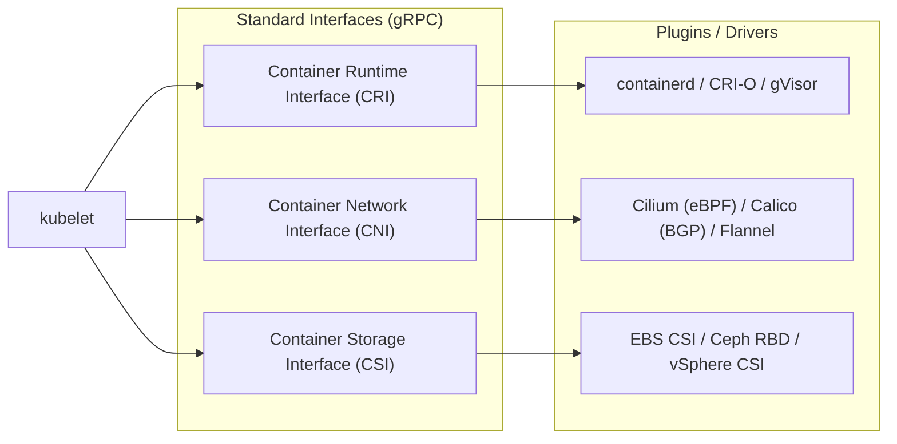
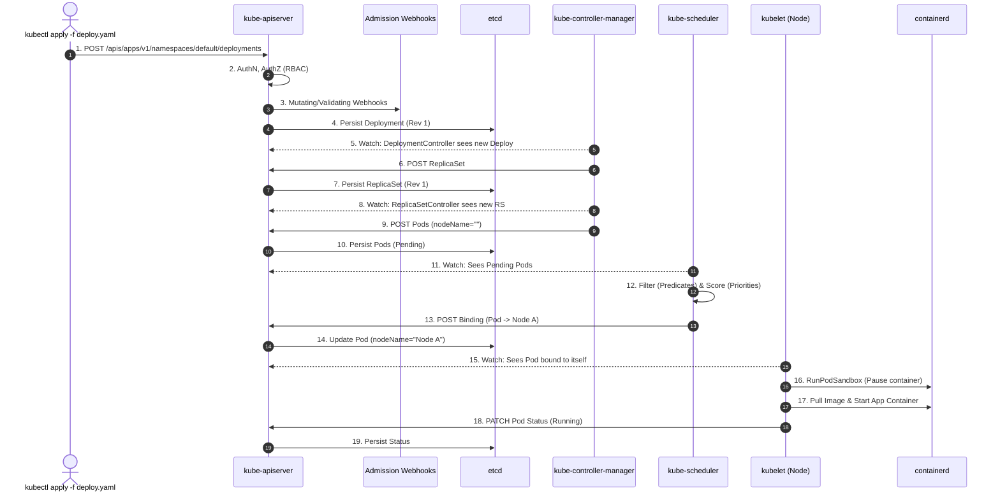

# Kubernetes: Pro-Level Architecture, Control Plane & Node Internals

> **Cluster 02 — Module 01**  
> Focus: Kubernetes internals, distributed system architecture, control loop mechanics, etcd Raft consensus, API server flow, scheduler algorithms, and the node-level CRI/CNI/CSI ecosystem.

---

## 1. High-Level Cluster Architecture & The Declarative Model

At its core, Kubernetes is a distributed, declarative state machine. It does not imperatively execute commands; instead, it constantly drives the **actual state** of the cluster towards a user-defined **desired state** via independent, asynchronous reconciliation loops.

```mermaid
flowchart TD
    subgraph Control_Plane["Control Plane (Highly Available Quorum)"]
        API["kube-apiserver\n(REST API, AuthN/AuthZ, Admission, Watch)"]
        ETCD["etcd Cluster\n(Distributed Raft KV Store, MVCC)"]
        Sched["kube-scheduler\n(Predicates/Priorities, Node Binding)"]
        KCM["kube-controller-manager\n(Control Loops, Garbage Collection)"]
        CCM["cloud-controller-manager\n(Cloud IAM/VPC/LB Integration)"]

        API <-->|gRPC/HTTP| ETCD
        API <-->|Watch/REST| Sched
        API <-->|Watch/REST| KCM
        API <-->|Watch/REST| CCM
    end

    subgraph Data_Plane["Data Plane (Worker Nodes)"]
        subgraph Node_1["Worker Node (Node 1)"]
            Kubelet1["kubelet\n(Node Agent, PLEG, cgroups)"]
            Proxy1["kube-proxy\n(iptables/IPVS Service Routing)"]
            Runtime1["Container Runtime\n(containerd/CRI-O)"]
            CNI1["CNI Plugin\n(Calico/Cilium)"]
            Pod1["Pod (App + Pause)"]

            Kubelet1 -->|CRI (gRPC)| Runtime1
            Runtime1 --> Pod1
            Kubelet1 -->|CNI| CNI1
            Proxy1 -.-> Pod1
        end

        subgraph Node_2["Worker Node (Node 2)"]
            Kubelet2["kubelet"]
            Runtime2["Runtime"]
            Pod2["Pod"]
            Kubelet2 -->|CRI| Runtime2
            Runtime2 --> Pod2
        end
    end

    API <==>|mTLS / Watch API| Kubelet1
    API <==>|mTLS / Watch API| Kubelet2

    style Control_Plane fill:#f0f9ff,stroke:#0284c7,stroke-width:2px
    style Data_Plane fill:#f8fafc,stroke:#64748b,stroke-width:1px
```

---

## 2. Deep Dive: Control Plane Components

### 2.1 `kube-apiserver`: The Central Nervous System
The API server is the only component that persists state to `etcd`. It acts as a stateless, horizontally scalable REST/gRPC gateway.
- **API Request Lifecycle**:
  1. **Authentication (AuthN)**: Who is making the request? (X.509 certs, OIDC, ServiceAccount tokens).
  2. **Authorization (AuthZ)**: Can they do it? (RBAC - Roles/RoleBindings).
  3. **Mutating Admission Control**: Webhooks intercept the request and can alter the payload (e.g., injecting sidecars like Istio, adding default labels).
  4. **Object Schema Validation**: Validates the JSON/YAML structure against OpenAPI schemas.
  5. **Validating Admission Control**: Final checks, rejecting requests that violate policies (e.g., OPA Gatekeeper/Kyverno policies).
  6. **Persistence**: Saves the object to `etcd`.
- **The Watch API**: Clients open long-lived HTTP GET requests with chunked transfer encoding (gRPC streams internally). Instead of polling, `apiserver` pushes events to clients when objects change in `etcd`.

### 2.2 `etcd`: The State Store & Raft Consensus
`etcd` is a distributed, strictly consistent key-value store.
- **Raft Consensus**: Uses a leader-follower architecture. Writes are proposed to the leader, logged, and replicated to followers. A write is only committed when a quorum ($N/2 + 1$) acknowledges it.
- **MVCC (Multi-Version Concurrency Control)**: `etcd` doesn't just store the current value; it stores revisions. This allows the API server to watch for changes from a specific `resourceVersion` without missing updates.
- **Compaction**: Because MVCC stores history, `etcd` requires periodic compaction to remove old revisions and prevent disk exhaustion.
- **Quorum Rules**: Always run 3, 5, or 7 nodes. 3 nodes tolerate 1 failure; 5 tolerate 2. Adding a 4th node decreases stability (still tolerates 1 failure but requires 3 acks instead of 2).

### 2.3 `kube-controller-manager`: The Reconciliation Engine
A monolithic binary running dozens of distinct, independent control loops.
- **The Reconciliation Loop Pattern**:
  ```go
  for {
      desiredState := getDesiredStateFromAPIServer()
      actualState := getActualStateFromCluster()
      if actualState != desiredState {
          executeRemediationTasks()
      }
      time.Sleep(interval)
  }
  ```
- Uses **Informers** and **ListerWatchers** (client-go cache) to monitor API server events efficiently without overwhelming it with GET requests.
- **Work Queues**: Events (Add/Update/Delete) are pushed to rate-limited work queues. Worker threads pop items off the queue and trigger the `Reconcile(req)` function.

### 2.4 `kube-scheduler`: The Node Allocator
Finds optimal nodes for unbound Pods (`nodeName: ""`).
- **Two-Phase Scheduling Framework**:
  1. **Filtering (Predicates)**: Hard constraints. Drops nodes lacking CPU/RAM, matching `nodeSelector`/`affinity`, or having untolerated `taints`.
  2. **Scoring (Priorities)**: Soft constraints. Ranks remaining nodes (0-100). Prefers spreading pods across failure domains (TopologySpreadConstraints), image locality, or node utilization levels.
- **Binding**: Once a node is selected, the scheduler emits a `Binding` object to the API server, updating the Pod's `nodeName`.

---

## 3. Worker Node Internals: The Data Plane

### 3.1 `kubelet`: The Node Agent
The `kubelet` ensures containers described in PodSpecs are running and healthy.
- **Sync Loop**: Receives PodSpecs via the API Watch stream or static pod manifests (from `/etc/kubernetes/manifests`).
- **PLEG (Pod Lifecycle Event Generator)**: Instead of constantly polling the container runtime (which is expensive), PLEG periodically relists containers and generates events (ContainerStarted, ContainerDied) to trigger the `kubelet` sync loop.
- **cgroups & Namespaces**: The `kubelet` interacts with Linux primitives. It sets up `cgroups` (for resource limits: CPU shares, memory limits) and instructs the runtime to create namespaces (IPC, Network, PID).

### 3.2 The CRI, CNI, and CSI Interfaces
Kubernetes relies on standard gRPC interfaces to avoid baking vendor-specific code into the core repository.



1. **CRI (Container Runtime Interface)**: Commands to create sandboxes, pull images, and start containers. The "sandbox" is typically implemented as the `pause` container, which holds the Network and IPC namespaces for all containers in the Pod.
2. **CNI (Container Network Interface)**: Binaries executed to configure the pod's network interface. It assigns an IP address from the Pod CIDR, sets up the `veth` pair connecting the pod to the node network, and configures route rules.
3. **CSI (Container Storage Interface)**: Automates storage provisioning (creating cloud volumes), attaching them to the correct VM (node), and mounting them into the Pod's filesystem.

### 3.3 `kube-proxy`: The Network Abstraction Layer
Implements Kubernetes `Services` (ClusterIP, NodePort) by managing node networking rules.
- **iptables mode (Default)**: Creates a chain of DNAT (Destination NAT) rules. O(N) complexity for rule updates. Scales poorly beyond thousands of services.
- **IPVS mode**: Uses the Linux IP Virtual Server. Hash-table based, O(1) complexity. Much faster and supports complex load-balancing algorithms (Round Robin, Least Connections).
- **Modern eBPF Replacements**: Projects like **Cilium** completely bypass `kube-proxy` and `iptables`, writing load-balancing rules directly into the Linux kernel via eBPF for massive performance gains.

---

## 4. The Anatomy of an API Request: End-to-End Flow

Let's trace exactly what happens when you deploy an app.



---

## 5. Architectural Best Practices & Hardening
- **Control Plane HA**: Run multiple API servers behind a Layer 4 Load Balancer (e.g., HAProxy/Envoy). Keep `etcd` on dedicated, fast NVMe disks (fsync latency is critical to Raft performance).
- **API Server Security**: Disable anonymous access. Enable audit logging. Use OIDC for user authentication instead of static tokens.
- **Node Security**: Restrict Kubelet API access (disable anonymous auth, enable Webhook AuthZ). Use AppArmor/SELinux and Seccomp profiles for container workloads.
- **Resource Management**: Always set `requests` and `limits` to enable the scheduler to pack nodes efficiently and to allow the Kubelet's OOM (Out of Memory) killer to make deterministic decisions during node pressure.
