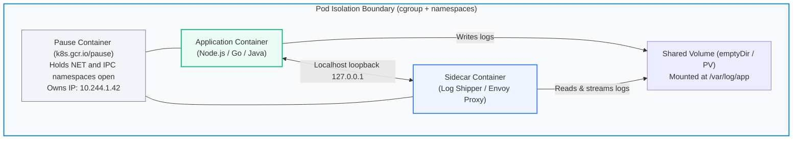
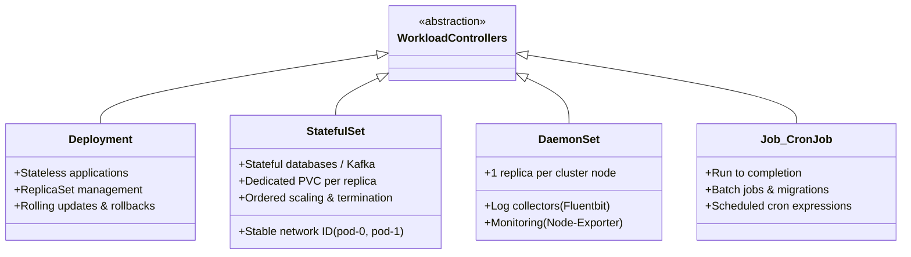
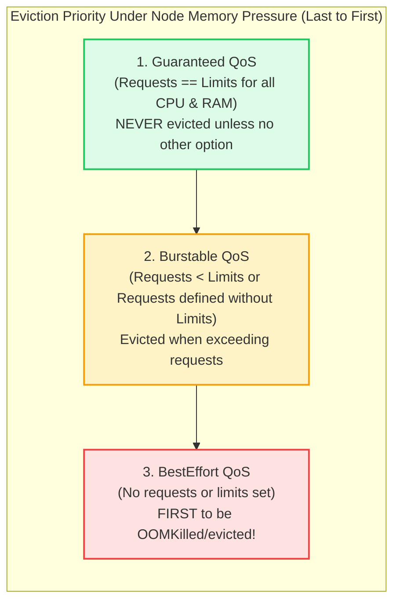

# Kubernetes: Workloads, Lifecycle & Advanced Scheduling

> **Cluster 02 — Module 02**  
> Focus: Pod anatomy, the Pause container, StatefulSets vs Deployments, QoS classes, Node Affinity, Taints/Tolerations, and Scheduling Algorithms.

---

## 1. Inside a Pod: The Pause Container & Shared Namespaces

A **Pod** is the atomic scheduling unit in Kubernetes. It is a collection of one or more tightly coupled containers that share the same storage volumes, network namespace, and IPC namespace.



### Pro-Level Insights: The Pause Container
The **Pause container** (sometimes called the infra container) acts as the parent container for all other containers in the pod. 
- **Zombie Harvesting:** It runs a simple C-level loop (`pause()`) and reaps zombie processes (acting as PID 1 if PID namespace sharing is enabled).
- **Network Holding:** When a pod starts, `kubelet` instructs the runtime to launch the `pause` container first to request a network namespace and an IP address. Application containers then join this network namespace (`--net=container:pause`), enabling `localhost` communication.

---

## 2. Workload Controllers Deep-Dive

Kubernetes controllers watch the state of your cluster, then make or request changes where needed.



### Deployment Strategies

Deployments orchestrate updates through ReplicaSets. The default and most common strategies are:

1. **RollingUpdate (Default):** Replaces old Pods with new ones gradually.
   - `maxSurge`: Maximum number of Pods that can be created over the desired number of Pods.
   - `maxUnavailable`: Maximum number of Pods that can be unavailable during the update process.
2. **Recreate:** Kills all existing Pods before creating new ones. Useful when the application cannot tolerate running multiple versions simultaneously.
3. **Canary / Blue-Green (via Service meshes or CI/CD tools like ArgoCD):** While not native Deployment strategies, these are easily achieved using multiple Deployments routing traffic dynamically.

### StatefulSets vs Deployments (Production Comparison)

StatefulSets guarantee the **ordering** and **uniqueness** of a set of pods.

| Feature | Deployment | StatefulSet |
| :--- | :--- | :--- |
| **Pod Identity** | Random hashes (`order-app-6848c4bb58-x9p2z`) | Stable, ordinal index (`kafka-0`, `kafka-1`, `kafka-2`) |
| **Storage Binding** | Pods typically share read-only storage or use stateless storage | Each pod receives its own dedicated `PersistentVolume` via `volumeClaimTemplates` |
| **Scaling Order** | Parallel, random order | Strict sequential order ($0 \to 1 \to 2$ on scale up; $2 \to 1 \to 0$ on scale down) |
| **Network Identity** | Ephemeral pod IPs behind a ClusterIP | Headless Service assigns individual DNS A-records per pod |
| **Primary Use Cases** | Stateless APIs, web apps, microservices | Kafka brokers, ZooKeeper, MongoDB, Cassandra, PostgreSQL |

### DaemonSets

DaemonSets ensure that all (or some) Nodes run a copy of a Pod. As nodes are added to the cluster, Pods are added to them. As nodes are removed, those Pods are garbage collected.
- **Typical Use Cases:** `fluentd` (log collection), `prometheus-node-exporter` (monitoring), `kube-proxy`, and CNI plugins (e.g., `calico-node`).

---

## 3. Resource Allocation & Quality of Service (QoS) Classes

When defining Pod specifications, you specify **requests** (used by the scheduler to find a node with enough capacity) and **limits** (enforced by `cgroups` on the host).

Kubernetes assigns one of three **QoS classes**, determining eviction priority during host memory pressure.



```yaml
# Example: Guaranteed QoS Pod
resources:
  requests:
    cpu: "500m"
    memory: "512Mi"
  limits:
    cpu: "500m"
    memory: "512Mi"
```

---

## 4. Advanced Scheduling: Affinity, Taints, and the Scheduler Algorithm

### The Scheduling Algorithm

The `kube-scheduler` operates in two main phases when assigning a Pod to a Node:
1. **Filtering (Predicates):** Filters out nodes that do not meet the Pod's requirements (e.g., inadequate CPU/Memory, failing node selector, tainted nodes lacking tolerations).
2. **Scoring (Priorities):** Ranks the remaining nodes based on various functions (e.g., packing pods tightly, spreading them across zones, favoring images already pulled). The node with the highest score wins.

### Node Affinity (Directing Pods to Specific Hardware)

Node affinity provides advanced scheduling constraints.

```yaml
affinity:
  nodeAffinity:
    requiredDuringSchedulingIgnoredDuringExecution: # Hard constraint
      nodeSelectorTerms:
        - matchExpressions:
            - key: topology.kubernetes.io/zone
              operator: In
              values: ["us-east-1a", "us-east-1b"]
    preferredDuringSchedulingIgnoredDuringExecution: # Soft constraint (Scoring)
      - weight: 1
        preference:
          matchExpressions:
            - key: disktype
              operator: In
              values: ["ssd"]
```

### Pod Affinity & Anti-Affinity

- **Pod Affinity:** "Schedule this Pod on the same node/zone as Pod X." (Useful for co-locating heavily communicating microservices).
- **Pod Anti-Affinity:** "Ensure this Pod never runs on the same node/zone as Pod X." (Crucial for High Availability).

```yaml
affinity:
  podAntiAffinity:
    requiredDuringSchedulingIgnoredDuringExecution:
      - labelSelector:
          matchExpressions:
            - key: app
              operator: In
              values: ["order-service"]
        topologyKey: "kubernetes.io/hostname" # Spreads pods across different physical nodes
```

### Taints and Tolerations (Node Repulsion)

While Affinity attracts Pods to Nodes, **Taints and Tolerations** repel Pods.

- **Taint** on a Node: *"I repel pods unless they tolerate me."*
  `kubectl taint nodes node-gpu dedicated=gpu:NoSchedule`
- **Toleration** on a Pod: *"I can tolerate this taint and run here."*

```yaml
tolerations:
  - key: "dedicated"
    operator: "Equal"
    value: "gpu"
    effect: "NoSchedule"
```

**Taint Effects:**
- `NoSchedule`: Hard constraint. Pods won't be scheduled unless they tolerate it.
- `PreferNoSchedule`: Soft constraint. Kubernetes will try to avoid scheduling.
- `NoExecute`: Existing pods on the node will be evicted if they don't have a matching toleration.

---

## 5. Official References
- [Kubernetes Pod Lifecycle](https://kubernetes.io/docs/concepts/workloads/pods/pod-lifecycle/)
- [StatefulSets Deep Dive](https://kubernetes.io/docs/concepts/workloads/controllers/statefulset/)
- [DaemonSets](https://kubernetes.io/docs/concepts/workloads/controllers/daemonset/)
- [Pod Quality of Service (QoS) Classes](https://kubernetes.io/docs/tasks/configure-pod-container/quality-service-pod/)
- [Assigning Pods to Nodes](https://kubernetes.io/docs/concepts/scheduling-eviction/assign-pod-node/)
