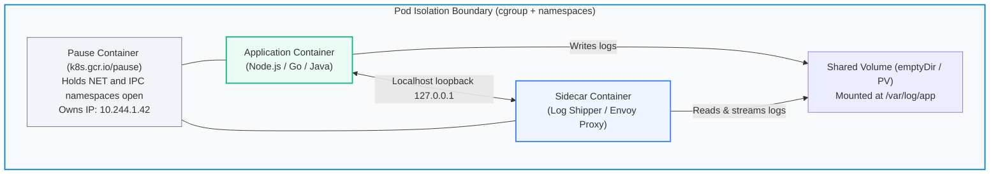
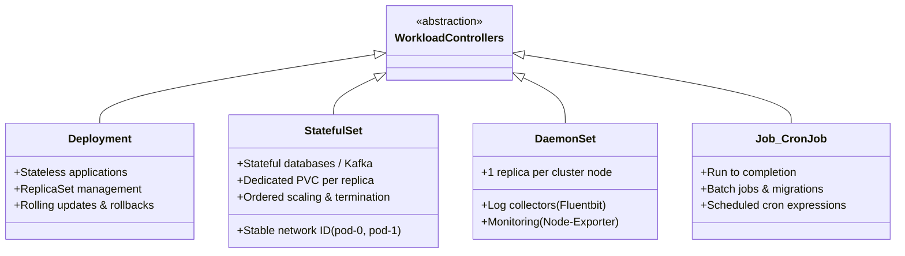
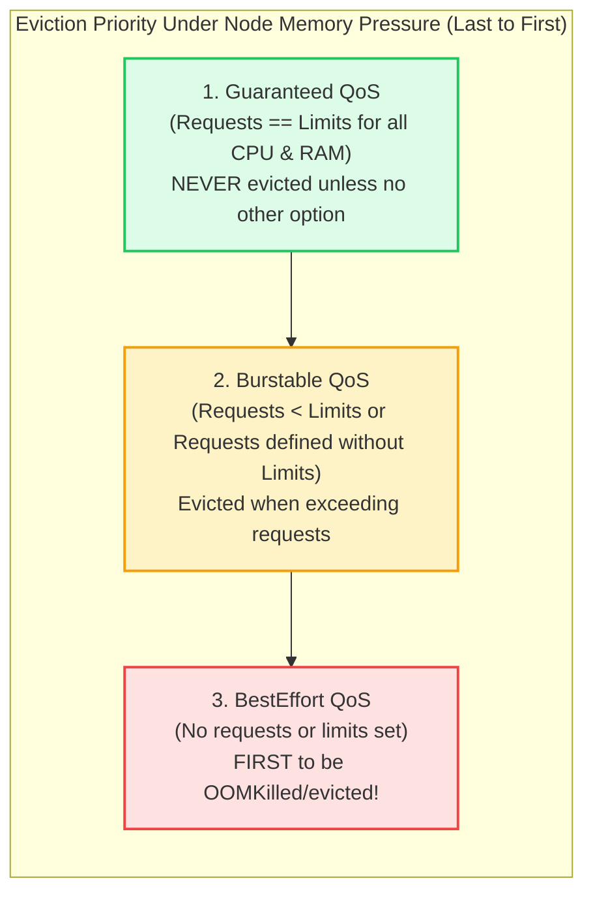

# Kubernetes: Workloads, Lifecycle & Advanced Scheduling

> **Cluster 02 — Module 02**  
> Focus: Pod anatomy, the Pause container, StatefulSets vs Deployments, QoS classes, Node Affinity, and Taints/Tolerations.

---

## 1. Inside a Pod: The Pause Container & Shared Namespaces

A **Pod** is the atomic scheduling unit in Kubernetes. It is a collection of one or more tightly coupled containers that share the same storage volumes, network namespace, and IPC namespace.



- **The Pause Container**: When a pod starts, `kubelet` instructs the runtime to launch the `pause` container first. The pause container requests a network namespace and sits idle. The application and sidecar containers then join this existing network namespace (`--net=container:pause`), enabling them to communicate with each other over `localhost`.

---

## 2. Workload Controllers Compared



### Deployments vs StatefulSets (Production Comparison)

| Feature | Deployment | StatefulSet |
| :--- | :--- | :--- |
| **Pod Identity** | Random hashes (`order-app-6848c4bb58-x9p2z`) | Stable, ordinal index (`kafka-0`, `kafka-1`, `kafka-2`) |
| **Storage Binding** | Pods typically share read-only storage or use stateless storage | Each pod receives its own dedicated `PersistentVolume` via `volumeClaimTemplates` |
| **Scaling Order** | Parallel, random order | Strict sequential order ($0 \to 1 \to 2$ on scale up; $2 \to 1 \to 0$ on scale down) |
| **Network Identity** | Ephemeral pod IPs behind a ClusterIP | Headless Service assigns individual DNS A-records per pod |
| **Primary Use Cases** | Stateless APIs, web apps, microservices | Kafka brokers, ZooKeeper, MongoDB, Cassandra, PostgreSQL |

---

## 3. Resource Allocation & Quality of Service (QoS) Classes

When defining Pod specifications, you specify **requests** (for scheduling) and **limits** (for kernel enforcement). Kubernetes classifies Pods into three **QoS classes**, which determine the order in which pods are terminated during host memory pressure.



```yaml
# Example: Guaranteed QoS Pod
resources:
  requests:
    cpu: "500m"
    memory: "512Mi"
  limits:
    cpu: "500m"
    memory: "512Mi"
```

---

## 4. Advanced Scheduling: Affinity, Anti-Affinity & Taints

### Node Affinity (Directing Pods to Specific Hardware)
```yaml
affinity:
  nodeAffinity:
    requiredDuringSchedulingIgnoredDuringExecution:
      nodeSelectorTerms:
        - matchExpressions:
            - key: topology.kubernetes.io/zone
              operator: In
              values: ["us-east-1a", "us-east-1b"]
```

### Pod Anti-Affinity (High Availability / Fault Tolerance)
Ensures two replicas of the same service **never** land on the same physical node or availability zone:
```yaml
affinity:
  podAntiAffinity:
    requiredDuringSchedulingIgnoredDuringExecution:
      - labelSelector:
          matchExpressions:
            - key: app
              operator: In
              values: ["order-service"]
        topologyKey: "kubernetes.io/hostname"
```

### Taints and Tolerations (Node Repulsion)
- **Taint** on a Node: *"I repel pods unless they tolerate me."*
  `kubectl taint nodes node-gpu dedicated=gpu:NoSchedule`
- **Toleration** on a Pod: *"I can tolerate this taint and run here."*
```yaml
tolerations:
  - key: "dedicated"
    operator: "Equal"
    value: "gpu"
    effect: "NoSchedule"
```

---

## 5. Official References
- [Kubernetes Pod Lifecycle](https://kubernetes.io/docs/concepts/workloads/pods/pod-lifecycle/)
- [StatefulSets Deep Dive](https://kubernetes.io/docs/concepts/workloads/controllers/statefulset/)
- [Pod Quality of Service (QoS) Classes](https://kubernetes.io/docs/tasks/configure-pod-container/quality-service-pod/)
