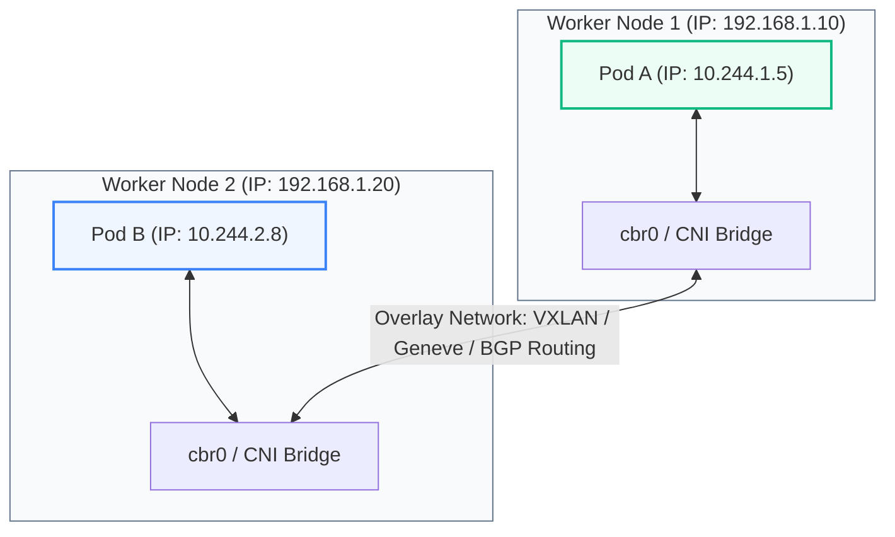
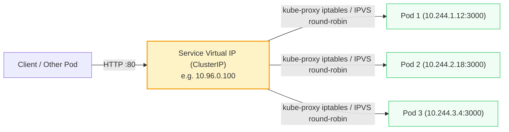
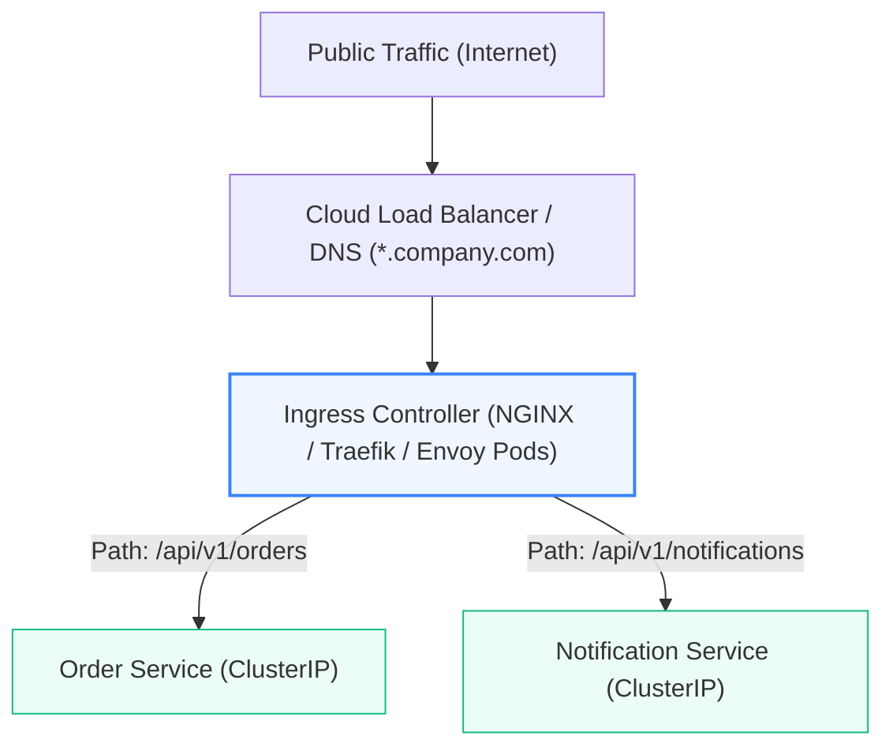

# Kubernetes: Networking, Services, Ingress & Network Policies

> **Cluster 02 — Module 03**  
> Focus: Kubernetes Flat Network Model, Service types, Headless Services for Kafka, CoreDNS resolution, Ingress controllers, and zero-trust NetworkPolicies.

---

## 1. The Kubernetes Networking Model

Kubernetes imposes four foundational networking rules across all nodes:
1. **Pod-to-Pod**: Every Pod receives a unique, routable IP address within the cluster. Pods can communicate with every other Pod across any node without Network Address Translation (NAT).
2. **Node-to-Pod**: Nodes can communicate directly with all Pods running on them or other nodes without NAT.
3. **No Port Clashes**: Because every Pod has its own IP, multiple Pods on the same node can bind to port `8080` without conflict.



---

## 2. Kubernetes Services: Types & Mechanisms

Pods are ephemeral; their IPs change whenever they restart. A **Service** provides a stable virtual IP (VIP) and DNS name acting as an internal load balancer pointing to dynamic Pod IPs selected via labels.



### The 4 Service Types

| Service Type | Routing Scope | Behavior |
| :--- | :--- | :--- |
| **`ClusterIP`** | Cluster-Internal only | Default type. Allocates an internal virtual IP reachable only from within the cluster. |
| **`NodePort`** | Cluster-External | Opens a static port on every physical node (range `30000-32767`). Traffic to `<NodeIP>:<NodePort>` routes to the Service. |
| **`LoadBalancer`** | Cluster-External | Integrates with cloud providers (AWS NLB, GCP LB, Azure LB) to provision a public load balancer routing into NodePorts. |
| **`Headless` (`clusterIP: None`)** | Cluster-Internal | Allocates **no** virtual IP. CoreDNS directly returns the individual A-records of all backing Pods. |

### Why Headless Services are Mandatory for Kafka & Distributed Databases
In stateful systems like Kafka or Cassandra, clients cannot send writes to an arbitrary random broker. A producer writing to partition 0 must connect directly to the specific broker hosting the partition leader.  
With a **Headless Service**:
```yaml
apiVersion: v1
kind: Service
metadata:
  name: kafka-headless
spec:
  clusterIP: None
  selector:
    app: kafka
  ports:
    - port: 9092
      name: plaintext
```
CoreDNS generates individual predictable DNS records for each StatefulSet pod:
- `kafka-0.kafka-headless.default.svc.cluster.local` $\to$ `10.244.1.20`
- `kafka-1.kafka-headless.default.svc.cluster.local` $\to$ `10.244.2.22`
- `kafka-2.kafka-headless.default.svc.cluster.local` $\to$ `10.244.3.25`

---

## 3. CoreDNS Resolution Syntax

Every service is registered in cluster DNS using its Fully Qualified Domain Name (FQDN):

$$\mathbf{\langle service\text{-}name\rangle.\langle namespace\rangle.svc.cluster.local}$$

- Within the same namespace: `curl http://order-service:3000`
- Across namespaces: `curl http://order-service.payments.svc.cluster.local:3000`

---

## 4. Ingress & Ingress Controllers (Layer 7 Routing)

While Services operate at Layer 4 (TCP/UDP), **Ingress** manages Layer 7 HTTP/HTTPS external access into the cluster:



```yaml
apiVersion: networking.k8s.io/v1
kind: Ingress
metadata:
  name: app-ingress
  annotations:
    nginx.ingress.kubernetes.io/ssl-redirect: "true"
spec:
  ingressClassName: nginx
  rules:
    - host: api.example.com
      http:
        paths:
          - path: /orders
            pathType: Prefix
            backend:
              service:
                name: order-service
                port:
                  number: 3000
```

---

## 5. NetworkPolicies (Zero-Trust Security)

By default, all pods in Kubernetes can talk to all other pods. A **NetworkPolicy** acts as an internal packet firewall (requires a CNI like Calico or Cilium).

### Production Example: Default Deny All + Allow Only Kafka Producers
```yaml
# 1. Deny all incoming traffic to Kafka pods by default
apiVersion: networking.k8s.io/v1
kind: NetworkPolicy
metadata:
  name: kafka-isolate
spec:
  podSelector:
    matchLabels:
      app: kafka
  policyTypes:
    - Ingress
  ingress:
    # Allow ONLY pods labeled 'role: producer' on port 9092
    - from:
        - podSelector:
            matchLabels:
              role: producer
      ports:
        - protocol: TCP
          port: 9092
```

---

## 6. Official References
- [Kubernetes Network Model](https://kubernetes.io/docs/concepts/services-networking/)
- [DNS for Services and Pods](https://kubernetes.io/docs/concepts/services-networking/dns-pod-service/)
- [Ingress Controllers Documentation](https://kubernetes.io/docs/concepts/services-networking/ingress-controllers/)
- [Network Policies Guide](https://kubernetes.io/docs/concepts/services-networking/network-policies/)
