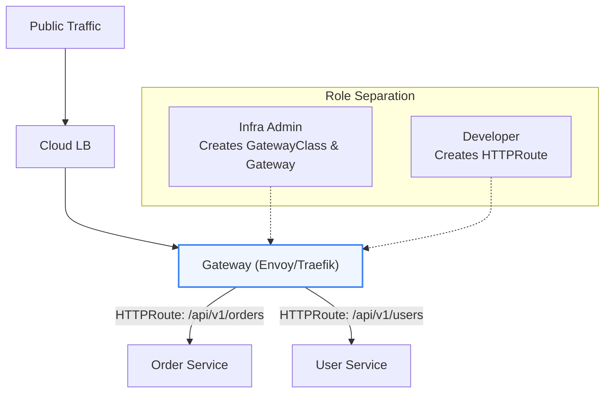

# Kubernetes: Advanced Networking, Services, Ingress & Gateway API

> **Cluster 02 — Module 03**  
> Focus: Kubernetes Flat Network Model, Container Network Interface (CNI), kube-proxy (iptables/IPVS), CoreDNS, Ingress vs Gateway API, and zero-trust NetworkPolicies.

---

## 1. The Kubernetes Networking Model & CNI

Kubernetes imposes fundamental networking requirements designed to create a flat, highly routable topology.

### The Core Rules
1. **Pod-to-Pod**: Every Pod receives a unique, routable IP address within the cluster. Pods communicate across any node without Network Address Translation (NAT).
2. **Node-to-Pod**: Nodes can communicate directly with all Pods (and vice versa) without NAT.
3. **No Port Clashes**: Each Pod has its own IP, meaning applications inside different Pods on the same node can bind to the same port (e.g., `8080`) without conflict.

### Under the Hood: CNI (Container Network Interface)
The implementation of these rules is delegated to **CNI Plugins** (like Calico, Cilium, Flannel). 
- **IPAM (IP Address Management)**: The CNI allocates a pod CIDR to each node and hands out IPs to pods.
- **Veth Pairs**: A virtual ethernet pair connects the Pod's network namespace to the host's root network namespace.
- **Routing/Encapsulation**: Traffic between nodes is handled via overlay networks (VXLAN/Geneve) or unencapsulated BGP routing.

```mermaid
flowchart TD
    subgraph Node_1["Worker Node 1 (IP: 192.168.1.10)"]
        direction TB
        PodA["Pod A (IP: 10.244.1.5)\nNetwork NS"]
        VethA["veth-pair (Host NS)"]
        Bridge1["cni0 / Bridge"]
        PodA <-->|veth| VethA <--> Bridge1
    end

    subgraph Node_2["Worker Node 2 (IP: 192.168.1.20)"]
        direction TB
        PodB["Pod B (IP: 10.244.2.8)\nNetwork NS"]
        VethB["veth-pair (Host NS)"]
        Bridge2["cni0 / Bridge"]
        PodB <-->|veth| VethB <--> Bridge2
    end

    Bridge1 <-->|Overlay (VXLAN) / Underlay (BGP)| Bridge2

    style Node_1 fill:#f8fafc,stroke:#64748b,stroke-width:1px
    style Node_2 fill:#f8fafc,stroke:#64748b,stroke-width:1px
    style PodA fill:#ecfdf5,stroke:#10b981,stroke-width:2px
    style PodB fill:#eff6ff,stroke:#3b82f6,stroke-width:2px
```

---

## 2. Services & kube-proxy: The Load Balancing Engine

Pods are ephemeral; a **Service** provides a stable Virtual IP (VIP) and DNS name. This abstraction is heavily powered by **kube-proxy**, a daemon running on every node.

### kube-proxy Modes
- **iptables (Default)**: kube-proxy configures netfilter/iptables rules. Traffic destined for a Service VIP is intercepted by iptables in the kernel, NATed, and load-balanced (randomly) to a backend Pod IP. It scales decently but rule evaluation is linear ($O(n)$).
- **IPVS (Advanced)**: Uses the IP Virtual Server in the Linux kernel. IPVS uses hash tables ($O(1)$), meaning significantly better performance for clusters with thousands of services. Supports advanced algorithms (rr, lc, dh, sh).

```mermaid
flowchart LR
    Client["Client Pod"] -->|HTTP :80| VIP["Service VIP\n10.96.0.100"]
    VIP -->|kube-proxy (iptables/IPVS)\nDNAT & LB| Pod1["Pod 1 (10.244.1.12:80)"]
    VIP -->|kube-proxy (iptables/IPVS)\nDNAT & LB| Pod2["Pod 2 (10.244.2.18:80)"]

    style VIP fill:#fef3c7,stroke:#f59e0b,stroke-width:2px
```

### Service Types

| Type | Routing Scope | Mechanism |
| :--- | :--- | :--- |
| **`ClusterIP`** | Cluster-Internal | Allocates an internal VIP. Reachable only within the cluster. |
| **`NodePort`** | Cluster-External | Opens a static port (`30000-32767`) on all nodes. iptables routes `<NodeIP>:<NodePort>` to the Service. |
| **`LoadBalancer`** | Cluster-External | Triggers cloud controller (AWS/GCP) to create an external LB pointing to NodePorts. |
| **`Headless` (`clusterIP: None`)** | Cluster-Internal | No VIP allocated. DNS returns the A records of the individual Pod IPs. |

> **Pro Tip: Headless Services for Stateful Workloads**
> Stateful apps (Kafka, Cassandra) require clients to connect to specific nodes (e.g., partition leaders). A headless service generates predictable DNS records (`kafka-0.kafka-headless...`) allowing direct Pod addressing without kube-proxy interference.

---

## 3. CoreDNS and Name Resolution

CoreDNS translates Service names to IPs. The structure is:
$$\mathbf{\langle service\text{-}name\rangle.\langle namespace\rangle.svc.cluster.local}$$

- Inside the same namespace: `curl http://orders`
- Cross-namespace: `curl http://orders.payments.svc.cluster.local`

**The `ndots:5` Issue**: By default, `/etc/resolv.conf` in pods appends multiple search domains (like `.default.svc.cluster.local`) if a queried domain has fewer than 5 dots. This can cause high DNS query amplification for external domain lookups.

---

## 4. Layer 7 Routing: Ingress vs. Gateway API

Services operate at Layer 4. For HTTP/HTTPS routing (path-based routing, TLS termination), we use Layer 7 controllers.

### Ingress Controllers
An Ingress resource defines the routing rules, while an Ingress Controller (e.g., NGINX, Traefik) implements them by watching the API server and dynamically updating its reverse-proxy config.

### Gateway API (The Future)
The Gateway API is the modern evolution of Ingress. It offers a role-oriented, richer set of CRDs (`GatewayClass`, `Gateway`, `HTTPRoute`).



---

## 5. NetworkPolicies (Zero-Trust Security)

By default, all Pods can talk to all other Pods. **NetworkPolicies** provide micro-segmentation at Layer 3/4. 
- Enforced by the CNI (e.g., Calico uses iptables, Cilium uses eBPF).
- Operates on labels, not IPs.

### Example: Default Deny + Specific Allow
```yaml
apiVersion: networking.k8s.io/v1
kind: NetworkPolicy
metadata:
  name: api-isolation
  namespace: prod
spec:
  podSelector:
    matchLabels:
      app: backend-api
  policyTypes:
    - Ingress
  ingress:
    # Allow traffic ONLY from frontend pods
    - from:
        - podSelector:
            matchLabels:
               tier: frontend
      ports:
        - protocol: TCP
          port: 8080
```

---

## 6. Official References
- [Kubernetes Network Model](https://kubernetes.io/docs/concepts/services-networking/)
- [Kube-Proxy and iptables/IPVS](https://kubernetes.io/docs/reference/networking/virtual-ips/)
- [Gateway API](https://gateway-api.sigs.k8s.io/)
- [Network Policies Guide](https://kubernetes.io/docs/concepts/services-networking/network-policies/)
