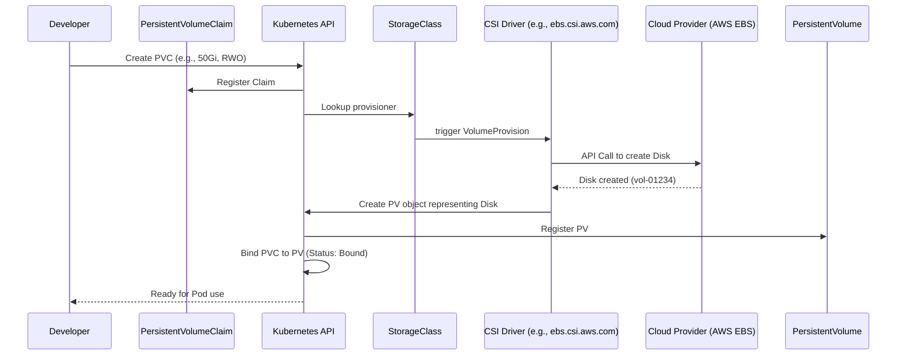
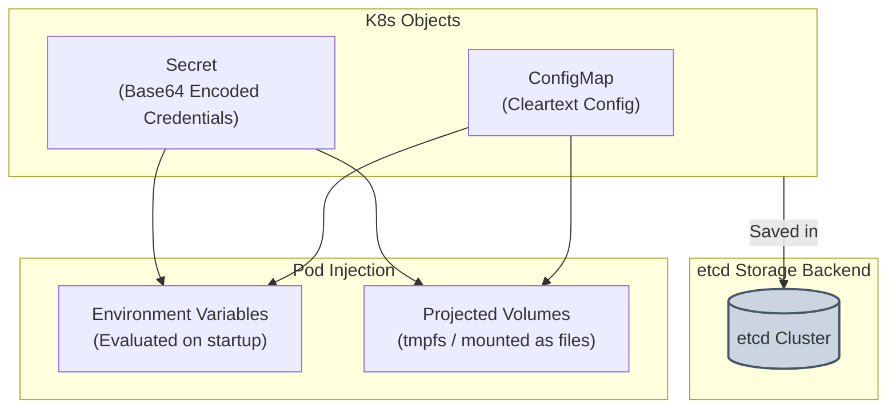
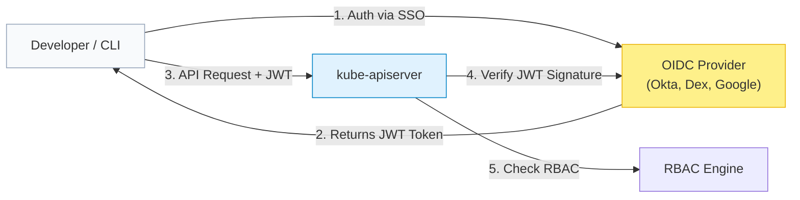

# Kubernetes: Storage, Configs, Secrets & RBAC Security

> **Cluster 02 — Module 04**  
> Focus: PV/PVC binding lifecycle, StorageClasses, Container Storage Interface (CSI), ConfigMaps, Secrets, RBAC authorization, OIDC, Pod Security Standards, and KMS encryption.

---

## 1. Advanced Kubernetes Storage: CSI & PV/PVC Binding Lifecycle

Kubernetes originally relied on "in-tree" volume plugins for cloud providers, resulting in tight coupling and slow feature delivery. The **Container Storage Interface (CSI)** abstracts storage into out-of-tree plugins, enabling standard interfaces for block and file storage systems.

### The PV/PVC Binding Lifecycle

The lifecycle of persistent storage involves several critical phases and actors, shifting from developer abstraction to hardware realization.



### Storage Access Modes
- **`ReadWriteOnce` (RWO)**: Mounted as read-write by a **single node**. Standard for AWS EBS or Azure Disk.
- **`ReadOnlyMany` (ROX)**: Mounted read-only by **many nodes**.
- **`ReadWriteMany` (RWX)**: Mounted read-write by **many nodes** simultaneously. Requires shared file systems like NFS, AWS EFS, or CephFS.
- **`ReadWriteOncePod` (RWOP)**: Mountable as read-write by a single Pod only. Introduced in K8s 1.22 for stronger isolation.

### Volume Binding Modes
- **`Immediate`**: Storage is provisioned the moment the PVC is created. (Can cause issues if storage is provisioned in AZ-A, but the Pod gets scheduled to AZ-B).
- **`WaitForFirstConsumer`**: Provisioning is delayed until a Pod using the PVC is scheduled. This guarantees the volume is created in the exact same Availability Zone (AZ) as the Pod's node.

---

## 2. ConfigMaps and Secrets: Under the Hood

To adhere to the 12-factor app methodology, configuration and sensitive data are injected into Pods at runtime.



### How K8s Secrets Actually Work
> [!WARNING]
> **Base64 is NOT Encryption!**
> By default, Secrets are stored in `etcd` as Base64-encoded plain text. Anyone with raw `etcd` access or API `get` access on secrets can decode them trivially.

### KMS Encryption at Rest (Pro-Level)
To secure secrets, Kubernetes supports **Encryption at Rest** using a Key Management Service (KMS) provider.
1. K8s API server intercepts the Secret write request.
2. It sends the Secret data to an external KMS (e.g., AWS KMS, HashiCorp Vault) for envelope encryption.
3. The KMS returns an encrypted payload (ciphertext).
4. K8s stores this ciphertext in `etcd`.
Even if `etcd` is compromised, the attacker cannot read the secrets without the external KMS key.

---

## 3. RBAC, OIDC, and Identity Management

Kubernetes **Role-Based Access Control (RBAC)** authorizes API requests, but Kubernetes itself **does not manage users**. It relies on external identity providers like **OIDC (OpenID Connect)**.

### The Identity Flow (OIDC)



### RBAC Core Components
- **`Role` / `ClusterRole`**: The *What*. Defines allowed API groups, resources, and verbs (e.g., `get pods`, `create deployments`).
- **`ServiceAccount` / `User` / `Group`**: The *Who*. The subject requesting access.
- **`RoleBinding` / `ClusterRoleBinding`**: The *Bridge*. Binds the subject to the role.

> [!TIP]
> **Principle of Least Privilege**: Never grant `cluster-admin` globally. Use finely scoped `RoleBindings` restricted to specific namespaces whenever possible.

---

## 4. Pod Security Standards (PSS) & Hardening

Historically handled by PodSecurityPolicies (PSP), security is now managed by **Pod Security Admission (PSA)** implementing **Pod Security Standards (PSS)**.

### Pod Security Levels
1. **Privileged**: Unrestricted policy, typically for system-level or infrastructure workloads (e.g., CNI plugins, CSI drivers).
2. **Baseline**: Minimally restrictive policy preventing known privilege escalations.
3. **Restricted**: Highly restrictive, enforcing strict Pod hardening best practices.

### Example: A Hardened Workload (Restricted Level)

```yaml
apiVersion: apps/v1
kind: Deployment
metadata:
  name: hardened-app
  namespace: secure-ns
spec:
  replicas: 2
  template:
    spec:
      # Enforce User/Group IDs to prevent root execution
      securityContext:
        runAsNonRoot: true
        runAsUser: 10001
        runAsGroup: 10001
        fsGroup: 10001
        seccompProfile:
          type: RuntimeDefault
      containers:
        - name: app
          image: myapp:1.0.0
          securityContext:
            allowPrivilegeEscalation: false
            readOnlyRootFilesystem: true  # Prevent runtime modifications to filesystem
            capabilities:
              drop:
                - ALL                     # Drop all Linux capabilities
          volumeMounts:
            - name: tmp-volume
              mountPath: /tmp
      volumes:
        - name: tmp-volume
          emptyDir: {}                    # Provide writable /tmp for readOnlyRootFilesystem
```

---

## 5. Official References
- [Kubernetes CSI Documentation](https://kubernetes.io/docs/concepts/storage/volumes/#csi)
- [Encrypting Secret Data at Rest](https://kubernetes.io/docs/tasks/administer-cluster/encrypt-data/)
- [OIDC Authentication in Kubernetes](https://kubernetes.io/docs/reference/access-authn-authz/authentication/#openid-connect-tokens)
- [Pod Security Standards](https://kubernetes.io/docs/concepts/security/pod-security-standards/)
