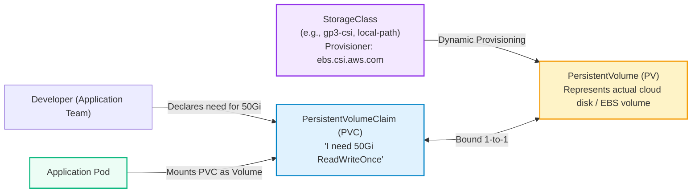
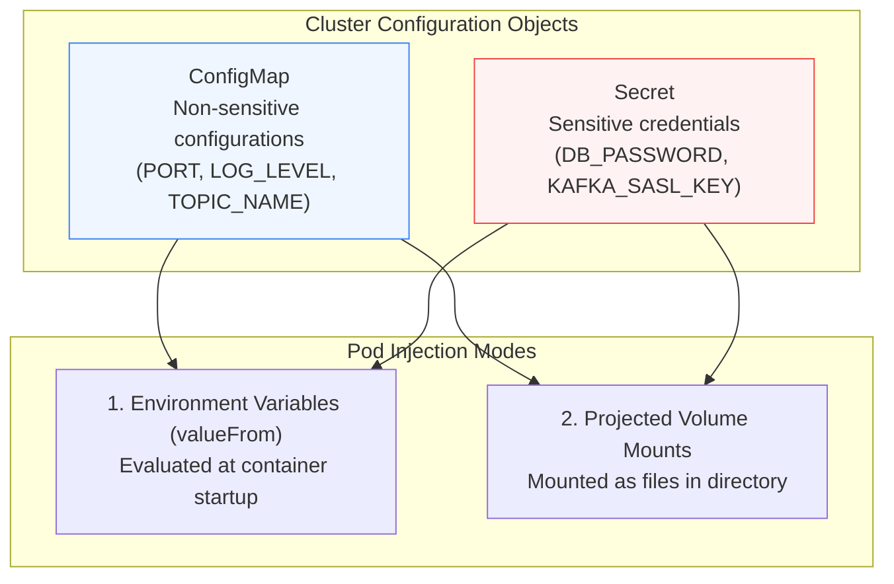
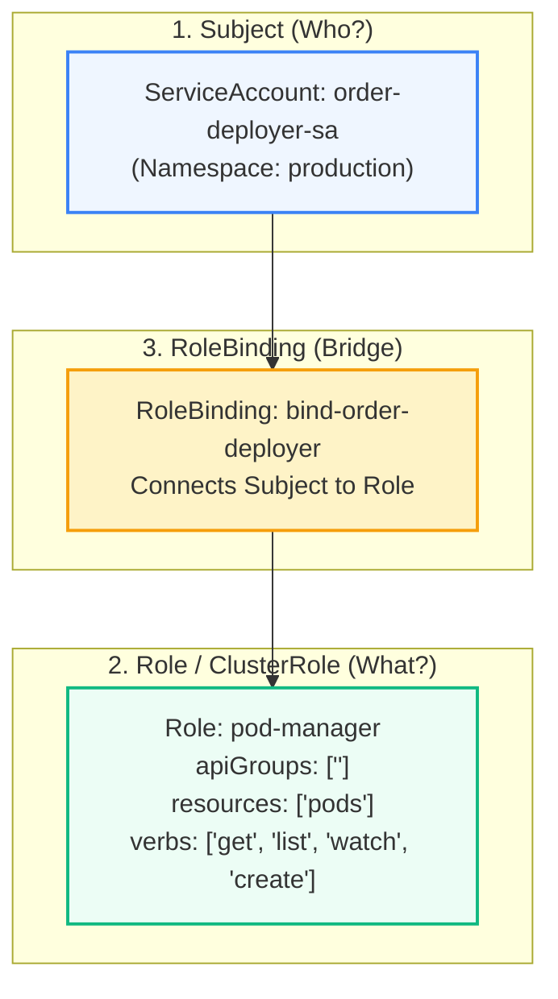

# Kubernetes: Storage, Configs, Secrets & RBAC Security

> **Cluster 02 — Module 04**  
> Focus: PV/PVC binding lifecycle, StorageClasses, ConfigMaps, Secrets, RBAC authorization, and Pod Security Standards.

---

## 1. Kubernetes Storage Architecture: PV, PVC & StorageClasses

Because container filesystems are ephemeral, persistent state requires decoupled storage volumes managed by the Container Storage Interface (CSI).



### Storage Access Modes
- **`ReadWriteOnce` (RWO)**: Volume can be mounted as read-write by a **single node**. (Default for AWS EBS, Azure Disk).
- **`ReadOnlyMany` (ROX)**: Volume can be mounted read-only by **many nodes** simultaneously.
- **`ReadWriteMany` (RWX)**: Volume can be mounted read-write by **many nodes** simultaneously (e.g. NFS, AWS EFS, CephFS).
- **`ReadWriteOncePod` (RWOP)**: Mountable as read-write by a single Pod only.

### Reclaim Policies
- **`Delete` (Default)**: When PVC is deleted, the underlying storage backend (e.g., AWS EBS volume) is permanently deleted.
- **`Retain`**: When PVC is deleted, the PV remains in `Released` state. Data is preserved for manual recovery.

---

## 2. ConfigMaps and Secrets

Configuration must be decoupled from application image artifacts according to 12-factor application guidelines.



> [!WARNING]
> **Base64 is NOT Encryption!**  
> Kubernetes Secrets are stored in `etcd` as Base64-encoded strings by default. Anyone with API access to read secrets can decode them via `echo "cGFzc3dvcmQ=" | base64 -d`.  
> **Production Best Practice**: Enable etcd encryption-at-rest (`EncryptionConfiguration`) and use the **External Secrets Operator (ESO)** to sync secrets securely from AWS Secrets Manager, HashiCorp Vault, or Azure Key Vault.

---

## 3. RBAC (Role-Based Access Control)

Kubernetes uses RBAC to determine whether an entity (User or ServiceAccount) can perform a specific **verb** (`get`, `list`, `create`, `delete`) on a **resource** (`pods`, `services`, `secrets`).



### Namespace Scoped vs Cluster Scoped
- **`Role` + `RoleBinding`**: Confined strictly to a single Kubernetes namespace.
- **`ClusterRole` + `ClusterRoleBinding`**: Cluster-wide permissions (Nodes, PersistentVolumes, Namespaces, or resources across all namespaces).

---

## 4. Hardening Workloads with SecurityContext

Production workloads should enforce the **Restricted** Pod Security Standard:

```yaml
apiVersion: apps/v1
kind: Deployment
metadata:
  name: hardened-app
spec:
  replicas: 2
  template:
    spec:
      securityContext:
        runAsNonRoot: true
        runAsUser: 10001
        runAsGroup: 10001
        fsGroup: 10001
        seccompProfile:
          type: RuntimeDefault
      containers:
        - name: app
          image: myapp:1.0.0
          securityContext:
            allowPrivilegeEscalation: false
            readOnlyRootFilesystem: true
            capabilities:
              drop:
                - ALL
          volumeMounts:
            - name: writable-temp
              mountPath: /tmp
      volumes:
        - name: writable-temp
          emptyDir: {}
```

---

## 5. Official References
- [Kubernetes Storage Overview](https://kubernetes.io/docs/concepts/storage/)
- [Configuring Pods with Secrets](https://kubernetes.io/docs/concepts/configuration/secret/)
- [Using RBAC Authorization](https://kubernetes.io/docs/reference/access-authn-authz/rbac/)
- [Pod Security Standards](https://kubernetes.io/docs/concepts/security/pod-security-standards/)
