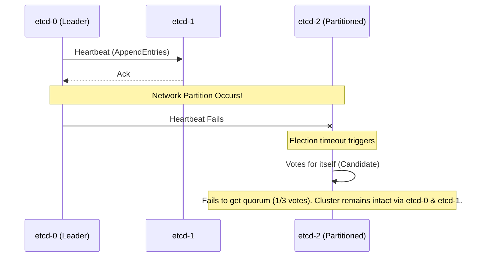
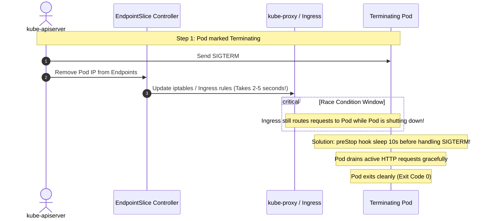

# Kubernetes: Senior Interview Questions & Production Incident Runbook

> **Cluster 02 — Module 05**  
> Focus: Senior/Staff-level interview questions, systematic pod triage flowcharts, advanced debugging (OOMKilled, CrashLoopBackOff), API & etcd performance, and Zero-Downtime deployments.

---

## 1. Production Pod Failure Diagnostic Flowchart

```mermaid
flowchart TD
    PodStatus["Pod Not Healthy / Failing"] --> CheckState{"Examine Status: kubectl describe pod <pod-name>"}
    
    CheckState -->|Pending| SchedFail["Kube-Scheduler cannot place pod:\n1. Insufficient Node CPU/RAM\n2. Taints without Tolerations\n3. NodeSelector / Affinity mismatch\n4. PVC unbound"]
    CheckState -->|ImagePullBackOff / ErrImagePull| ImageFail["Image pull failure:\n1. Typo in image name/tag\n2. Missing imagePullSecrets\n3. Rate limiting (Docker Hub 429)"]
    CheckState -->|CrashLoopBackOff| AppCrash["Container starts then exits immediately:\n1. Application threw uncaught exception\n2. Missing required ConfigMap / Secret env var\n3. Port conflict / DB connection refused"]
    CheckState -->|OOMKilled (137)| OOM["Container memory usage > resources.limits.memory\nKernel cgroup OOM killer terminated process"]
    CheckState -->|Running but 0/1 Ready| ProbeFail["Readiness probe failing:\nContainer alive but failing /health endpoint.\nTraffic is NOT routed to this pod"]

    style SchedFail fill:#fef3c7,stroke:#f59e0b,stroke-width:2px
    style ImageFail fill:#fee2e2,stroke:#ef4444,stroke-width:2px
    style AppCrash fill:#fee2e2,stroke:#ef4444,stroke-width:2px
    style OOM fill:#fee2e2,stroke:#ef4444,stroke-width:2px
    style ProbeFail fill:#e0f2fe,stroke:#0284c7,stroke-width:2px
```

---

## 2. Advanced Debugging Scenarios

### 2.1 Deep Dive: Debugging `OOMKilled` (Exit Code 137)
While standard answers cite `resources.limits.memory`, Staff-level debugging requires understanding Linux cgroups and memory types.
- **cgroups v1 vs v2**: Kubernetes uses cgroups to restrict resource usage. In cgroups v1, the kernel tracks total memory as `RSS (Resident Set Size) + Page Cache`. If your application writes large files, the Page Cache grows. If `RSS + Cache` hits the limit, the kernel tries to reclaim cache. If it can't reclaim fast enough, the OOM Killer is invoked!
- **Pro-Tip**: Look at `/sys/fs/cgroup/memory/memory.stat` (cgroup v1) or `memory.stat` (cgroup v2) to differentiate between `rss` and `cache`. 
- **Java/JVM**: Ensure `MaxRAMPercentage` is set so the JVM respects cgroup limits, rather than host memory.

### 2.2 Deep Dive: Debugging `CrashLoopBackOff`
A container exits prematurely. Standard debugging uses `kubectl logs -p`. Advanced techniques include:
- **Ephemeral Containers**: Since 1.23, you can use `kubectl debug -it <pod> --image=busybox` to attach a debugging container to a crashing pod's namespace. This allows network tests (`curl`, `nslookup`) and filesystem inspection without restarting the pod.
- **Core Dumps**: If it's a segmentation fault (Exit code 139), configure the host's `core_pattern` and mount a hostPath volume to capture core dumps for `gdb` analysis.

### 2.3 Investigating API Slowness & Control Plane Latency
When `kubectl` commands time out or HPA stops working, the Control Plane is struggling.
- **Etcd Disk Latency**: `etcd` is highly sensitive to disk I/O. If `fsync` latency exceeds 10ms, Raft elections fail, and the API server hangs. Check metrics: `etcd_disk_wal_fsync_duration_seconds`.
- **API Server Overload**: Excessive LIST operations from controllers or outdated operators can overwhelm the API server. Use `kubectl get --raw /metrics` and check `apiserver_request_duration_seconds`. 
- **Solution**: Move `etcd` to dedicated SSDs with high IOPS. Optimize operators to use Informers and field selectors instead of full LIST calls.

### 2.4 Etcd Split-Brain & Quorum Loss

- **Split-Brain**: Etcd relies on the Raft consensus algorithm, requiring (N/2)+1 nodes to agree. A true split-brain (two leaders) is mathematically impossible in Raft, but a partition can cause a minority segment to endlessly hold elections.
- **Defragmentation**: Etcd's MVCC (Multi-Version Concurrency Control) database grows over time. If it hits the 2GB/8GB limit, it stops accepting writes (Alarm: `NOSPACE`). 
- **Fix**: Run `etcdctl defrag` regularly via CronJobs and configure `auto-compaction`.

---

## 3. Zero-Downtime Rolling Update Blueprint

To achieve 100% zero-downtime deployments without dropping in-flight requests, you must handle the asynchronous nature of Endpoint removal.



### The Production Zero-Downtime Deployment Spec
```yaml
apiVersion: apps/v1
kind: Deployment
metadata:
  name: zero-downtime-app
spec:
  replicas: 3
  strategy:
    type: RollingUpdate
    rollingUpdate:
      maxSurge: 25%          
      maxUnavailable: 0      
  template:
    spec:
      terminationGracePeriodSeconds: 60
      containers:
        - name: app
          image: order-service:v2.0.0
          lifecycle:
            preStop:
              exec:
                # Delays SIGTERM so Ingress / iptables finish draining traffic
                command: ["/bin/sh", "-c", "sleep 10"]
          readinessProbe:
            httpGet:
              path: /health/ready
              port: 3000
            initialDelaySeconds: 5
            periodSeconds: 5
            failureThreshold: 3
          livenessProbe:
            httpGet:
              path: /health/live
              port: 3000
            initialDelaySeconds: 15
            periodSeconds: 10
            failureThreshold: 3
```

---

## 4. Advanced Upgrade Strategies & Lifecycle Management

How do you upgrade a cluster or workloads without disruption?
- **PodDisruptionBudgets (PDB)**: Essential for node drains. A PDB ensures a minimum number or percentage of replicas are always available (e.g., `minAvailable: 2`). If `kubectl drain` violates this, the drain is blocked until a replacement pod is scheduled.
- **Node Draining**: `kubectl drain <node> --ignore-daemonsets --delete-emptydir-data`. This evicts workloads safely, respecting PDBs and grace periods.
- **Deployment Strategies**:
  - **Blue-Green**: Deploy a completely parallel environment. Switch Ingress traffic 100% instantly. Rollback is instant. Requires 2x resources.
  - **Canary**: Shift 5%, 10%, 25% of traffic over time using tools like Argo Rollouts or Istio. Ideal for spotting hidden bugs before full exposure.

---

## 5. Top Interview Questions & Answers

### Q1: What happens from `kubectl apply -f` to a container running?
**Answer:**
1. Client sends YAML over HTTPS to `kube-apiserver`.
2. API server authenticates, authorizes (RBAC), and applies mutating/validating admission webhooks.
3. Object is persisted in `etcd`.
4. Controllers (`DeploymentController`) observe the change via Watch API and create unassigned Pod objects.
5. `kube-scheduler` filters nodes (predicates) and ranks nodes (priorities), binding the pod to a node.
6. The `kubelet` receives the pod spec, instructs the Container Runtime (CRI) to pull the image, mounts storage (CSI), configures networking (CNI), and reports `Running`.

### Q2: What is the difference between Liveness, Readiness, and Startup probes?
**Answer:**
- **Startup Probe**: Secures slow-starting apps (legacy JVM). Disables liveness/readiness checks until successful.
- **Readiness Probe**: Determines if the pod can accept traffic. Failure removes the pod IP from Service Endpoints (no traffic), but does **not** kill it.
- **Liveness Probe**: Determines if the process is healthy. Failure causes `kubelet` to kill and restart the container.

### Q3: How does `kube-proxy` route traffic in `iptables` vs `ipvs` mode?
**Answer:**
- **iptables**: Generates sequential packet filtering rules ($O(N)$ lookup). Degrades throughput at scale (thousands of services).
- **ipvs**: Uses kernel-level IP Virtual Server hash tables ($O(1)$ lookup time), supporting high connection rates and advanced load balancing (least-connection).

### Q4: What are the three QoS classes and how do they determine eviction order?
**Answer:**
1. **Guaranteed**: Requests == Limits for CPU & RAM.
2. **Burstable**: Requests < Limits.
3. **BestEffort**: Neither requests nor limits specified.  
When a node suffers MemoryPressure, `kubelet` evicts pods in reverse order: **BestEffort** first, then **Burstable** pods exceeding their requests, and **Guaranteed** pods last.

### Q5: What is a Headless Service?
**Answer:** A service with `clusterIP: None`. It doesn't use kube-proxy/iptables load balancing. Instead, CoreDNS returns multiple A-records (the individual IPs of all backing Pods). Essential for StatefulSets and discovering cluster peers (Kafka, Cassandra).

### Q6: What is the role of the `pause` container?
**Answer:** It is the foundational container in a pod that initializes and holds open the shared Linux namespaces (Network, IPC). This allows application containers to crash and restart without losing the pod's IP address.

### Q7: What are Mutating and Validating Admission Webhooks?
**Answer:** Plugins intercepting requests to the API server:
- **Mutating**: Modify payloads dynamically (e.g., injecting sidecar containers for service meshes).
- **Validating**: Enforce strict compliance policies, rejecting unauthorized setups (e.g., OPA Gatekeeper preventing root users).

---

## 6. Production Triage Command Reference

```bash
# Get pods with extended output (Node, IP)
kubectl get pods -o wide

# Describe pod to trace scheduler failures, probe failures, and lifecycle events
kubectl describe pod <pod_name>

# View previous container logs before it crashed (crucial for CrashLoopBackOff)
kubectl logs <pod_name> --previous -c <container_name>

# Check node resource pressure
kubectl describe node <node_name> | grep -A 5 Conditions

# Spawn ephemeral debug container to troubleshoot a failing pod's network/DNS
kubectl debug -it <pod_name> --image=busybox:1.28 --target=<container_name>

# Manually query API server metrics for slowness investigation
kubectl get --raw /metrics | grep apiserver_request_duration_seconds
```
