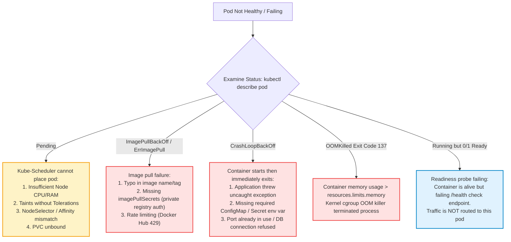

# Kubernetes: Top 20 Interview Questions & Production Incident Runbook

> **Cluster 02 — Module 05**  
> Focus: Senior interview questions, systematic pod triage flowcharts, CrashLoopBackOff, OOMKilled, and Zero-Downtime deployments.

---

## 1. Production Pod Failure Diagnostic Flowchart



---

## 2. Zero-Downtime Rolling Update Blueprint

A major interview question is: *"How do you guarantee 100% zero-downtime deployments without dropping a single in-flight HTTP request?"*


### The Production Zero-Downtime Deployment Spec
```yaml
apiVersion: apps/v1
kind: Deployment
metadata:
  name: zero-downtime-app
spec:
  replicas: 3
  strategy:
    type: RollingUpdate
    rollingUpdate:
      maxSurge: 25%          # Spin up extra pods first before killing old ones
      maxUnavailable: 0       # Never drop below 100% capacity
  template:
    spec:
      terminationGracePeriodSeconds: 60
      containers:
        - name: app
          image: order-service:v2.0.0
          lifecycle:
            preStop:
              exec:
                # Delays SIGTERM so Ingress / iptables finish draining traffic
                command: ["/bin/sh", "-c", "sleep 10"]
          # Readiness Probe: Only route traffic once app is fully booted
          readinessProbe:
            httpGet:
              path: /health/ready
              port: 3000
            initialDelaySeconds: 5
            periodSeconds: 5
            failureThreshold: 3
          # Liveness Probe: Restart pod if it deadlocks
          livenessProbe:
            httpGet:
              path: /health/live
              port: 3000
            initialDelaySeconds: 15
            periodSeconds: 10
            failureThreshold: 3
```

---

## 3. Top 20 Kubernetes Interview Questions & Answers

### Q1: What happens from `kubectl apply -f` to a container running?
**Answer:**
1. Client sends YAML over HTTPS to `kube-apiserver`.
2. API server authenticates, authorizes (RBAC), and applies mutating/validating admission webhooks.
3. Object is persisted in `etcd`.
4. Controllers (`DeploymentController`, `ReplicaSetController`) observe the change via the Watch API and create unassigned Pod objects (`nodeName: ""`).
5. `kube-scheduler` filters nodes (predicates) and ranks surviving nodes (priorities), then binds the pod to a node.
6. The `kubelet` on that node receives the pod specification, instructs the Container Runtime (via CRI) to pull the image and create the `pause` container and application containers, mounts storage (CSI) and configures networking (CNI), and reports `Running` back to the API server.

### Q2: What is the difference between Liveness, Readiness, and Startup probes?
**Answer:**
- **Startup Probe**: Determines whether the container application has finished initializing (e.g., slow legacy JVM apps). Disables liveness and readiness checks until it succeeds.
- **Readiness Probe**: Determines whether the container is ready to accept user network traffic. If it fails, the pod's IP is stripped from the Service Endpoints (no traffic is sent), but the pod is **not** killed.
- **Liveness Probe**: Determines whether the container process is alive. If it fails, `kubelet` terminates the container and restarts it according to the `restartPolicy`.

### Q3: What is `CrashLoopBackOff` and how do you debug it?
**Answer:** Kubernetes is attempting to start a container, but the application crashes immediately upon execution. To avoid thrashing system resources, `kubelet` increases the restart delay exponentially (10s, 20s, 40s... up to 5m).  
**Triage:**
1. `kubectl describe pod <pod-name>`: Check Events section.
2. `kubectl logs <pod-name> --previous`: Read logs of the container *instance that crashed immediately prior*.
3. Check missing environment variables, failed database connections, or permission errors.

### Q4: Explain `OOMKilled` (Exit code 137). How do Requests vs Limits affect this?
**Answer:** Exit code 137 ($128 + 9$) indicates `SIGKILL`. If a container consumes more memory than defined in `resources.limits.memory`, the Linux kernel cgroup OOM killer terminates it.  
- **Memory Requests**: Used strictly by `kube-scheduler` to choose which node has enough memory capacity.
- **Memory Limits**: The hard ceiling enforced by the kernel cgroup. Exceeding limits triggers an immediate kill.

### Q5: What is the difference between a Deployment and a StatefulSet?
**Answer:** Deployments manage interchangeable, stateless replicas with random pod names, shared/no state, and non-deterministic scaling. StatefulSets manage stateful workloads requiring stable, persistent network identities (`app-0`, `app-1`), dedicated storage per replica (`volumeClaimTemplates`), and ordered, sequential rollout/scale-down.

### Q6: How does `kube-proxy` route traffic in `iptables` vs `ipvs` mode?
**Answer:**
- **iptables**: Generates sequential packet filtering rules for every service and endpoint. With thousands of services, evaluating $O(N)$ sequential rules degrades packet throughput.
- **ipvs**: Uses kernel-level IP Virtual Server hash tables ($O(1)$ lookup time), supporting high connection rates and advanced balancing algorithms (least-connection, weighted).

### Q7: What happens to a cluster if `etcd` loses quorum?
**Answer:** If more than $N/2 - 1$ etcd nodes fail, etcd loses consensus. The `kube-apiserver` switches to read-only or fails requests completely: no new pods can be scheduled, updated, or created. However, **existing workloads already running on worker nodes continue executing uninterrupted**, because their local runtimes and kube-proxy iptables rules remain intact in kernel memory.

### Q8: What is a Headless Service?
**Answer:** A service with `clusterIP: None`. It assigns no virtual ClusterIP. Instead, CoreDNS returns the individual A-records of all backing Pods. This enables clients (like Kafka producers or database nodes) to discover and connect directly to individual cluster peers.

### Q9: What are the three QoS classes and how do they determine eviction order?
**Answer:**
1. **Guaranteed**: Requests == Limits for CPU & RAM.
2. **Burstable**: Requests < Limits.
3. **BestEffort**: Neither requests nor limits specified.  
When a node runs low on memory/disk, `kubelet` evicts pods in reverse order: **BestEffort** first, then **Burstable** pods exceeding their requests, and **Guaranteed** pods last.

### Q10: How does CoreDNS resolve `<service>.<namespace>.svc.cluster.local`?
**Answer:** CoreDNS watches the Kubernetes API for Service and Endpoint objects. When a Service is created, CoreDNS creates an `A` record pointing to the Service's ClusterIP (or multiple A records pointing to pod IPs if Headless).

### Q11: What is Pod Anti-Affinity?
**Answer:** A scheduling rule instructing `kube-scheduler` to avoid placing pods with matching labels on the same node or across the same availability zone. Used to ensure high availability during hardware or zone outages.

### Q12: What is the difference between Taints/Tolerations and Node Affinity?
**Answer:** Node Affinity **attracts** pods to specific nodes. Taints allow a node to **repel** pods unless the pod explicitly has a matching Toleration.

### Q13: What is a DaemonSet and when is it used?
**Answer:** Ensures that all (or some) nodes run exactly one copy of a Pod. When nodes are added, pods are automatically scheduled on them. Used for node-level infrastructure: log collection (Fluentd), node monitoring (Prometheus Node Exporter), and networking agents (Calico/Cilium CNI).

### Q14: What is the role of the `pause` container?
**Answer:** It is the first container initialized in a pod. It creates and holds open the shared Linux namespaces (Network, IPC). When application containers restart or crash, the network identity (IP address, port bindings) remains preserved because the pause container remains alive.

### Q15: How does Horizontal Pod Autoscaler (HPA) make scaling decisions?
**Answer:** HPA queries the Metrics Server (or custom Prometheus adapter) every 15 seconds. It computes the desired replica count using the formula:
$$\text{Desired Replicas} = \left\lceil \text{Current Replicas} \times \left( \frac{\text{Current Metric Value}}{\text{Target Metric Value}} \right) \right\rceil$$

### Q16: How do you debug a Pod stuck in `Pending`?
**Answer:** Run `kubectl describe pod <pod-name>`. Read the `Events` log at the bottom. Typical root causes:
1. `0/N nodes available: Insufficient cpu/memory`.
2. PVC is not bound (`PersistentVolumeClaim not found`).
3. NodeSelector or NodeAffinity did not match any nodes.
4. Node is tainted and pod lacks matching toleration.

### Q17: What are Mutating and Validating Admission Webhooks?
**Answer:** Plugins in `kube-apiserver`:
- **Mutating Webhooks**: Modify incoming requests before persistence (e.g. injecting sidecar proxies like Istio/Linkerd, adding default security contexts).
- **Validating Webhooks**: Reject requests that violate organizational compliance policies (e.g. OPA Gatekeeper, Kyverno rejecting images from untrusted registries or containers running as root).

### Q18: What is the difference between a Role and a ClusterRole?
**Answer:** A `Role` binds permissions strictly within a single namespace (e.g., read pods in `staging`). A `ClusterRole` defines permissions cluster-wide (e.g., read nodes, persistent volumes, or pods across all namespaces).

### Q19: What is `terminationGracePeriodSeconds` and how does it relate to the `preStop` hook?
**Answer:** The total duration Kubernetes grants a pod to shut down gracefully after receiving deletion. First, the `preStop` hook executes. Then, `SIGTERM` is sent to the container processes. If processes have not exited before the grace period expires (default 30s), `SIGKILL` is sent immediately.

### Q20: What is the Container Storage Interface (CSI)?
**Answer:** An open standard specification that allows storage vendors to develop storage plugins for Kubernetes out-of-tree without modifying core Kubernetes source code.

---

## 4. Production Triage Command Reference

```bash
# Get pods with extended output (Node, IP)
kubectl get pods -o wide

# Describe pod to see scheduler failures, probe failures, and image pull events
kubectl describe pod <pod_name>

# View previous container logs before it crashed
kubectl logs <pod_name> --previous -c <container_name>

# Check node resource pressure (MemoryPressure, DiskPressure, PIDPressure)
kubectl describe node <node_name> | grep -A 5 Conditions

# View top resource-consuming pods
kubectl top pods --sort-by=memory
```
