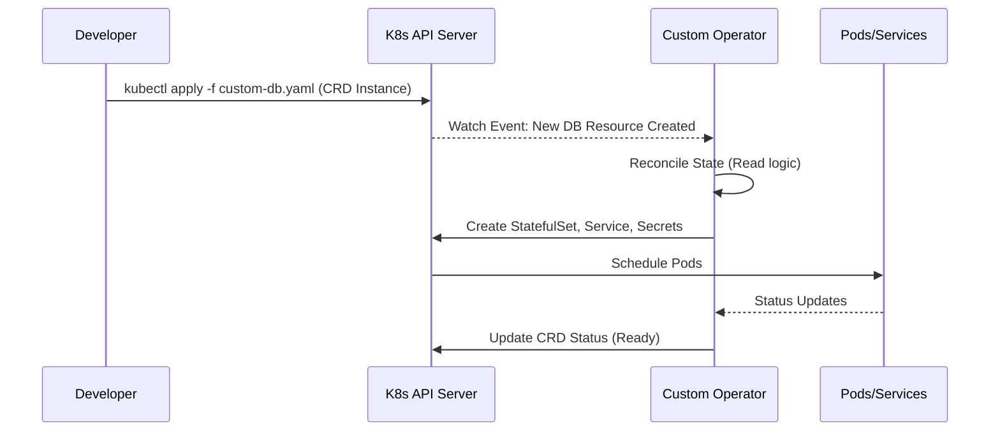

# Kubernetes: Pro CLI Cheat Sheet & Practical Hands-On Labs

> **Cluster 02 — Module 06**  
> Focus: Essential `kubectl` operational cheat sheet, advanced debugging, imperative vs declarative paradigms, CRDs, and production workload deployment.

---

## 1. Core Architecture & Workflow

Before diving into the CLI, it is essential to understand how `kubectl` commands interact with the Kubernetes control plane.

```mermaid
flowchart TD
    A[Developer/DevOps] -->|kubectl (REST API Calls)| B[API Server]
    B -->|Persists State| C[(etcd)]
    B -->|Schedules Pods| D[Kube-Scheduler]
    B -->|Manages State| E[Controller Manager]
    B <-->|Commands & Status| F[Kubelet on Worker Node]
    F -->|Creates Containers| G[Container Runtime]
    F -->|Manages Networking| H[Kube-Proxy]
```

---

## 2. Imperative vs. Declarative Management

Kubernetes offers two primary ways to manage resources:

### Imperative Commands
Operate directly on live objects. Best for quick tests, debugging, or generating template YAMLs.
* **Pros:** Fast, easy to learn.
* **Cons:** Not version-controlled, hard to audit or reproduce.
* **Examples:**
  * `kubectl run my-pod --image=nginx`
  * `kubectl create deployment my-dep --image=nginx`
  * `kubectl expose deployment my-dep --port=80`

### Declarative Configuration
Define the *desired state* in YAML/JSON files. Kubernetes reconciles the actual state to match the desired state.
* **Pros:** GitOps friendly, version-controllable, self-documenting, repeatable.
* **Cons:** Steeper learning curve, requires writing YAML.
* **Example:** `kubectl apply -f deployment.yaml`

> **Pro Tip:** Combine both! Use imperative commands with `--dry-run=client -o yaml` to generate base manifests, then save and apply declaratively:
> `kubectl create deployment web --image=nginx --dry-run=client -o yaml > web-deploy.yaml`

---

## 3. Advanced `kubectl` Cheat Sheet & Aliases

### Power Aliases
Adding these to your `~/.bashrc` or `~/.zshrc` saves hundreds of keystrokes:
```bash
alias k='kubectl'
alias kg='kubectl get'
alias kd='kubectl describe'
alias kdel='kubectl delete'
alias kl='kubectl logs'
alias kex='kubectl exec -it'
alias ktx='kubectx' # Requires kubectx
alias kns='kubens'  # Requires kubectx
```

### Context & Configuration
```bash
# View API resources and their short names (e.g., po, deploy, svc)
kubectl api-resources

# Switch default namespace for all future commands (without kubens)
kubectl config set-context --current --namespace=production
```

### JSONPath & Resource Filtering Power Tricks
```bash
# Get all failing pods across ALL namespaces
kubectl get pods -A --field-selector status.phase!=Running,status.phase!=Succeeded

# Print only Pod names and their IP addresses using jsonpath
kubectl get pods -o jsonpath='{range .items[*]}{.metadata.name}{"\t"}{.status.podIP}{"\n"}{end}'

# Sort nodes by memory capacity
kubectl get nodes --sort-by=.status.capacity.memory
```

---

## 4. Pro-Level Debugging & Live Triage

When things go wrong in production, these commands are your lifeline.

```bash
# Stream live logs from all pods matching a label selector
kubectl logs -l app=order-service -f --tail=100

# Stream logs for a specific container in a multi-container pod
kubectl logs <pod_name> -c <container_name> -f

# Port-forwarding: Forward local port 8080 to Pod or Service port 3000
kubectl port-forward service/order-service 8080:3000

# Run a temporary diagnostic pod (curl/wget/ping)
kubectl run -it --rm debug-pod --image=radial/busyboxplus:curl -- restart=Never
```

### Ephemeral Containers (Advanced)
If a pod crashes on startup or lacks a shell (e.g., distroless images), inject an ephemeral debug container into the running pod's namespace:
```bash
# Attach a 'netshoot' container to troubleshoot networking issues
kubectl debug -it <pod_name> --image=nicolaka/netshoot --target=<container_name>
```

---

## 5. Custom Resource Definitions (CRDs) & Operators

Kubernetes is extensible. You can define your own resources (CRDs) and build **Operators** (custom controllers) to manage them. This is how databases, message queues, and complex stateful apps are managed natively in K8s.


* **CRD (Custom Resource Definition):** Extends the Kubernetes API (e.g., creating a `Database` or `Certificate` resource type).
* **Operator:** A pod running a custom controller that watches CRDs and makes the cluster match the desired state by creating native resources (Pods, Deployments, etc.).

---

## 6. Hands-On Lab 1: Local Cluster Setup (Kind)

`kind` (Kubernetes in Docker) is the industry standard for running local clusters.

1. **Install `kind`:**
   ```bash
   # Windows (via Chocolatey)
   choco install kind
   ```

2. **Create multi-node cluster config (`kind-config.yaml`):**
   ```yaml
   kind: Cluster
   apiVersion: kind.x-k8s.io/v1alpha4
   nodes:
     - role: control-plane
     - role: worker
     - role: worker
   ```

3. **Spin up the cluster:**
   ```bash
   kind create cluster --name lab-cluster --config kind-config.yaml
   
   # Verify nodes
   kubectl get nodes
   ```

---

## 7. Hands-On Lab 2: Self-Healing & Health Probes

Kubernetes keeps apps highly available through health probes.

Create a file named `resilient-app.yaml`:

```yaml
apiVersion: v1
kind: ConfigMap
metadata:
  name: app-config
data:
  APP_ENV: "production"
  LOG_LEVEL: "info"
---
apiVersion: apps/v1
kind: Deployment
metadata:
  name: resilient-demo
  labels:
    app: resilient-demo
spec:
  replicas: 3
  selector:
    matchLabels:
      app: resilient-demo
  template:
    metadata:
      labels:
        app: resilient-demo
    spec:
      containers:
        - name: web
          image: nginx:alpine
          ports:
            - containerPort: 80
          envFrom:
            - configMapRef:
                name: app-config
          resources:
            requests:
              cpu: "100m"
              memory: "64Mi"
            limits:
              cpu: "250m"
              memory: "128Mi"
          # Readiness Probe: Is the app ready to receive traffic?
          readinessProbe:
            httpGet:
              path: /
              port: 80
            initialDelaySeconds: 3
            periodSeconds: 5
          # Liveness Probe: Is the app deadlocked/frozen and needs a restart?
          livenessProbe:
            httpGet:
              path: /
              port: 80
            initialDelaySeconds: 5
            periodSeconds: 10
---
apiVersion: v1
kind: Service
metadata:
  name: resilient-service
spec:
  type: ClusterIP
  selector:
    app: resilient-demo
  ports:
    - port: 80
      targetPort: 80
```

### Verification & Testing
```bash
# 1. Apply the manifests
kubectl apply -f resilient-app.yaml

# 2. Verify all 3 pods reach 1/1 Ready status
kubectl get pods -l app=resilient-demo

# 3. Simulate failure: Kill the Nginx process in one pod
POD_NAME=$(kubectl get pods -l app=resilient-demo -o jsonpath='{.items[0].metadata.name}')
kubectl exec -it $POD_NAME -- nginx -s stop

# 4. Observe self-healing: Kubelet detects liveness probe failure and restarts the container!
kubectl get pods -l app=resilient-demo -w
```
