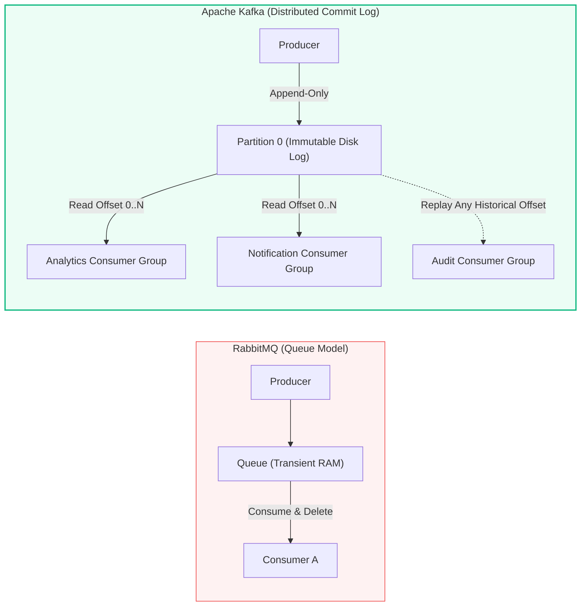
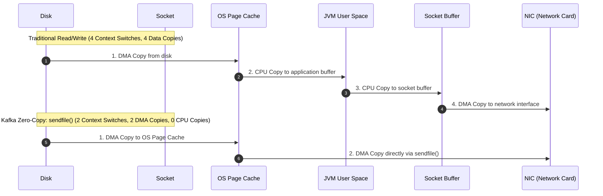
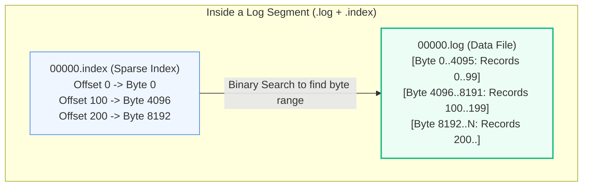
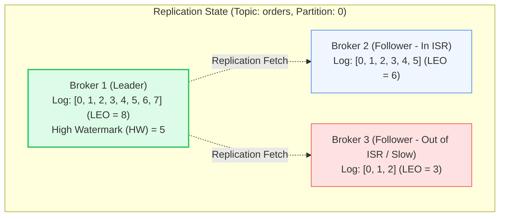

# Apache Kafka: Architecture, Storage & Commit Log Internals

> **Cluster 03 — Module 01**  
> Focus: Distributed commit logs, OS page cache, Zero-Copy data transfer, partitions, ISR, High Watermark, and broker internals.

---

## 1. What is Kafka? (Event Store vs Traditional Queues)

Traditional message brokers (e.g. RabbitMQ, ActiveMQ) maintain message queues where messages are discarded once acknowledged by consumers. **Apache Kafka** is a distributed, append-only, immutable **commit log**. Messages are written sequentially to disk and retained according to time or size policies, allowing multiple independent consumer groups to read at their own pace and replay history.



---

## 2. The Distributed Commit Log & Disk Performance Secrets

A common question: *"How can Kafka write to spinning disks or SSDs and still process millions of events per second?"*

Kafka achieves incredible speed through two operating system level mechanisms:

### A. Sequential Disk I/O & OS Page Cache
- Sequential disk access is fast—often rivaling random memory access throughput (up to 600 MB/s on modern drives).
- Kafka avoids allocating giant JVM memory heaps (which trigger painful garbage collection pauses). Instead, it writes directly to the OS **Page Cache** (RAM managed by the Linux kernel). If a consumer is caught up, data is read directly from kernel memory without touching the physical disk!

### B. Linux Zero-Copy (`sendfile()` Syscall)
In traditional network transfers, data is copied 4 times across kernel and user space boundaries:



By bypassing user space completely, Kafka eliminates CPU copy cycles and reduces context switches by 50%.

---

## 3. Log Anatomy: Segments, Indexes & Offsets

A Kafka **Topic** is divided into one or more **Partitions**. A partition is physically represented as a directory of log segment files on the broker's filesystem:

```
/var/lib/kafka/data/orders.v1-0/
├── 00000000000000000000.log         <-- Actual raw message records
├── 00000000000000000000.index       <-- Maps Logical Offset -> Physical Byte Position
├── 00000000000000000000.timeindex   <-- Maps Timestamp -> Logical Offset
├── 00000000000000104523.log         <-- Active rolling segment
├── 00000000000000104523.index
└── leader-epoch-checkpoint
```



Kafka uses a **Sparse Index**: rather than indexing every single message, it indexes every $N$ bytes (default 4KB). To find message offset `142`, it binary-searches the `.index` file to find offset `100` at byte `4096`, then scans sequentially in the `.log` file until offset `142` is located.

---

## 4. Replication: Leader, Followers, ISR, and High Watermark

Every partition has one **Leader** broker and zero or more **Follower** replica brokers.
- **Leader**: Handles all read and write requests from clients.
- **Followers**: Fetch messages sequentially from the Leader to stay synchronized.



### Critical Terms:
- **LEO (Log End Offset)**: The offset of the next record to be written in the log.
- **ISR (In-Sync Replicas)**: The subset of replica brokers that are actively caught up with the leader within `replica.lag.time.max.ms` (default 30 seconds).
- **HW (High Watermark)**: The highest offset that has been replicated to **all** in-sync replicas in the ISR.
  > [!IMPORTANT]
  > **Consumers can ONLY read up to the High Watermark (HW)**. Uncommitted records beyond the HW are invisible to consumers to guarantee consistency during leader failover.

---

## 5. Official References
- [Apache Kafka Documentation: Design Principles](https://kafka.apache.org/documentation/#design)
- [Kafka Log Compaction & Storage Internals](https://kafka.apache.org/documentation/#compaction)
- [Linux Zero-Copy Architecture Paper](https://www.linuxjournal.com/article/6345)
