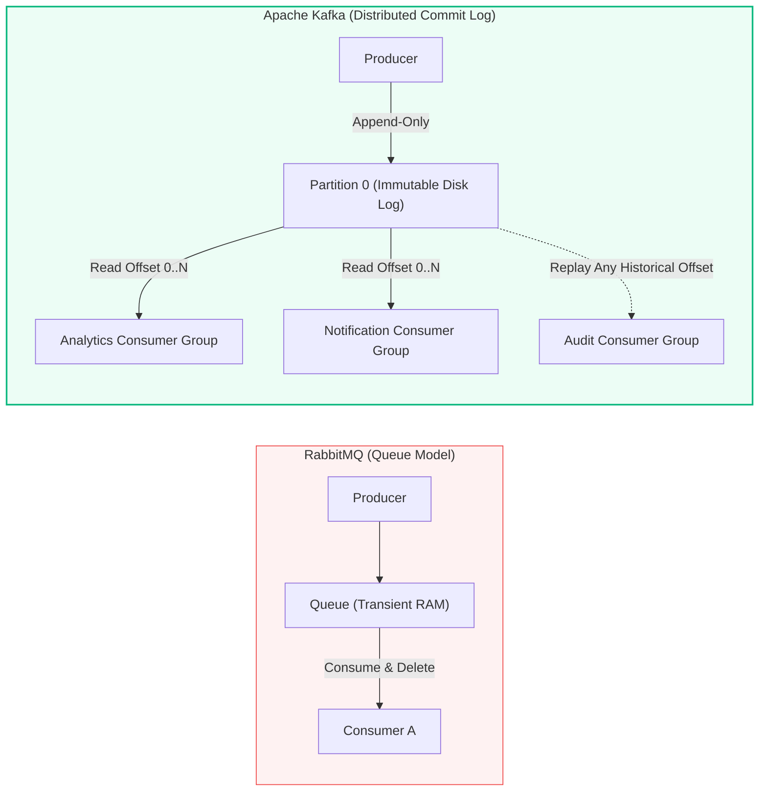
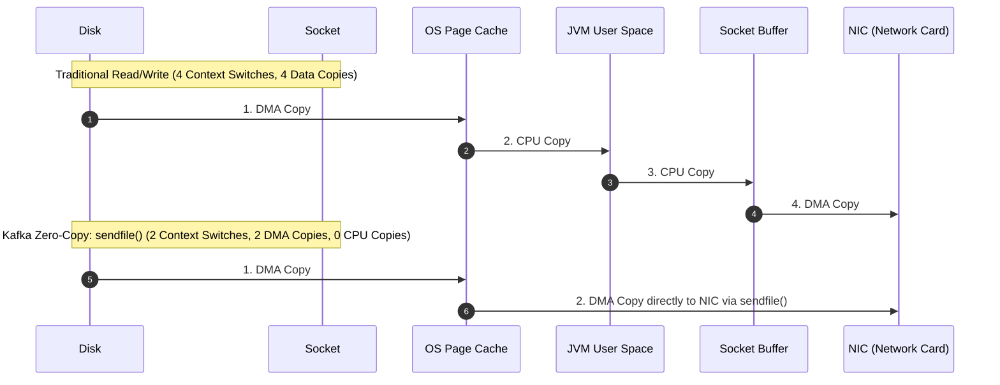
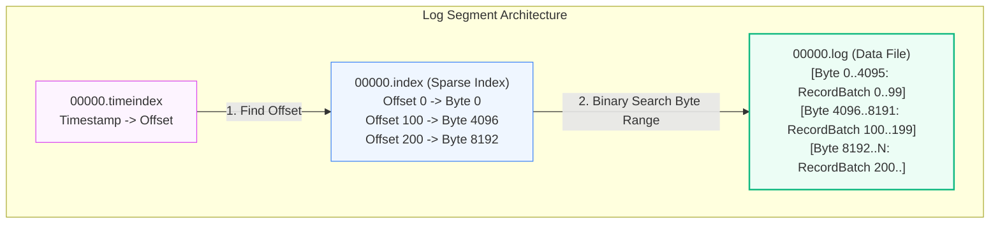
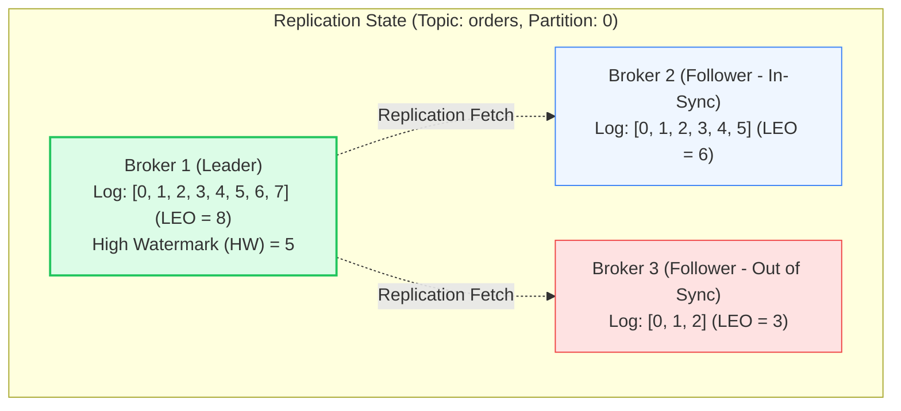

# Apache Kafka: Architecture, Storage & Commit Log Internals

> **Cluster 03 — Module 01**
> Focus: Distributed commit logs, OS page cache, Zero-Copy data transfer, partitions, ISR, High Watermark, Leader Epochs, and broker internals.

---

## 1. Event Store vs. Traditional Queues: A Paradigm Shift

While traditional message brokers (e.g., RabbitMQ, ActiveMQ) typically implement transient queues where messages are aggressively discarded upon consumer acknowledgment, **Apache Kafka** introduces a fundamentally different model: the **distributed, append-only, immutable commit log**.

In traditional systems, the broker's primary goal is to route messages and keep queues empty. In Kafka, the broker acts as a specialized, high-performance **event store**. Messages are persisted to disk and retained based on time or size limits (e.g., retain for 7 days, or 100GB). This decoupling allows multiple independent consumer groups to read the same data at entirely different paces, and critically, permits historical event replay.



---

## 2. The Distributed Commit Log: Hardware Symbiosis

A fundamental question for newcomers is: *"How can Kafka persist everything to spinning HDDs or SSDs and still process gigabytes of data per second?"*

Kafka achieves this by working in extreme harmony with the underlying Linux operating system rather than relying on JVM heap management.

### A. Sequential Disk I/O & OS Page Cache
Kafka’s workload is strictly sequential append-only writes and sequential reads. Modern disks (even 7200 RPM HDDs) can achieve up to 300–600 MB/s for sequential I/O, matching or exceeding random RAM access speeds.
Furthermore, Kafka bypasses application-level caching. Instead, it relies on the Linux **Page Cache**. Data is written directly to OS memory buffers (dirty pages), which the kernel flushes to disk asynchronously. When a consumer reads data, if it's a real-time consumer (tailing the log), the data is served directly from the kernel's Page Cache—without a single disk read or touching the JVM heap!

### B. Linux Zero-Copy (`sendfile()` and Scatter-Gather)
In traditional I/O, serving data over the network requires context switches and redundant memory copies between kernel and user space. Kafka leverages the `sendfile()` system call (alongside NIC scatter-gather capabilities) to execute a **Zero-Copy** transfer.



By eliminating user-space buffering, Kafka eradicates CPU memory copies and cuts context switches in half, freeing the CPU to handle millions of connections and metadata operations.

---

## 3. Log Anatomy: Segments, Indexes, and Epochs

A Kafka **Topic** is a logical concept divided into **Partitions** for horizontal scalability. Physically, a partition is a directory on a broker's filesystem, composed of rolling **Log Segments**.

```
/var/lib/kafka/data/orders.v1-0/
├── 00000000000000000000.log         <-- Raw record batches
├── 00000000000000000000.index       <-- Maps logical Offset to physical Byte Position
├── 00000000000000000000.timeindex   <-- Maps Timestamp to logical Offset
├── 00000000000000104523.log         <-- Active rolling segment (append mode)
├── 00000000000000104523.index
└── leader-epoch-checkpoint          <-- Mitigates data loss during failover
```



### Sparse Indexing
Kafka uses a **Sparse Index**. It does not map every single offset. Instead, it creates an index entry every `index.interval.bytes` (default 4KB). When a consumer requests offset `142`, Kafka binary searches the `.index` to find the nearest lower offset (e.g., `100` at byte `4096`), jumps to that byte in the `.log` file, and sequentially scans forward. This keeps the index small enough to fit entirely in memory.

---

## 4. Replication, High Watermark, and Leader Epochs

Kafka achieves high availability through replication. Every partition has one **Leader** and zero or more **Followers**.

- **Leader**: Absorbs all writes and reads.
- **Followers**: Continuously issue `Fetch` requests to the leader to mirror the log.



### The Anatomy of Consistency: LEO, ISR, and HW
- **LEO (Log End Offset)**: The offset of the *next* message to be written. The leader and each follower maintain their own LEO.
- **ISR (In-Sync Replicas)**: The dynamic subset of replicas fully caught up with the leader (within `replica.lag.time.max.ms`). If a broker stalls, it is evicted from the ISR.
- **HW (High Watermark)**: The highest offset successfully replicated to **all** nodes currently in the ISR. 

> [!IMPORTANT]
> **Visibility Guarantee**: Consumers can **only** read up to the High Watermark. Messages between the HW and LEO are uncommitted and invisible. This ensures that if the leader crashes, any visible message is guaranteed to exist on the new leader.

### Producer Guarantees
Durability is governed by the producer's `acks` setting combined with the topic's `min.insync.replicas`:
- `acks=0`: Fire and forget.
- `acks=1`: Leader acknowledges once written to its local log.
- `acks=all`: Leader acknowledges only after the HW advances (all ISR members have replicated it). Combined with `min.insync.replicas=2`, this guarantees zero data loss if a single node fails.

### Leader Epochs (Avoiding Data Divergence)
To handle complex network partitions and split-brain scenarios where HW propagation is delayed, Kafka uses the `leader-epoch-checkpoint` file. An epoch is a monotonically increasing counter tracking leadership changes. Replicas use this to accurately truncate divergent logs upon reconnecting, preventing data loss or corruption anomalies that existed in older Kafka versions relying purely on HW.

---

## 5. Log Compaction

Kafka also supports **Log Compaction**, a policy where Kafka retains only the *latest* known value for each key, rather than dropping old data by time. This is heavily used for materializing state (e.g., a table of user balances).
Deleting a key is achieved by writing a **Tombstone** message (a record with the key and a `null` payload), which the compactor eventually recognizes and uses to wipe the key entirely from the log.

---

## References & Pro-Reading
- [KIP-101: Alter Replication Protocol to use Leader Epochs](https://cwiki.apache.org/confluence/display/KAFKA/KIP-101+-+Alter+Replication+Protocol+to+use+Leader+Epochs)
- [Kafka Log Compaction Internals](https://kafka.apache.org/documentation/#compaction)
- [Linux Zero-Copy Architecture Paper](https://www.linuxjournal.com/article/6345)
- [Optimizing Kafka for Cloud Storage (Tiered Storage KIP-405)](https://cwiki.apache.org/confluence/display/KAFKA/KIP-405%3A+Kafka+Tiered+Storage)
