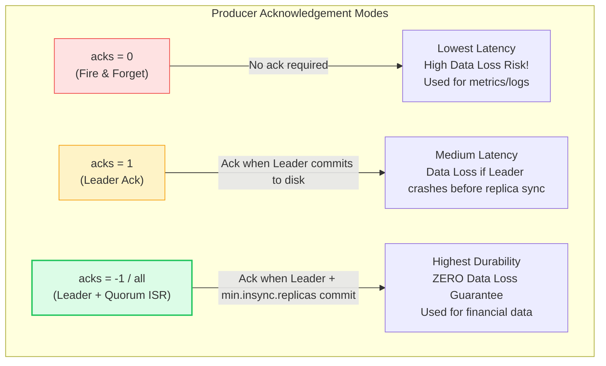
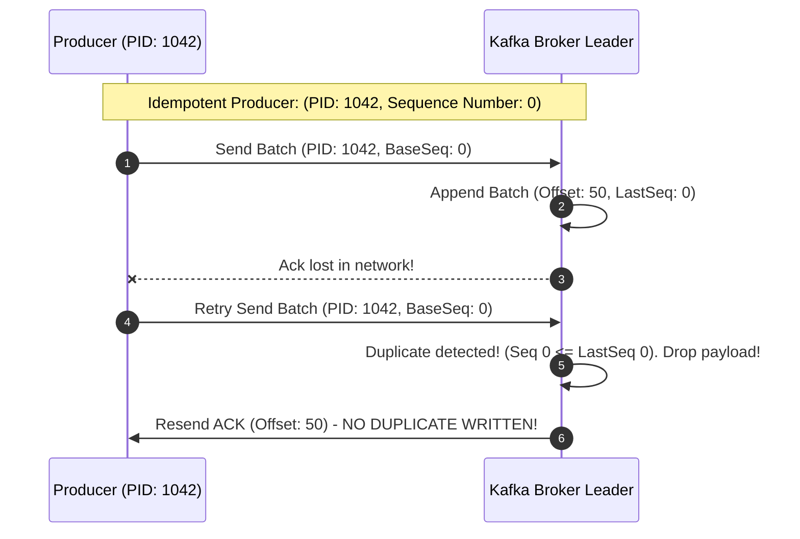

# Kafka: Producer Internals, Batching & Delivery Semantics (Pro Deep Dive)

> **Cluster 03 — Module 02**  
> Focus: RecordAccumulator, BufferPool internals, Threading models, partitioners, Acks configurations, idempotent & transactional producers, and zero-data-loss durability guarantees.

---

## 1. Producer Architecture & The Multi-Threaded Pipeline

Publishing a message to Kafka is not a simple blocking network call; it involves a sophisticated, multi-stage, asynchronous pipeline operating across multiple threads within the client JVM.

```mermaid
flowchart TD
    subgraph Client_App["Application Thread"]
        Record["ProducerRecord(topic, key, value, headers)"] --> Interceptors["Producer Interceptors\n(Optional mutation/metrics)"]
        Interceptors --> Serializer["Key & Value Serializers\n(String, JSON, Avro, Protobuf)"]
        Serializer --> Partitioner["Partitioner\n(Hash Murmur2, Sticky, or Custom)"]
        Partitioner --> Accumulator["RecordAccumulator (In-Memory Buffer)\nOrganized by TopicPartition Deques"]
    end

    subgraph Background_Thread["I/O Sender Thread"]
        Sender["Sender Thread (Java NIO)\nDrains batches when batch.size or linger.ms triggers"]
        Accumulator -->|Dequeued Batches| Sender
        Sender --> NetworkClient["NetworkClient\nHandles TCP Connections, In-Flight Requests"]
    end

    subgraph Kafka_Cluster["Kafka Cluster"]
        BrokerLeader["Partition Leader Broker\nAppends batch to disk log"]
        NetworkClient -->|Async Socket I/O (TCP)| BrokerLeader
    end

    style Accumulator fill:#e0f2fe,stroke:#0284c7,stroke-width:2px
    style Sender fill:#fef3c7,stroke:#f59e0b,stroke-width:2px
    style BrokerLeader fill:#ecfdf5,stroke:#10b981,stroke-width:2px
```

### 1.1 The RecordAccumulator & BufferPool (Deep Dive)
When the application calls `producer.send()`, the record doesn't go to the network immediately. It enters the **RecordAccumulator**.
- **Memory Management (`buffer.memory`)**: The producer allocates a chunk of memory (default 32MB) for the `BufferPool`.
- **Deque per Partition**: Internally, the Accumulator maintains a `ConcurrentMap<TopicPartition, Deque<ProducerBatch>>`. Records for a specific partition are appended to the last active `ProducerBatch` in that partition's deque.
- **Blocking Behavior**: If the application produces data faster than the Sender thread can drain it, the `BufferPool` exhausts. Future `send()` calls will block up to `max.block.ms` (default 60s). If memory isn't freed by then, a `TimeoutException` is thrown.

---

## 2. Partitioning Strategies & Ordering Guarantees

> [!IMPORTANT]
> **Kafka ONLY guarantees strict ordering WITHIN a single partition.** It does NOT guarantee ordering across different partitions of the same topic.

1. **Explicit Key Provided (`key != null`)**:
   Kafka computes the hash of the key using **Murmur2**:
   $$\text{Partition} = \text{abs}(\text{Murmur2}(\text{key})) \pmod{\text{Total Partitions}}$$
   *Pro Insight*: If the total number of partitions changes (e.g., adding partitions), the hash routing changes. Therefore, for topics requiring strict key ordering, *never* change the partition count after creation.
   
2. **Null Key (`key == null`) - Sticky Partitioner (KIP-480)**:
   Instead of round-robining individual records (which creates many small, inefficient batches), the Sticky Partitioner "sticks" to a single partition until the batch is full or `linger.ms` is reached, then switches to another partition. This drastically minimizes network request overhead, maximizes compression efficiency, and reduces broker CPU load.

3. **Custom Partitioners**: Implement the `org.apache.kafka.clients.producer.Partitioner` interface for specialized routing (e.g., routing premium customer IDs to dedicated high-performance partitions).

---

## 3. High Throughput & Low Latency Tuning

Producers group records into batches. Tuning these settings defines the trade-off between throughput and latency:

| Parameter | Default | Production Tuning | Purpose / Deep Insight |
| :--- | :--- | :--- | :--- |
| **`batch.size`** | `16384` (16 KB) | `65536` (64 KB) or `131072` (128 KB) | Maximum bytes of data to accumulate per partition batch before sending immediately. Larger batches = better compression and throughput. |
| **`linger.ms`** | `0` ms | `5` to `50` ms | Artificial delay to wait for more records to fill the batch. A value > 0 is crucial for high-volume producers to prevent sending micro-batches. |
| **`compression.type`**| `none` | `lz4`, `zstd`, or `snappy` | Compresses batches. Done entirely on the client, saving network bandwidth (often 40-70%) and broker disk space. The broker stores the compressed batch as-is. |
| **`buffer.memory`** | `33554432` (32 MB) | `67108864` (64 MB)+ | Total memory allocated for pending unsent batches. Increase if `send()` blocks frequently due to bursty traffic. |
| **`max.in.flight.requests.per.connection`** | `5` | `1` (strict order) or `5` (idempotent) | Number of unacknowledged requests allowed per broker connection. > 1 allows pipelining (higher throughput). |

---

## 4. Delivery Semantics & Acknowledgement Levels (`acks`)

The `acks` parameter dictates the durability guarantee required from the broker cluster before the client considers a write successful.



### 4.1 The "Golden Triangle" of Zero Data Loss
To guarantee financial-grade message durability, you MUST configure these three settings in unison:

1. **`acks=all`** (Producer Config): Wait for all in-sync replicas (ISR) to acknowledge.
2. **`replication.factor=3`** (Topic Config): Every partition has 3 copies across 3 distinct physical brokers.
3. **`min.insync.replicas=2`** (Broker/Topic Config): The broker will reject writes with a `NotEnoughReplicasException` if fewer than 2 replicas are alive and in-sync. This prevents the scenario where `acks=all` succeeds but only the leader was alive, negating the redundancy.

---

## 5. Advanced Semantics: Idempotence and Transactions

### 5.1 Idempotent Producer (`enable.idempotence=true`)
Network timeouts are ambiguous. Did the request fail to reach the broker, or did the broker process it but the ACK failed to reach the producer? If the producer retries, a duplicate record might be appended.

**Idempotence** (enabled by default since Kafka 3.0) guarantees exactly-once processing *for a single partition during a single producer session*.


*How it works*: The broker tracks the highest Sequence Number received for each `(Producer ID, TopicPartition)`. If a batch arrives with a sequence number less than or equal to the tracked sequence, it is identified as a duplicate and ignored.

*Note on Ordering*: When idempotence is enabled, you can safely set `max.in.flight.requests.per.connection` up to `5` while still maintaining strict ordering, because the broker uses the sequence numbers to reorder or reject out-of-order batches.

### 5.2 Transactional Producer (Exactly-Once Semantics - EOS)
Introduced in KIP-98, transactions allow a producer to write to *multiple* partitions across *multiple* topics atomically. Either all records are successfully committed and visible to consumers, or none are.

- **Usage**: Crucial for stream processing (e.g., Kafka Streams consumes from Topic A, processes, and writes to Topic B). The read, process, and write must happen atomically.
- **Mechanism**: 
  - Requires `transactional.id` configured on the producer.
  - Relies on the **Transaction Coordinator** broker and an internal `__transaction_state` topic.
  - The producer writes data with a "Transaction ID". Once complete, it sends a commit marker.
  - **Consumers** must set `isolation.level=read_committed` to only read messages that are part of committed transactions.

---

## 6. Official References & Deep Reads
- [Kafka Producer Configuration Reference](https://kafka.apache.org/documentation/#producerconfigs)
- [KIP-98: Exactly Once Delivery and Transactions](https://cwiki.apache.org/confluence/display/KAFKA/KIP-98+-+Exactly+Once+Delivery+and+Transactional+Messaging)
- [KIP-480: Sticky Partitioner Design](https://cwiki.apache.org/confluence/display/KAFKA/KIP-480%3A+Sticky+Partitioner)
- [KIP-360: Improve reliability of idempotent/transactional producer](https://cwiki.apache.org/confluence/display/KAFKA/KIP-360%3A+Improve+reliability+of+idempotent%2Ftransactional+producer)
