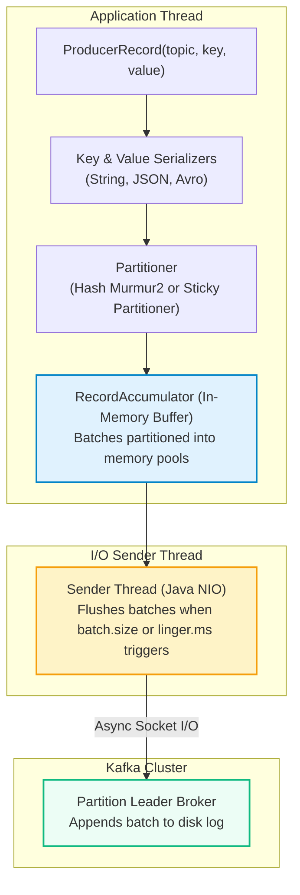
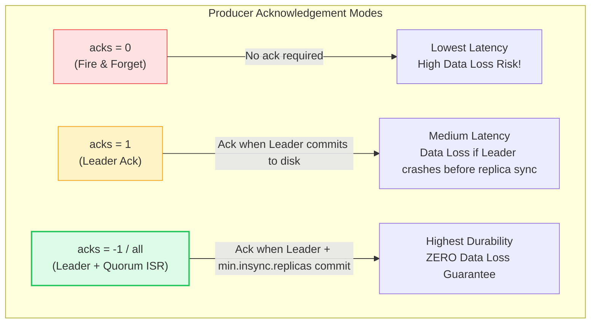
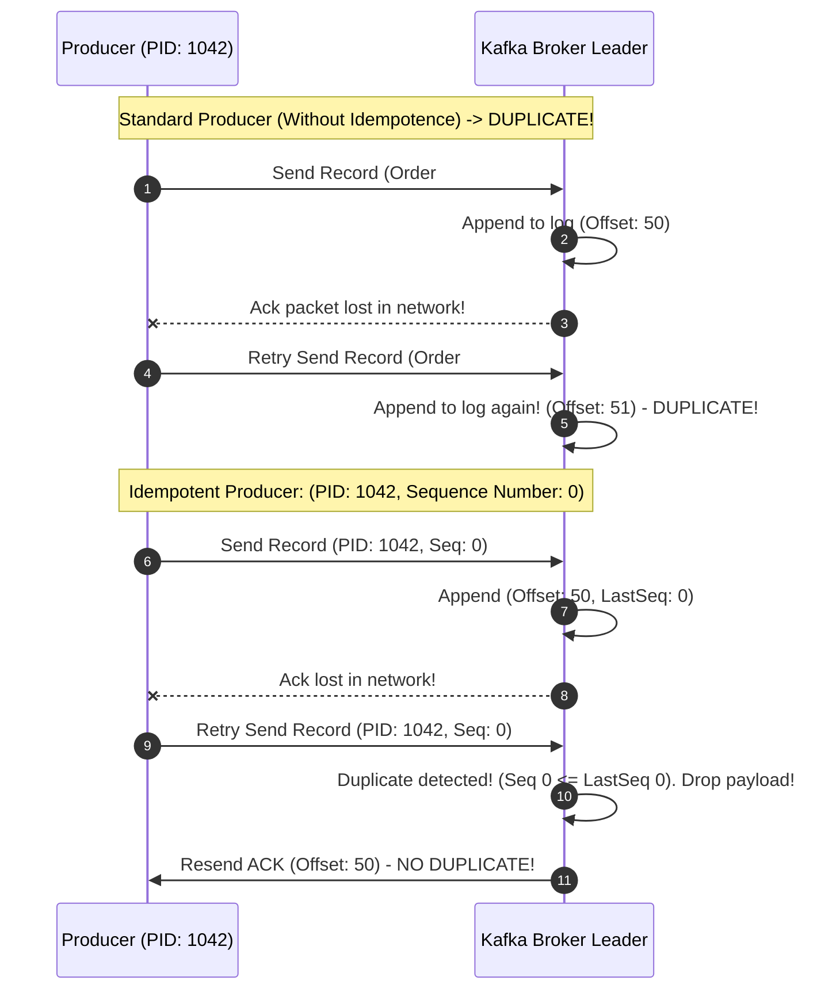

# Kafka: Producer Internals, Batching & Delivery Semantics

> **Cluster 03 — Module 02**  
> Focus: RecordAccumulator, partitioners, acks configurations, idempotent producers, and zero-data-loss durability guarantees.

---

## 1. Producer Architecture & The Pipeline

Publishing a message to Kafka involves a multi-stage, asynchronous pipeline within the client library:

---

## 2. Partitioning Strategies & Ordering Guarantees

> [!IMPORTANT]
> **Kafka ONLY guarantees strict ordering WITHIN a single partition.** It does NOT guarantee ordering across different partitions of the same topic.

1. **Explicit Key Provided (`key != null`)**:
   Kafka computes the hash of the key using **Murmur2**:
   $$\text{Partition} = \text{abs}(\text{Murmur2}(\text{key})) \pmod{\text{Total Partitions}}$$
   *Implication*: All events sharing the exact same key (e.g. `order_id="ORD-10928"`) are guaranteed to land on the **exact same partition**, guaranteeing strict chronological ordering.
2. **Null Key (`key == null`)**:
   Kafka uses the **Sticky Partitioner** (introduced in KIP-480). It fills an entire batch destined for partition $X$ before rotating to partition $Y$. This drastically minimizes network request overhead and maximizes compression.

---

## 3. High Throughput Tuning: `linger.ms` & `batch.size`

Producers group records into batches before transmitting them over TCP:

| Parameter | Default | Production Value | Purpose |
| :--- | :--- | :--- | :--- |
| **`batch.size`** | `16384` (16 KB) | `65536` (64 KB) or `131072` (128 KB) | Maximum bytes of data to accumulate per partition batch before sending immediately. |
| **`linger.ms`** | `0` ms | `10` to `50` ms | Artificial delay telling the producer to wait for more records to arrive to form a fuller batch. |
| **`compression.type`**| `none` | `lz4` or `zstd` | Compresses batches across the wire and on disk. Reduces network bandwidth by 40-70%. |
| **`buffer.memory`** | `33554432` (32 MB) | `67108864` (64 MB) | Total memory allocated for pending unsent batches. |

---

## 4. Delivery Semantics & Acknowledgement Levels (`acks`)

The `acks` parameter configures how many replica brokers must acknowledge receipt before the producer considers the write successful:

### The "Golden Triangle" of Zero Data Loss
To guarantee financial-grade message durability, configure these three settings in unison:

1. **`acks=all`** (on Producer): Wait for all in-sync replicas to write to their local log.
2. **`replication.factor=3`** (on Topic): Every partition has 3 copies across 3 distinct physical brokers.
3. **`min.insync.replicas=2`** (on Broker/Topic): The broker will reject writes (`NotEnoughReplicasException`) if fewer than 2 replicas are in the ISR.

---

## 5. Idempotent Producer (`enable.idempotence=true`)

In distributed networks, transient network glitches can occur *after* the broker commits a record but *before* the acknowledgement packet reaches the producer. If the producer retries, a duplicate record is created!

- When `enable.idempotence=true` is set (default since Kafka 3.0), the broker assigns a **Producer ID (PID)** and tracks monotonically increasing **Sequence Numbers** for each partition. Retried duplicate records are safely ignored.

---

## 6. Official References
- [Kafka Producer Configuration Reference](https://kafka.apache.org/documentation/#producerconfigs)
- [KIP-98: Exactly Once Delivery and Transactions](https://cwiki.apache.org/confluence/display/KAFKA/KIP-98+-+Exactly+Once+Delivery+and+Transactional+Messaging)
- [KIP-480: Sticky Partitioner Design](https://cwiki.apache.org/confluence/display/KAFKA/KIP-480%3A+Sticky+Partitioner)
