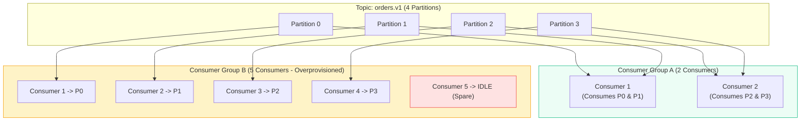
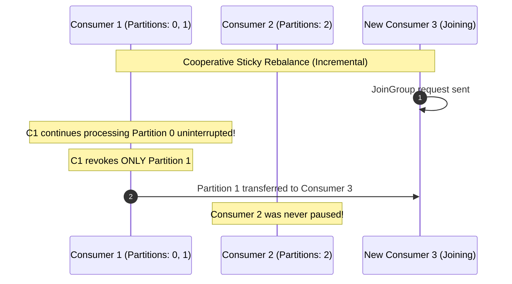

# Kafka: Consumer Groups, Offset Commits & Rebalance Protocols

> **Cluster 03 — Module 03**  
> Focus: Consumer scale-out mechanics, `__consumer_offsets` internals, advanced delivery semantics, Group Coordinator lifecycle, and Rebalance protocols.

---

## 1. Consumer Group Architecture & Scalability

Kafka scales read operations horizontally through **Consumer Groups**. A consumer group is a collection of consumers that share the same `group.id`, cooperating to consume from a set of subscribed topics.

> [!IMPORTANT]
> **Cardinal Rule of Consumer Groups**: Each partition within a topic is consumed by **at most one consumer instance** per consumer group at any given time.



- If you have **4 partitions** and **5 consumers** in the same group, the 5th consumer sits completely **idle** acting as a standby failover.
- Therefore, the number of partitions represents the **maximum degree of parallelism** for a single consumer group.

### The Group Coordinator & Consumer Leader

Rebalancing and partition assignments aren't handled by consumers arbitrarily. They are orchestrated through a broker-side entity and a consumer-side leader:
1. **Group Coordinator**: A specific Kafka broker responsible for managing a specific consumer group (determined by a hash of the `group.id`).
2. **Consumer Leader**: The first consumer to join the group. The Group Coordinator delegates the actual partition assignment logic to the Consumer Leader, which executes the configured Assignor strategy and sends the assignments back to the Coordinator.

---

## 2. Partition Assignment Strategies

Kafka consumers use partition assignors to decide which consumer gets which partition.

| Strategy | Description | Drawbacks |
| :--- | :--- | :--- |
| **`RangeAssignor`** (Default) | Assigns partitions on a per-topic basis. Divides partitions of each topic across available consumers sequentially. | Can lead to severe imbalances if consumers subscribe to multiple topics with different partition counts. |
| **`RoundRobinAssignor`** | Lays out all available partitions across all subscribed topics and assigns them sequentially to consumers. | Much better distribution than Range, but still causes massive partition shuffling on rebalances. |
| **`StickyAssignor`** | Achieves max balance like RoundRobin but attempts to **minimize partition movements** during rebalances. | Uses Eager Rebalance (stop-the-world). |
| **`CooperativeStickyAssignor`** | The modern standard (KIP-429). Same assignment logic as Sticky, but supports **Incremental Cooperative Rebalancing**. | None. Recommended for all modern deployments. |

### Rebalance Protocols: Eager vs Cooperative Sticky

A **rebalance** occurs whenever a consumer joins, leaves, crashes, or topic partitions are added.

#### A. Eager Rebalance (Stop-the-World - Legacy)
All consumers in the group must stop processing, revoke **all** assigned partitions, rejoin the group, and wait for new assignments. This causes noticeable latency spikes across the entire consumer group ("Stop-the-world").

#### B. Cooperative Sticky Rebalance (Incremental)
Instead of revoking all partitions globally, only the partitions that actually need to move from one consumer to another are temporarily revoked. Unaffected consumers continue processing in-flight messages without interruption!



---

## 3. Demystifying `__consumer_offsets`

Consumers track their reading progress using **offsets**. Committed offsets are stored internally inside Kafka in a special compacted topic named `__consumer_offsets`.

- **Partitions**: Default is 50 (`offsets.topic.num.partitions`). High partition count is required to handle high-frequency commit payloads from thousands of groups.
- **Message Key**: `[Group ID, Topic, Partition]`
- **Message Value**: `[Offset, Metadata, Timestamp]`
- **Compaction**: Because the topic is compacted, Kafka periodically removes older commits for the same key, keeping only the latest offset for a specific group's topic-partition.
- **Retention**: Controlled by `offsets.retention.minutes` (default 7 days). If a group is inactive for this duration, its offsets are deleted.

---

## 4. Offset Management & Commit Semantics

How and when you commit offsets dictates your system's message delivery guarantees.

```mermaid
flowchart TD
    subgraph Auto_Commit["enable.auto.commit = true (At-Most-Once / Data Loss Risk)"]
        AC1["1. Consumer polls 100 messages"] --> AC2["2. Timer hits 5s: Auto-commits offset 100 in background"]
        AC2 --> AC3["3. App crashes while processing record 40!"]
        AC3 --> AC4["Result: Records 41-100 are SKIPPED & LOST upon restart!"]
    end

    subgraph Manual_Commit["enable.auto.commit = false (At-Least-Once Delivery)"]
        MC1["1. Consumer polls 100 messages"] --> MC2["2. Process records 1..100 in database"]
        MC2 --> MC3["3. Execute commitSync() / commitAsync()"]
        MC3 --> MC4["Result: ZERO data loss. On crash, unprocessed records are replayed."]
    end

    style Auto_Commit fill:#fee2e2,stroke:#ef4444,stroke-width:1px
    style Manual_Commit fill:#dcfce7,stroke:#22c55e,stroke-width:2px
```



### Commit Implementation Patterns

1. **`commitSync()`**: Blocks the main thread until the broker confirms the offset commit. Guarantees safety, but limits consumer poll loop throughput. It retries automatically on retriable errors.
2. **`commitAsync()`**: Non-blocking fire-and-forget commit. Fast, but retrying failed async commits is dangerous: retrying out-of-order could overwrite a newer successful commit with an older one.
3. **The Pro Pattern**: Use `commitAsync()` at the end of the `poll()` loop for high throughput, and use a `commitSync()` inside a `finally` block or shutdown hook to ensure the last batch is synchronously flushed on exit.
4. **Exactly-Once Semantics (EOS)**: If processing involves writing back to Kafka, you can achieve true EOS by using Kafka Transactions, utilizing `producer.sendOffsetsToTransaction()`.

---

## 5. Consumer Heartbeats, Liveness, & Livelock Prevention

Kafka decouples consumer failure detection into two separate streams: Network Liveness and Processing Liveness.

```mermaid
flowchart LR
    Consumer["Consumer Instance"] -->|1. Background Heartbeat Thread\n(heartbeat.interval.ms = 3000)| Coord["Group Coordinator (Broker)"]
    Consumer -->|2. Main App Poll Loop\n(max.poll.interval.ms = 300000)| Coord

    style Consumer fill:#eff6ff,stroke:#3b82f6,stroke-width:2px
    style Coord fill:#ecfdf5,stroke:#10b981,stroke-width:2px
```

| Parameter | Default | Purpose & Failure Impact |
| :--- | :--- | :--- |
| **`session.timeout.ms`** | `45000` (45s) | **Network Liveness**. If the broker receives no heartbeat for this duration, it assumes the consumer is dead/disconnected and triggers a rebalance. |
| **`heartbeat.interval.ms`**| `3000` (3s) | The interval at which the background thread pings the Coordinator. (Rule of thumb: $\le \frac{1}{3} \times \text{session.timeout.ms}$). |
| **`max.poll.interval.ms`** | `300000` (5m) | **Processing Liveness**. Prevents **Livelock** (where the heartbeat thread is alive, but the app thread is frozen). If `poll()` isn't called within this window, the consumer gracefully leaves the group. |

> [!TIP]
> If your application performs heavy database writes and frequently triggers rebalances because it exceeds `max.poll.interval.ms`, do NOT just blindly increase the timeout. Instead, tune `max.poll.records` (default 500) down so your poll loop finishes faster.

---

## 6. Official References
- [Kafka Consumer Configurations](https://kafka.apache.org/documentation/#consumerconfigs)
- [KIP-429: Incremental Cooperative Rebalancing Protocol](https://cwiki.apache.org/confluence/display/KAFKA/KIP-429%3A+Kafka+Consumer+Incremental+Rebalance+Protocol)
- [Managing Consumer Offsets Internals](https://kafka.apache.org/documentation/#impl_offsettracking)
- [Exactly-Once Semantics (EOS) in Kafka](https://www.confluent.io/blog/exactly-once-semantics-are-possible-heres-how-apache-kafka-does-it/)
