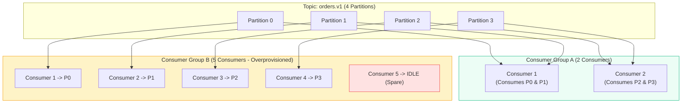
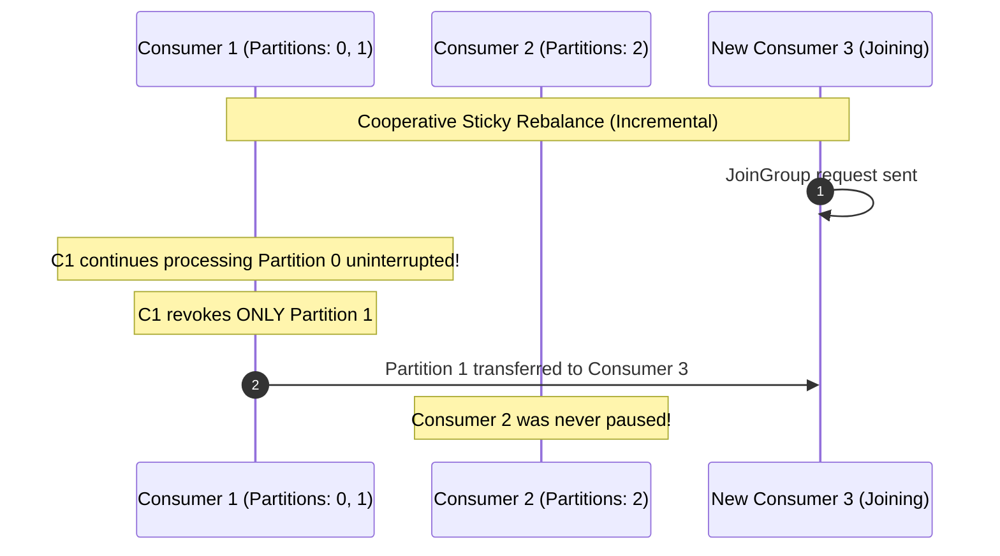

# Kafka: Consumer Groups, Offset Commits & Rebalance Protocols

> **Cluster 03 — Module 03**  
> Focus: Consumer scale-out mechanics, `__consumer_offsets`, manual vs auto-commit, heartbeat liveness, and Eager vs Cooperative Sticky Rebalances.

---

## 1. Consumer Groups & Partition Assignment Rules

Kafka scales read operations horizontally through **Consumer Groups**. 

> [!IMPORTANT]
> **Cardinal Rule of Consumer Groups**: Each partition within a topic is consumed by **at most one consumer instance** per consumer group.



- If you have **4 partitions** and **5 consumers** in the same group, the 5th consumer sits completely **idle** acting as a standby failover.
- Therefore, the number of partitions represents the **maximum degree of parallelism** for a single consumer group.

---

## 2. Offset Management & Commit Semantics

Consumers track their reading progress using **offsets**. Committed offsets are stored internally inside Kafka in a special compacted topic named:

$$\mathbf{\_\_consumer\_offsets}$$

### Auto-Commit vs Manual Commit (Data Loss vs Duplicates)

```mermaid
flowchart TD
    subgraph Auto_Commit["enable.auto.commit = true (Risk of Data Loss)"]
        AC1["1. Consumer polls 100 messages"] --> AC2["2. Timer hits 5s: Auto-commits offset 100"]
        AC2 --> AC3["3. App crashes while processing record 40!"]
        AC3 --> AC4["Result: Records 41-100 are SKIPPED & LOST forever!"]
    end

    subgraph Manual_Commit["enable.auto.commit = false (At-Least-Once Delivery)"]
        MC1["1. Consumer polls 100 messages"] --> MC2["2. Process records 1..100 in database"]
        MC2 --> MC3["3. Execute commitSync() / commitAsync()"]
        MC3 --> MC4["Result: ZERO data loss. On crash, unprocessed records are replayed."]
    end

    style Auto_Commit fill:#fee2e2,stroke:#ef4444,stroke-width:1px
    style Manual_Commit fill:#dcfce7,stroke:#22c55e,stroke-width:2px
```



### Commit Implementation Comparison
- **`commitSync()`**: Blocks until the broker confirms the offset commit. Guarantees safety, but limits consumer poll loop throughput.
- **`commitAsync()`**: Non-blocking fire-and-forget commit. Fast, but retrying failed async commits out-of-order can overwrite newer committed offsets.
- **Best Practice**: Use `commitAsync()` inside the poll loop, followed by a final `commitSync()` inside the application shutdown hook.

---

## 3. Consumer Heartbeats & Failure Detection

Consumers maintain membership in a group via continuous background heartbeats:

```mermaid
flowchart LR
    Consumer["Consumer Instance"] -->|1. Background Heartbeat Thread\n(heartbeat.interval.ms = 3000)| Coord["Group Coordinator (Broker)"]
    Consumer -->|2. Main App Poll Loop\n(max.poll.interval.ms = 300000)| Coord

    style Consumer fill:#eff6ff,stroke:#3b82f6,stroke-width:2px
    style Coord fill:#ecfdf5,stroke:#10b981,stroke-width:2px
```

| Parameter | Default | Production Value | What Happens When Violated? |
| :--- | :--- | :--- | :--- |
| **`session.timeout.ms`** | `45000` (45s) | `45000` ms | If no heartbeat is received within this time, broker marks consumer dead and triggers a rebalance. |
| **`heartbeat.interval.ms`**| `3000` (3s) | `3000` ms | How frequently heartbeat packets are dispatched (recommended $\le \frac{1}{3} \times \text{session timeout}$). |
| **`max.poll.interval.ms`** | `300000` (5m) | Tune to batch size | If `poll()` is not called within this window (e.g. slow database processing), consumer is kicked out! |

---

## 4. Rebalance Protocols: Eager vs Cooperative Sticky

A **rebalance** occurs whenever a consumer joins, leaves, crashes, or topic partitions are added.

### A. Eager Rebalance (Stop-the-World - Legacy)
All consumers in the group must stop processing, revoke all assigned partitions, rejoin the group, and wait for new assignments. This causes noticeable latency spikes across the entire consumer group.

### B. Cooperative Sticky Rebalance (KIP-429 - Modern Standard)
Instead of revoking all partitions, only the partitions that actually need to move from one consumer to another are temporarily revoked. Unaffected consumers continue processing in-flight messages without interruption!



**Configuration**:
```properties
partition.assignment.strategy=org.apache.kafka.clients.consumer.CooperativeStickyAssignor
```

---

## 5. Official References
- [Kafka Consumer Configurations](https://kafka.apache.org/documentation/#consumerconfigs)
- [KIP-429: Incremental Cooperative Rebalancing Protocol](https://cwiki.apache.org/confluence/display/KAFKA/KIP-429%3A+Kafka+Consumer+Incremental+Rebalance+Protocol)
- [Managing Consumer Offsets Internals](https://kafka.apache.org/documentation/#impl_offsettracking)
