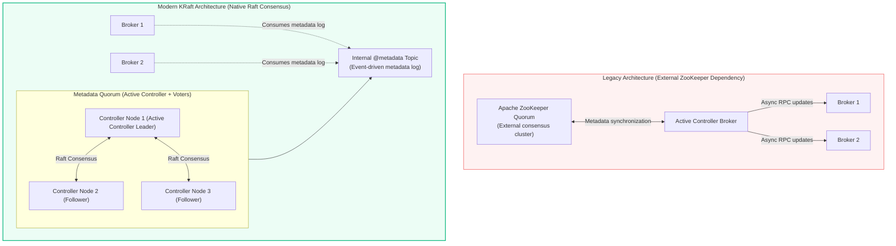
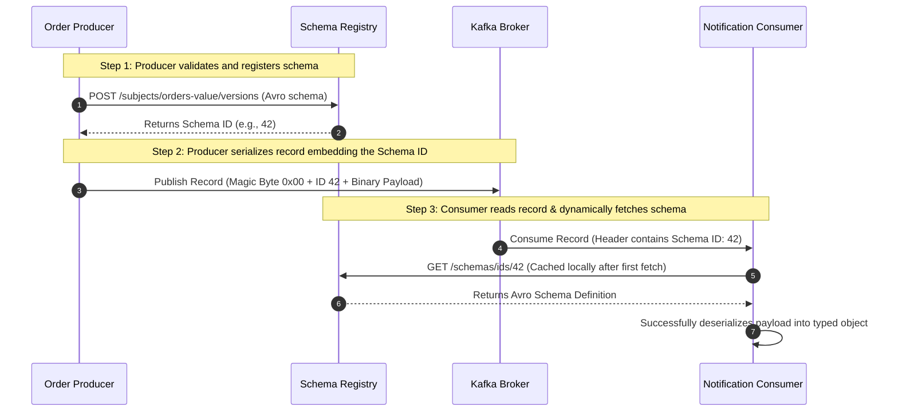
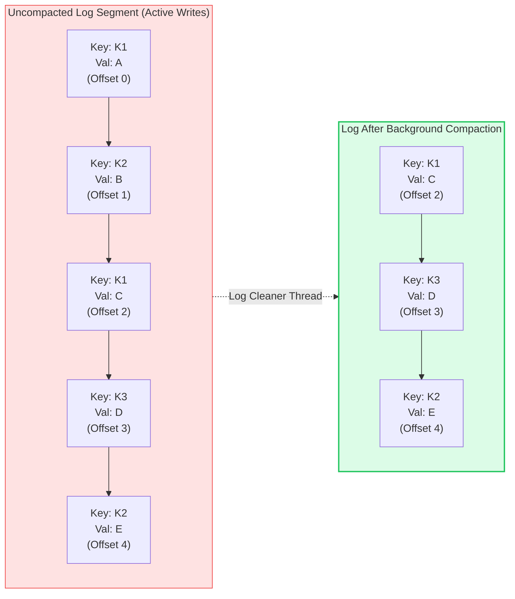
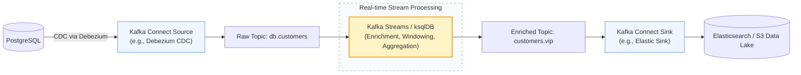

# Kafka Advanced Concepts: KRaft, Schema Registry, Log Compaction, & The Ecosystem

> **Cluster 03 — Module 04**  
> Focus: KRaft consensus architecture, Schema Registry wire formatting and evolution, topic log compaction mechanics, and stream processing with Kafka Connect and Kafka Streams.

---

## 1. The KRaft Revolution: A Zookeeper-less Future (KIP-500)

For years, Apache Kafka relied on Apache ZooKeeper to manage cluster topology, broker heartbeats, leader elections, and topic metadata. While functional, ZooKeeper introduced significant bottlenecks, particularly related to the active controller's need to fetch entire metadata states upon failover. **KRaft (Kafka Raft Metadata Mode)** rearchitects Kafka by implementing a native consensus protocol based on Raft.



### Pro-Level Insights: Why KRaft Changes the Game

- **Event-Driven Metadata:** Instead of keeping the metadata state in ZooKeeper and asynchronously propagating changes via RPCs to brokers, KRaft models metadata as a standard Kafka log (the `@metadata` topic). Brokers consume this log just like standard consumers, leading to identical eventual consistency mechanisms as the data plane.
- **Microsecond Failovers:** In a ZK setup, a controller failover requires the new controller to load the entire ZK state into RAM, taking minutes for large clusters. In KRaft, voter and observer controllers continuously consume the `@metadata` log, maintaining a hot in-memory state. Failovers are near-instantaneous.
- **Massive Partition Scalability:** By removing the ZK write synchronization bottleneck, KRaft allows clusters to scale from $\approx 200,000$ partitions to millions of partitions per cluster, unlocking true multi-tenancy.
- **Unified Security & Config:** A single security model and configuration paradigm across the entire cluster, eliminating the need to secure ZK endpoints separately.

---

## 2. Schema Registry & The Avro Wire Format

Data serialization is crucial in streaming architectures. If producers and consumers do not share a strict contract, schema drift leads to downstream deserialization failures (the dreaded **poison pills**). The **Confluent Schema Registry** resolves this by enforcing backward, forward, or full compatibility rules on Apache Avro, Protobuf, or JSON Schema.



### The 5-Byte Wire Format Header
When using Schema Registry serializers, the message payload is prepended with a 5-byte header, keeping the payload compact while maintaining strict schema tracking:
```text
[Byte 0: Magic Byte (0x00)] [Bytes 1-4: 32-bit big-endian Schema ID] [Bytes 5..N: Raw Avro Binary]
```

### Pro-Level Insights: Schema Evolution Deep Dive
- **BACKWARD (Default)**: A new schema can be used to read older data. Rule: You can only *add optional fields* or *delete fields*. Consumers should be updated *before* producers.
- **FORWARD**: An old schema can be used to read newer data. Rule: You can only *add fields* or *delete optional fields*. Producers should be updated *before* consumers.
- **FULL**: The schema is both backward and forward compatible. Rule: You can only *add or delete optional fields*.
- **Transitive Compatibility**: Ensures a schema is compatible not just with the previous version, but with *all* previous versions (e.g., BACKWARD_TRANSITIVE). Essential for long-term data retention (S3 data lakes or compact topics).

---

## 3. Log Retention vs. Log Compaction

Kafka models data as an immutable append-only log. However, disk space is finite. Partitions support two mutually exclusive cleanup policies:

### A. Time/Size-based Retention (`cleanup.policy=delete`)
Segments are dropped entirely once they exceed a defined TTL (`retention.ms`) or a size threshold per partition (`retention.bytes`). This is ideal for ephemeral event streams (e.g., clickstreams, logs).

### B. Key-Based Log Compaction (`cleanup.policy=compact`)
Kafka retains the **latest known value for every unique message key**. This effectively turns a Kafka topic into a distributed key-value store, perfect for CDC (Change Data Capture) state, configuration tables, or user profiles.



### Pro-Level Insights: Compaction Mechanics
- **Tombstone Records**: To delete a key from a compacted topic, producers publish a record with the key and a `null` value (the tombstone). The background cleaner preserves the tombstone for `delete.retention.ms` (giving consumers time to process the deletion) before permanently removing the key.
- **Dirty Ratio**: The cleaner thread prioritizes partitions with the highest "dirty ratio" (the proportion of uncompacted vs. compacted data).
- **Idempotence Required**: For compacted topics to accurately represent state without duplicate phantom keys, producers must ensure idempotence (`enable.idempotence=true`).

---

## 4. The Broader Kafka Ecosystem: Connect & Streams

Kafka is not just a pub/sub system; it is a holistic streaming platform powered by two major extensions.



### Kafka Connect
A distributed runtime for running connectors (plugins) that move data in and out of Kafka without custom code.
- **Source Connectors**: Stream data *into* Kafka. E.g., reading PostgreSQL WAL logs via Debezium CDC.
- **Sink Connectors**: Stream data *out of* Kafka. E.g., flushing enriched events to Amazon S3 or Elasticsearch.
- **Pro-Level Insight**: Connect relies on Kafka internally to store its own state, configuration, and offsets (via internal compacted topics), making the Connect cluster completely stateless and horizontally scalable.

### Kafka Streams
A Java/Scala client library for building real-time applications.
- **KStream & KTable Duality**: Streams represent infinite event logs, while Tables represent the current state (like a compacted topic). Streams and Tables can be seamlessly joined and aggregated.
- **Exactly-Once Semantics (EOS)**: By leveraging Kafka's transactional API, Kafka Streams ensures that processing, state store updates, and downstream publishing happen atomically (`processing.guarantee="exactly_once_v2"`).
- **Pro-Level Insight**: State stores (RocksDB) in Kafka Streams are backed up by internal changelog topics in Kafka. If a stream processing instance crashes, a new instance can reconstruct its exact state by replaying the changelog topic.

---

## 5. Official References
- [KIP-500: Replace ZooKeeper with a Self-Managed Metadata Quorum](https://cwiki.apache.org/confluence/display/KAFKA/KIP-500%3A+Replace+ZooKeeper+with+a+Self-Managed+Metadata+Quorum)
- [Confluent Schema Registry Deep Dive](https://docs.confluent.io/platform/current/schema-registry/index.html)
- [Kafka Connect Architecture & Internals](https://kafka.apache.org/documentation/#connect)
- [Kafka Streams Developer Guide](https://kafka.apache.org/documentation/streams/)
