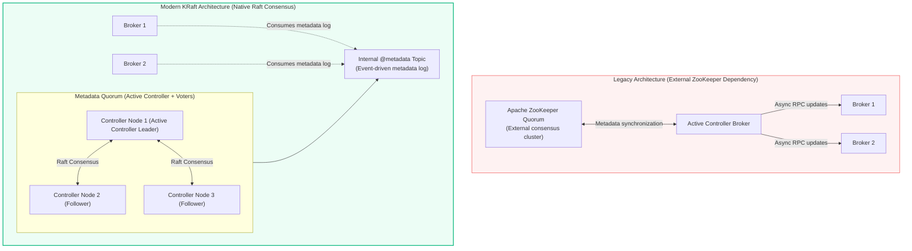
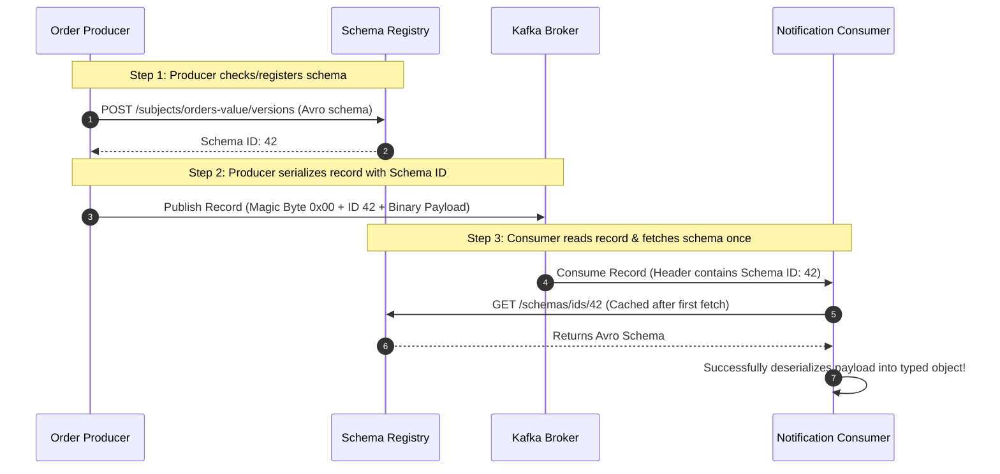
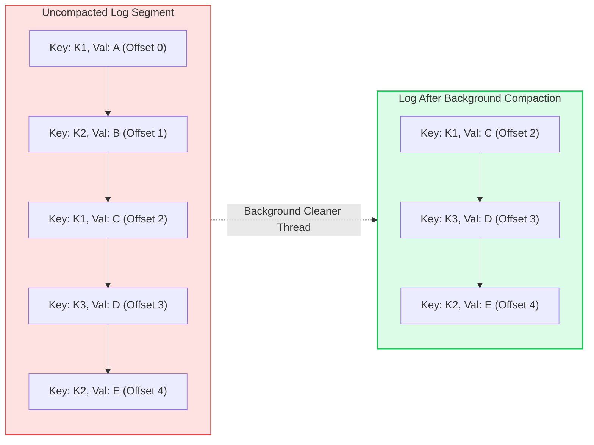
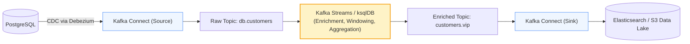

# Kafka: KRaft Consensus, Schema Registry & The Kafka Ecosystem

> **Cluster 03 — Module 04**  
> Focus: KRaft vs ZooKeeper, Schema Registry wire format, schema evolution, log compaction, and Kafka Connect/Streams.

---

## 1. The KRaft Revolution: Retiring Apache ZooKeeper (KIP-500)

Historically, Kafka relied on Apache ZooKeeper to manage cluster metadata, leader elections, and broker discovery. ZooKeeper introduced architectural bottlenecks that are now resolved by **KRaft (Kafka Raft Metadata Mode)**.



### Why KRaft Outperforms ZooKeeper

| Metric | Legacy ZooKeeper Architecture | Modern KRaft Architecture |
| :--- | :--- | :--- |
| **Max Partitions per Cluster** | $\approx 200,000$ (ZK synchronization bottleneck) | Millions of partitions |
| **Controller Failover Time** | Minutes (controller had to reload full ZK state into memory) | Sub-second (Follower controllers already have metadata preloaded in memory) |
| **Operational Simplicity** | Two separate distributed systems to monitor, secure, and patch | Single unified binary (`kafka-server-start.sh`) |
| **Metadata Consistency** | Vulnerable to desynchronization between ZooKeeper and Controller | Strictly linearized Raft log (`@metadata`) |

---

## 2. Schema Registry & The Avro Wire Format

In microservice environments, producers and consumers evolve independently. If a producer removes or alters a field without notice, consumer services crash with deserialization errors (**poison pills**).

The **Confluent Schema Registry** serves as the central source of truth for message schemas (using Apache Avro, Protobuf, or JSON Schema).



### The 5-Byte Wire Format Header
When using Schema Registry serializers, the message payload is formatted as:
```
[Byte 0: Magic Byte (0x00)] [Bytes 1-4: 32-bit big-endian Schema ID] [Bytes 5..N: Raw Avro Binary]
```

### Schema Evolution Rules
- **BACKWARD (Default)**: Consumers using the new schema can read records written by the old schema (e.g. adding an optional field with a default value).
- **FORWARD**: Consumers using the old schema can read records written by the new schema (e.g. removing an optional field).
- **FULL**: Backward and Forward compatible simultaneously.

---

## 3. Log Retention vs Log Compaction

Kafka partitions support two distinct cleanup policies:

### A. Delete Policy (`cleanup.policy=delete`)
Records are purged once they exceed a time threshold (`retention.ms`, default 7 days) or a size threshold (`retention.bytes`).

### B. Compact Policy (`cleanup.policy=compact`)
Kafka retains the **latest known value for every message key**. Older values sharing the same key are deleted during background cleaner thread runs.



- **Tombstone Record**: To completely delete a key from a compacted topic, the producer sends a record with the key and a **`null` value**. The cleaner eventually purges the key entirely.

---

## 4. Kafka Ecosystem: Connect & Streams



- **Kafka Connect**: Ready-to-run declarative framework for streaming data between datastores (PostgreSQL, MySQL, S3, Snowflake) and Kafka without writing boilerplate integration code.
- **Kafka Streams**: A lightweight client library for Java/Scala that enables real-time stream processing, event-time windowing, session aggregations, and stream-table joins (`KStream`, `KTable`).

---

## 5. Official References
- [KIP-500: Replace ZooKeeper with a Self-Managed Metadata Quorum](https://cwiki.apache.org/confluence/display/KAFKA/KIP-500%3A+Replace+ZooKeeper+with+a+Self-Managed+Metadata+Quorum)
- [Confluent Schema Registry Guide](https://docs.confluent.io/platform/current/schema-registry/index.html)
- [Kafka Connect Architecture](https://kafka.apache.org/documentation/#connect)
- [Kafka Streams Developer Guide](https://kafka.apache.org/documentation/streams/)
