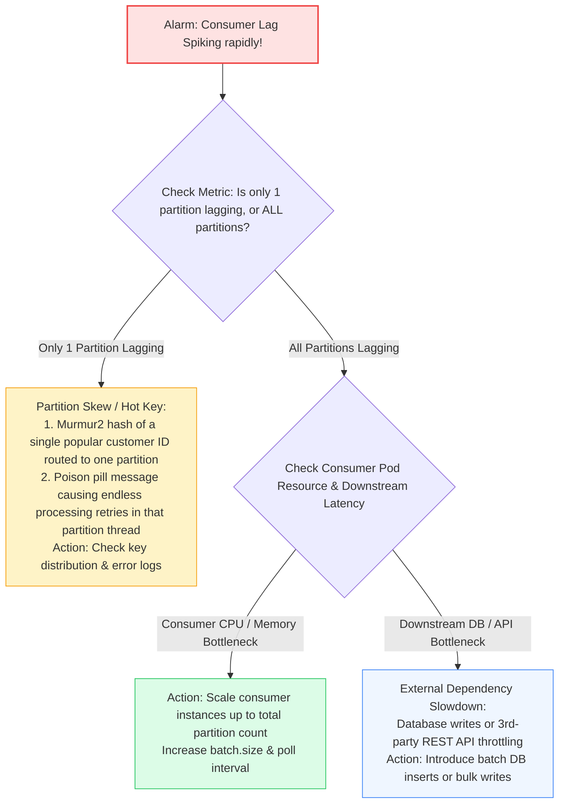
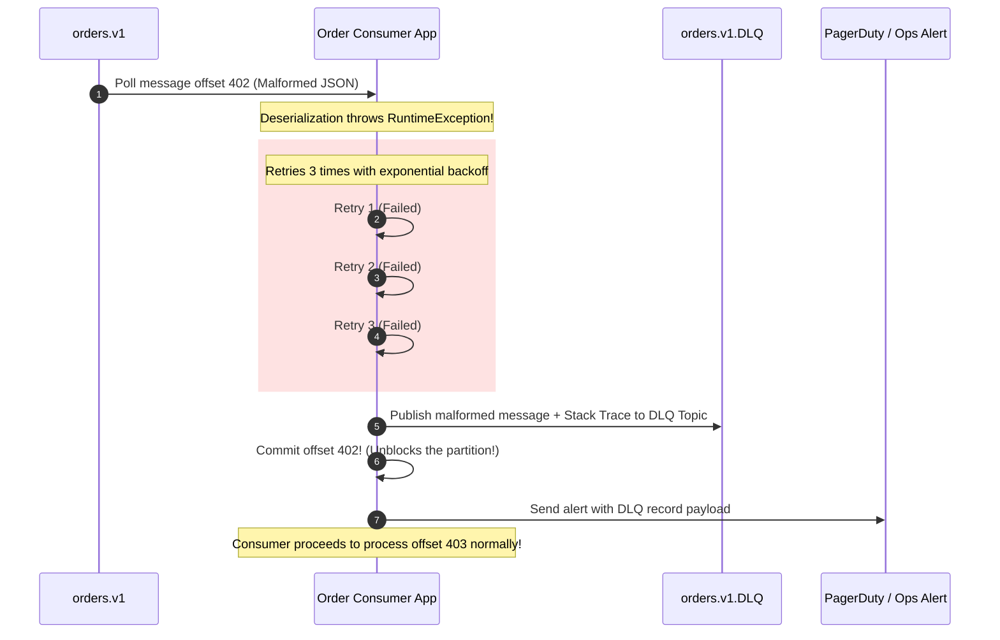

# Kafka: Top 20 Interview Questions & Production Failure Scenarios

> **Cluster 03 — Module 05**  
> Focus: Senior interview problem sets, Exactly-Once Semantics (EOS), consumer lag spikes, poison pills, DLQ patterns, and unclean leader elections.

---

## 1. Production Failure Runbook: Diagnosing Consumer Lag

**Consumer Lag** is the delta between the latest message written to a partition (Log End Offset) and the latest message processed by the consumer group (Committed Offset).

$$\mathbf{\text{Lag} = \text{LEO} - \text{Current Offset}}$$



---

## 2. The Poison Pill & Dead Letter Queue (DLQ) Architecture

A **poison pill** is a corrupted or unexpected message payload that causes the consumer application code to throw an unhandled exception every time it is polled. If the consumer retries continuously, the entire partition halts!



---

## 3. Top 20 Kafka Interview Questions & Answers

### Q1: Why is Apache Kafka orders of magnitude faster than traditional brokers?
**Answer:**
1. **Sequential Disk I/O**: Kafka writes to append-only logs, bypassing slow random disk head movements.
2. **OS Page Cache Utilization**: Writes and reads happen in Linux kernel memory (Page Cache), avoiding JVM garbage collection pauses.
3. **Zero-Copy Optimization**: Uses the `sendfile()` system call to transfer bytes directly from OS Page Cache to the Network Interface Card (NIC) with zero CPU buffer copies.
4. **End-to-End Batching & Compression**: Producers, brokers, and consumers operate on batches of records rather than individual messages.

### Q2: How is Exactly-Once Semantics (EOS) achieved in Kafka?
**Answer:**
EOS requires three coordinated mechanisms:
1. **Idempotent Producer (`enable.idempotence=true`)**: Broker assigns a Producer ID (PID) and tracks sequence numbers per partition to deduplicate retried network packets.
2. **Kafka Transactions (`transactional.id`)**: Coordinates atomic multi-partition writes using a two-phase commit protocol managed by the Transaction Coordinator.
3. **Consumer Isolation Level (`isolation.level=read_committed`)**: Consumers only read messages that belong to successfully committed transactions, skipping aborted or in-flight transaction batches.

### Q3: What is the difference between High Watermark (HW) and Log End Offset (LEO)?
**Answer:**
- **LEO**: The offset of the next record to be written in a partition log. Every replica has its own LEO.
- **HW**: The highest offset replicated across **all** In-Sync Replicas (ISR). Consumers can **only** read up to the HW to prevent dirty reads during leader elections.

### Q4: What happens if the ISR drops below `min.insync.replicas`?
**Answer:** If `acks=all` is configured and the number of active synchronized replicas in the ISR is lower than `min.insync.replicas`, the broker rejects incoming producer writes and throws `NotEnoughReplicasException` (or `NotEnoughReplicasAfterAppendException`). This prevents silent data loss during severe cluster degradation.

### Q5: What is an Unclean Leader Election (`unclean.leader.election.enable`)?
**Answer:**
- When the leader of a partition dies and **no** replicas in the ISR are available, Kafka must choose:
  - If `false` (default): Partition remains unavailable until an ISR member recovers. **Prioritizes Consistency (zero data loss)**.
  - If `true`: An out-of-sync replica (outside ISR) is elected leader. **Prioritizes Availability, but causes permanent data loss and offset divergence**.

### Q6: How does Kafka guarantee message ordering?
**Answer:** Strictly **within a single partition only**. Messages sent with the same partition key produce the same Murmur2 hash and are stored sequentially in the same partition. To preserve ordering during producer retries, set `max.in.flight.requests.per.connection <= 5` when idempotence is enabled.

### Q7: What is the difference between `poll()` timeout and `max.poll.interval.ms`?
**Answer:**
- `poll(Duration.ofMillis(100))`: How long the consumer thread will block waiting for data if the broker buffer is currently empty.
- `max.poll.interval.ms` (default 5m): Maximum duration allowed between consecutive invocations of `poll()`. If your application code takes longer than this to process a batch, the consumer is evicted from the group and a rebalance is triggered.

### Q8: What triggers a consumer group rebalance?
**Answer:**
1. A new consumer instance joins the group.
2. An existing consumer crashes or leaves gracefully (`SIGTERM`).
3. A consumer fails to send heartbeats within `session.timeout.ms`.
4. A consumer exceeds `max.poll.interval.ms` before polling again.
5. New partitions are added to a subscribed topic.

### Q9: How does Cooperative Sticky Rebalance improve on Eager Rebalance?
**Answer:** Eager rebalancing executes a "Stop-The-World" revocation: every consumer in the group pauses processing and revokes all partitions. Cooperative Sticky Rebalancing performs an incremental two-phase handover: only the partitions being reassigned are temporarily revoked, while unaffected consumers continue processing uninterrupted.

### Q10: Where are consumer offsets stored and why?
**Answer:** In an internal Kafka topic named `__consumer_offsets`. It is partitioned (typically 50 partitions) and configured with `cleanup.policy=compact`. Offsets are keyed by `[group_id, topic, partition]`. Storing offsets in Kafka rather than external systems like ZooKeeper enables high write throughput and atomic offset commits.

### Q11: What happens if a consumer crashes when `enable.auto.commit=true`?
**Answer:** If the auto-commit interval triggers (default 5 seconds) before processing is finished and the node crashes, unprocessed records are marked as committed and permanently skipped (**data loss**). If it crashes before the 5-second timer, the next consumer reprocesses the messages (**duplicate processing**).

### Q12: Why should you avoid too many partitions per Kafka cluster?
**Answer:**
1. More open file handles and OS threads per broker.
2. Increased memory consumption in broker buffers and client accumulators.
3. Slower end-to-end replication latency.
4. Longer recovery and leader election times during broker shutdown (though significantly improved with KRaft).

### Q13: What is Log Compaction and what is a Tombstone?
**Answer:** Log compaction retains the latest message value for every key in the topic log, purging historical overwrites. A **Tombstone** is a record with a non-null key and a `null` value. It signals to the log cleaner thread that the key should be completely expunged.

### Q14: What is the Schema Registry wire format?
**Answer:** A 5-byte prefix prepended to the serialized payload:
- 1 byte: Magic byte (`0x00`).
- 4 bytes: Big-endian integer representing the Schema ID registered in Schema Registry.

### Q15: What is the difference between `auto.offset.reset = earliest` vs `latest`?
**Answer:** Used when a consumer group has no existing committed offset in `__consumer_offsets`:
- `earliest`: Starts reading from the very beginning of the partition log (offset 0).
- `latest` (default): Starts reading only new records arriving *after* the consumer group registered.

### Q16: How do you scale consumer processing beyond the partition count?
**Answer:** A single partition cannot be split across multiple consumers in the same group. To scale further:
1. Increase topic partition count (note: impacts ordering key hashes).
2. Inside the consumer application, deserialize the batch and distribute records to an internal worker thread pool, committing offsets only when all thread tasks complete.

### Q17: What is the Sticky Partitioner?
**Answer:** When messages have no key (`key == null`), the Sticky Partitioner groups consecutive messages into a single partition batch until the batch reaches `batch.size` or `linger.ms`, then switches to the next partition. This dramatically reduces network requests and improves compression.

### Q18: What is Partition Skew and how do you fix it?
**Answer:** When one partition receives significantly more traffic than others, saturating one consumer. Causes: poorly chosen partition keys (e.g. keying by `country` when 80% of traffic is `US`). Fix: Use compound keys (e.g. `userId_timestamp`) or salting (`key + "_" + random(1..5)`).

### Q19: What is KRaft and how does it replace ZooKeeper?
**Answer:** KRaft (Kafka Raft Metadata Mode) eliminates ZooKeeper by embedding a native Raft consensus quorum directly into Kafka brokers. Metadata is stored as an event log in the `@metadata` topic, enabling instantaneous failover, linear scalability, and single-system operational simplicity.

### Q20: How do you handle poison pill messages safely in production?
**Answer:** Wrap the consumer record processing loop in a `try-catch` block. Catch serialization/application exceptions, publish the unprocessable record along with error metadata and headers to a Dead Letter Queue (DLQ) topic, and commit the offset to allow the consumer to proceed.

---

## 4. Production Kafka CLI Triage Commands

```bash
# 1. Describe consumer group lag across all partitions
kafka-consumer-groups.sh --bootstrap-server localhost:9092 --describe --group order-processors

# 2. Reset consumer group offsets to earliest for historical replay
kafka-consumer-groups.sh --bootstrap-server localhost:9092 --group order-processors \
  --reset-offsets --to-earliest --execute --topic orders.v1

# 3. Check partition leader distribution and In-Sync Replicas (ISR)
kafka-topics.sh --bootstrap-server localhost:9092 --describe --topic orders.v1

# 4. Find under-replicated partitions across the entire cluster
kafka-topics.sh --bootstrap-server localhost:9092 --describe --under-replicated-partitions
```
