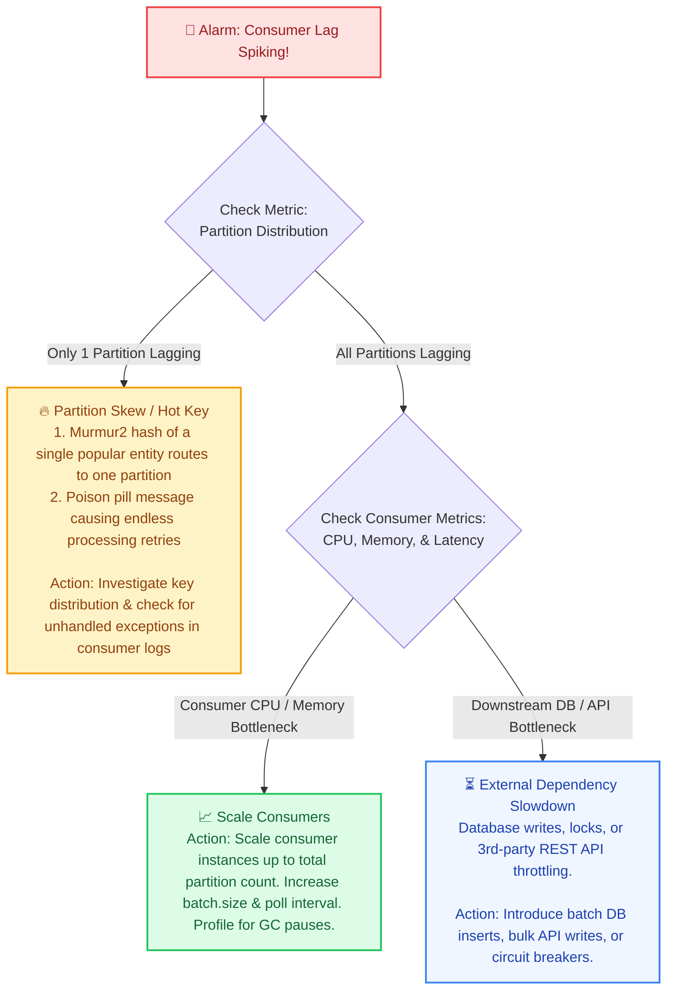
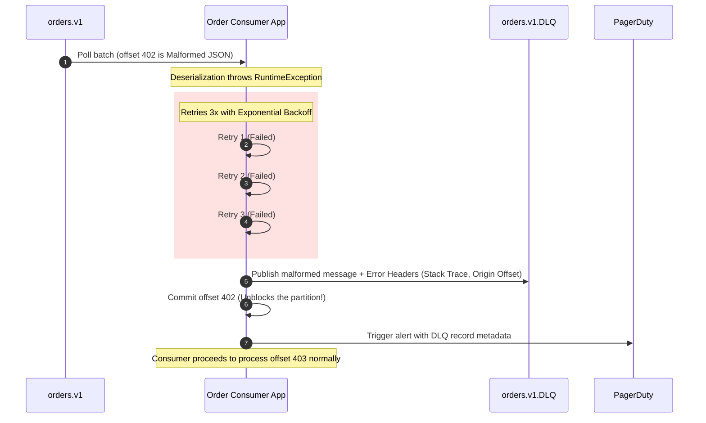

# Kafka: Top 20 Interview Questions & Production Failure Scenarios (Pro-Level)

> **Cluster 03 — Module 05**  
> Focus: Senior interview problem sets, Exactly-Once Semantics (EOS), consumer lag spikes, poison pills, DLQ patterns, and unclean leader elections.

---

## 1. Production Failure Runbook: Diagnosing Consumer Lag

**Consumer Lag** is the delta between the latest message written to a partition (Log End Offset) and the latest message processed by the consumer group (Committed Offset). 

$$\mathbf{\text{Lag} = \text{LEO} - \text{Current Offset}}$$

A sudden spike in lag implies that consumers cannot keep pace with the producer ingress rate. Diagnosing this at scale requires isolating the failure domain: is it the broker, the network, the consumer app, or an external dependency?



---

## 2. The Poison Pill & Dead Letter Queue (DLQ) Architecture

A **poison pill** is a corrupted, unparseable, or business-logic-violating message payload that causes the consumer application to throw an unhandled exception during processing. If the consumer fails to commit the offset and retries continuously, the entire partition halts, leading to catastrophic lag.

### The DLQ Recovery Pattern



*Pro-Tip:* Enhance DLQ records with Kafka Headers containing the original topic, partition, offset, exception class, and timestamp. This allows a separate recovery microservice to replay or inspect the messages later without mutating the original payload.

---

## 3. Top 20 Kafka Senior Interview Questions & Technical Answers

### Architecture & Internals

#### Q1: Why is Apache Kafka orders of magnitude faster than traditional Message Brokers (like RabbitMQ)?
**Answer:**
1. **Sequential Disk I/O:** Kafka structures topics as append-only immutable logs, forcing sequential disk writes and bypassing highly latent random disk seeks.
2. **OS Page Cache Utilization:** Kafka heavily relies on the Linux kernel Page Cache. It avoids loading data into the JVM heap, entirely bypassing JVM garbage collection pauses for data transit.
3. **Zero-Copy Optimization (`sendfile`):** Kafka uses the `sendfile()` system call to transfer bytes directly from the OS Page Cache to the Network Interface Card (NIC) socket buffer. It skips copying data to user-space entirely.
4. **End-to-End Batching & Compression:** Producers batch records, compress them (e.g., LZ4, Zstandard), and brokers store them compressed. The consumer decompresses them, drastically reducing network I/O.

#### Q2: What is KRaft, and how does it replace ZooKeeper?
**Answer:** 
KRaft (Kafka Raft Metadata Mode) eliminates the external ZooKeeper dependency by embedding a Raft consensus protocol directly inside Kafka brokers. 
- **Mechanism:** Cluster metadata is stored as an event log in an internal `@metadata` topic. A quorum of Controller nodes manages this log.
- **Benefits:** Instantaneous controller failover, linear scalability (supporting millions of partitions), single-system operational simplicity, and the elimination of split-brain scenarios between ZK and Kafka states.

#### Q3: What is the Schema Registry wire format?
**Answer:** 
Confluent Schema Registry prepends a 5-byte header to the serialized payload:
- **Byte 0:** Magic byte (always `0x00`).
- **Bytes 1-4:** A 32-bit Big-Endian integer representing the globally unique Schema ID registered in the registry.
This allows the consumer to dynamically fetch the exact Avro/Protobuf schema required for deserialization.

### Data Consistency & Exactly-Once Semantics

#### Q4: How is Exactly-Once Semantics (EOS) achieved in Kafka?
**Answer:**
EOS requires three coordinated mechanisms operating in tandem:
1. **Idempotent Producer (`enable.idempotence=true`):** The broker assigns a Producer ID (PID) and tracks sequence numbers per partition. If a producer retries a network packet, the broker deduplicates it based on `(PID, SequenceNumber)`.
2. **Kafka Transactions (`transactional.id`):** Coordinates atomic multi-partition writes using a two-phase commit protocol managed by the Transaction Coordinator. Writes across topics/partitions succeed or fail as a single atomic unit.
3. **Consumer Isolation Level (`isolation.level=read_committed`):** Consumers only read messages up to the Last Stable Offset (LSO) that belong to successfully committed transactions, filtering out aborted or in-flight transaction batches.

#### Q5: What is the difference between High Watermark (HW) and Log End Offset (LEO)?
**Answer:**
- **LEO (Log End Offset):** The offset of the very next record to be written in a specific partition log. Every replica has its own independent LEO.
- **HW (High Watermark):** The highest offset that has been successfully replicated across **all** In-Sync Replicas (ISR). Consumers can **only** read up to the HW. This guarantees that if the leader crashes, the new leader will have all the messages the consumer has already read.

#### Q6: What happens if the ISR drops below `min.insync.replicas`?
**Answer:** 
If a producer is configured with `acks=all` (strongly recommended for critical data) and the number of active synchronized replicas in the ISR falls below `min.insync.replicas`, the broker rejects incoming writes and throws a `NotEnoughReplicasException`. 
**Why?** This is a safety mechanism prioritizing consistency over availability. It prevents silent data loss during severe cluster degradation (e.g., widespread network partitions).

#### Q7: What is an Unclean Leader Election (`unclean.leader.election.enable`)?
**Answer:**
When the leader of a partition dies and **no** replicas remaining in the ISR are alive, the cluster faces a CAP theorem dilemma:
- `false` (Default): The partition goes offline until an ISR member recovers. **(Prioritizes Consistency: CP)**. Zero data loss, but lower availability.
- `true`: An out-of-sync replica (outside ISR) is promoted to leader. **(Prioritizes Availability: AP)**. Unreplicated messages are permanently lost, and consumer offsets may diverge.

### Consumer Group Mechanics

#### Q8: What is the difference between `poll()` timeout and `max.poll.interval.ms`?
**Answer:**
- `poll(Duration.ofMillis(100))`: Network-level timeout. How long the consumer thread blocks waiting for the broker to return data if the fetch buffer is currently empty.
- `max.poll.interval.ms` (default 5m): Application-level timeout. The maximum duration allowed between consecutive `poll()` invocations. If your processing logic takes longer than this (e.g., a slow DB insert), the broker assumes the consumer is dead, evicts it from the group, and triggers a rebalance.

#### Q9: How does Cooperative Sticky Rebalance improve upon Eager Rebalance?
**Answer:** 
- **Eager Rebalancing (Classic):** A "Stop-The-World" event. Every consumer in the group revokes all its assigned partitions, pauses processing, and waits for a completely new assignment. Causes massive latency spikes.
- **Cooperative Sticky Rebalancing (Modern):** An incremental, two-phase handover. Consumers retain their current partitions. Only the specific partitions being migrated to new consumers are temporarily revoked. Unaffected consumers continue processing without interruption.

#### Q10: What triggers a consumer group rebalance?
**Answer:**
1. A new consumer instance starts and joins the group.
2. An existing consumer crashes, disconnects, or leaves gracefully.
3. A consumer fails to send background heartbeats within `session.timeout.ms`.
4. A consumer exceeds `max.poll.interval.ms` before polling again (processing took too long).
5. The topic metadata changes (e.g., new partitions are added).

#### Q11: Where are consumer offsets stored and why?
**Answer:** 
Stored in a highly partitioned, compacted internal topic named `__consumer_offsets`. The key is `[group_id, topic, partition]` and the value is the committed offset. 
**Why?** In older versions, ZooKeeper stored offsets, but it couldn't handle the massive write throughput. Kafka topics are designed for high-throughput appends, making them perfect for fast, atomic offset commits.

#### Q12: What happens if a consumer crashes when `enable.auto.commit=true`?
**Answer:** 
Auto-commit periodically commits the highest offset returned by the *last* `poll()`.
- **Data Loss:** If the timer triggers (default 5s) before the consumer finishes processing the batch, and the node crashes, the offset is committed but processing failed. Messages are skipped forever.
- **Duplicate Processing:** If the node crashes *before* the timer triggers, but processing finished, the new consumer will read from the last committed offset, reprocessing the entire batch.
*Pro-Tip:* Disable auto-commit and manually call `commitSync()` or `commitAsync()` after successfully processing the data.

### Storage & Optimization

#### Q13: What is Log Compaction and what is a Tombstone?
**Answer:** 
Instead of deleting data by time (`retention.ms`), log compaction retains only the *latest* message value for every specific key in the topic log, purging historical overwrites (useful for state stores, e.g., current user balance).
A **Tombstone** is a record with a valid key but a `null` payload. It acts as a deletion marker, signaling the background log cleaner thread to completely expunge that key from the partition during the next compaction pass.

#### Q14: How does Kafka guarantee message ordering?
**Answer:** 
Kafka guarantees strict ordering **only within a single partition**. Messages produced with the same key generate the same Murmur2 hash, routing them to the exact same partition sequentially. 
*Note:* If idempotence is enabled, ensure `max.in.flight.requests.per.connection <= 5` to maintain ordering during producer network retries.

#### Q15: Why should you avoid too many partitions per Kafka cluster?
**Answer:**
While partitions increase parallelism, having hundreds of thousands of partitions per broker causes:
1. Open file handle exhaustion and excessive OS thread context switching.
2. Massive memory consumption in client accumulators (producers buffer per partition).
3. Slow leader election times during broker failure (though KRaft drastically improves this over ZK).
4. Increased end-to-end latency due to replication overhead.

#### Q16: What is the Sticky Partitioner?
**Answer:** 
When producers send messages with a `null` key, the Sticky Partitioner groups consecutive messages into a single partition's batch until the batch reaches `batch.size` or `linger.ms`. Then, it "sticks" to another partition. This minimizes network overhead, dramatically increases batch sizes, and improves compression ratios compared to naive Round-Robin routing.

#### Q17: What is Partition Skew and how do you fix it?
**Answer:** 
**Partition Skew** occurs when a poorly chosen partition key routes a massive disproportionate amount of traffic to a single partition, overloading one consumer thread while others idle.
- *Cause:* E.g., Keying by `tenant_id` where one enterprise customer generates 90% of the events.
- *Fix:* Use compound routing keys (e.g., `tenant_id + "_" + user_id`) or apply "salting" (appending a random integer to the key) to distribute the hot key across multiple partitions, aggregating the state downstream.

#### Q18: What is the difference between `auto.offset.reset = earliest` vs `latest`?
**Answer:** 
This configuration only applies when a consumer group starts up and **no valid committed offset exists** in `__consumer_offsets` for a partition.
- `earliest`: Replays the topic from the oldest retained message (offset 0 or lowest available).
- `latest` (Default): Skips all historical data and only consumes net-new messages arriving *after* the consumer group successfully joined.

#### Q19: How do you scale consumer processing beyond the partition count?
**Answer:** 
Kafka enforces a strict rule: a single partition cannot be read concurrently by multiple consumers in the same group. To scale processing throughput beyond the partition limit:
1. **Vertical / Async Processing:** The consumer `poll()` loop quickly fetches batches and hands them off to an internal `ThreadPoolExecutor` or reactive stream (e.g., Project Reactor).
2. **Caution:** You must carefully manage asynchronous offset commits. Only commit an offset once all async tasks for records prior to that offset have completed successfully, otherwise you risk data loss on crash.

#### Q20: How do you gracefully handle schema evolution?
**Answer:**
By enforcing **Forward** or **Backward** Compatibility rules in the Schema Registry.
- **Backward Compatibility (Most Common):** Consumers using the *new* schema can read data written by producers using the *old* schema. (Rule: You can only add optional fields or delete fields). Update Consumers first, then Producers.
- **Forward Compatibility:** Consumers using the *old* schema can read data written by producers using the *new* schema. (Rule: You can only add optional fields). Update Producers first, then Consumers.

---

## 4. Production Kafka CLI Triage Commands

```bash
# 1. Describe consumer group lag across all partitions
kafka-consumer-groups.sh --bootstrap-server localhost:9092 --describe --group order-processors

# 2. Reset consumer group offsets to earliest for historical replay (requires consumers to be stopped)
kafka-consumer-groups.sh --bootstrap-server localhost:9092 --group order-processors \
  --reset-offsets --to-earliest --execute --topic orders.v1

# 3. Check partition leader distribution and In-Sync Replicas (ISR)
kafka-topics.sh --bootstrap-server localhost:9092 --describe --topic orders.v1

# 4. Find under-replicated partitions across the entire cluster (Crucial health check)
kafka-topics.sh --bootstrap-server localhost:9092 --describe --under-replicated-partitions

# 5. Continuous console consumer for debugging with headers
kafka-console-consumer.sh --bootstrap-server localhost:9092 --topic orders.v1 \
  --property print.headers=true --property print.key=true --property print.value=true \
  --property print.timestamp=true --from-beginning
```
