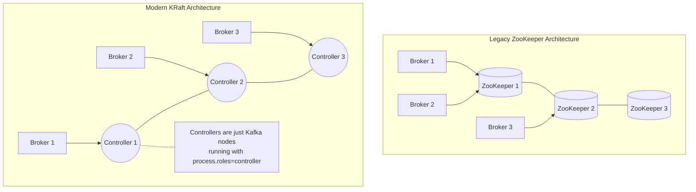
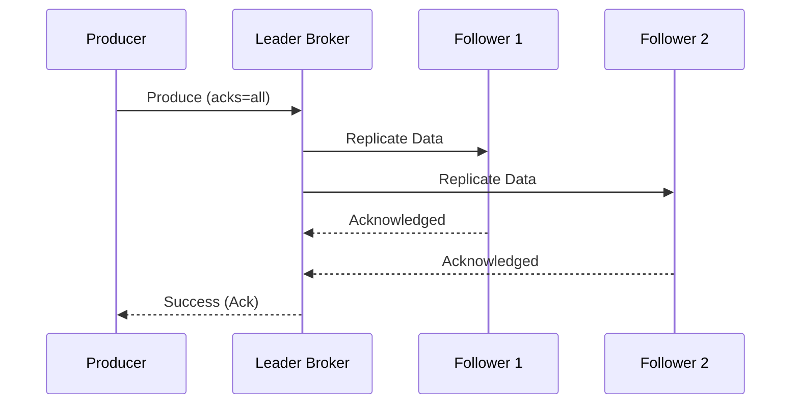

# Kafka: CLI Cheat Sheet & Practical Hands-On Labs (Pro Edition)

> **Cluster 03 — Module 06**
> **Focus:** Deep-dive CLI reference, production-grade KRaft deployment, advanced consumer/producer tuning, and key-based determinism labs.

---

## Architecture Context: The Shift to KRaft

Apache Kafka has officially deprecated ZooKeeper in favor of **KRaft (Kafka Raft Metadata Mode)**. KRaft simplifies architecture by moving metadata management internally into the Kafka cluster using a quorum-based consensus algorithm (Raft).



---

## 1. Production Kafka CLI Cheat Sheet & Pro Tips

### Topic Management Deep Dive

Beyond basic topic creation, production topics require careful planning around retention, cleanup policies, and segment sizes.

```bash
# Create a robust production topic with specific configurations
kafka-topics.sh --bootstrap-server localhost:9092 --create \
  --topic orders.v1 \
  --partitions 6 \
  --replication-factor 3 \
  --config min.insync.replicas=2 \
  --config cleanup.policy=compact,delete \
  --config retention.ms=604800000 # 7 days

# List all active topics (exclude internal topics)
kafka-topics.sh --bootstrap-server localhost:9092 --list --exclude-internal

# Inspect detailed topic state (Leader, Replicas, In-Sync Replicas - ISR)
kafka-topics.sh --bootstrap-server localhost:9092 --describe --topic orders.v1
```

> **Pro Tip (Partitioning):** You can dynamically *increase* partitions, but you **cannot decrease** them. Increasing partitions on a keyed topic will disrupt the hashing determinism (keys previously sent to Partition 1 might now hash to Partition 4). Plan your partition count carefully!

### Producer CLI: Testing Throughput & Guarantees

When producing messages, understanding `acks` and idempotency is critical for zero data loss.

```bash
# Produce with robust delivery guarantees (Idempotent Producer)
kafka-console-producer.sh --bootstrap-server localhost:9092 --topic orders.v1 \
  --producer-property acks=all \
  --producer-property enable.idempotence=true \
  --property "parse.key=true" \
  --property "key.separator=:"

# Example input lines:
# ORD-100:{"item":"Laptop","price":1200}
# ORD-101:{"item":"Keyboard","price":80}
```



### Consumer CLI: Groups, Offsets, and Isolation

Consumers operate in groups to scale read throughput. Understanding `isolation.level` is crucial when reading from transactional producers.

```bash
# Consume with explicit formatting and read committed transactions only
kafka-console-consumer.sh --bootstrap-server localhost:9092 --topic orders.v1 \
  --from-beginning \
  --group order-processors-v1 \
  --consumer-property isolation.level=read_committed \
  --property print.key=true \
  --property print.partition=true \
  --property print.offset=true \
  --property print.timestamp=true
```

### Consumer Group Inspection & Offset Manipulation

Managing lag (the difference between the last produced message offset and the last committed offset) is a daily operational task.

```bash
# Inspect lag per partition across a consumer group
kafka-consumer-groups.sh --bootstrap-server localhost:9092 \
  --describe --group order-processors-v1

# Dry-run offset reset (Shift back by 1 hour)
kafka-consumer-groups.sh --bootstrap-server localhost:9092 \
  --group order-processors-v1 \
  --reset-offsets --shift-by -1h \
  --topic orders.v1 --dry-run

# Execute offset reset (Consumers must be STOPPED)
kafka-consumer-groups.sh --bootstrap-server localhost:9092 \
  --group order-processors-v1 \
  --reset-offsets --to-earliest \
  --execute --topic orders.v1
```

---

## 2. Hands-On Lab 1: Deploying KRaft Mode via Docker

This lab sets up a single-node Kafka cluster running both Broker and Controller roles. 

### Step 1: `docker-compose-kafka.yml`

Save the following production-style configuration:

```yaml
version: "3.8"
services:
  kafka:
    image: bitnami/kafka:3.7.0
    container_name: kafka-kraft-lab
    ports:
      - "9092:9092"
      - "9093:9093"
    environment:
      # KRaft Specific Configuration
      - KAFKA_CFG_NODE_ID=0
      - KAFKA_CFG_PROCESS_ROLES=controller,broker
      - KAFKA_CFG_CONTROLLERS=0@kafka:9093
      # Listener Configuration
      - KAFKA_CFG_LISTENERS=PLAINTEXT://0.0.0.0:9092,CONTROLLER://0.0.0.0:9093
      - KAFKA_CFG_ADVERTISED_LISTENERS=PLAINTEXT://localhost:9092
      - KAFKA_CFG_LISTENER_SECURITY_PROTOCOL_MAP=CONTROLLER:PLAINTEXT,PLAINTEXT:PLAINTEXT
      - KAFKA_CFG_CONTROLLER_LISTENER_NAMES=CONTROLLER
      - KAFKA_CFG_INTER_BROKER_LISTENER_NAME=PLAINTEXT
      # Storage & Cleanup Tuning
      - KAFKA_CFG_LOG_RETENTION_HOURS=168
      - KAFKA_CFG_AUTO_CREATE_TOPICS_ENABLE=false
    volumes:
      - kafka_data:/bitnami/kafka

volumes:
  kafka_data:
    driver: local
```

### Step 2: Spin Up and Verify

```bash
docker compose -f docker-compose-kafka.yml up -d
docker logs -f kafka-kraft-lab
```

*Watch the logs for the `KafkaRaftServer` startup sequence, confirming ZooKeeper is absent.*

---

## 3. Hands-On Lab 2: Verifying Partition Hashing & Determinism

Kafka uses **MurmurHash2** to hash message keys. If a key is present, `hash(key) % num_partitions` dictates the partition. This ensures total ordering for events sharing the same key (e.g., all updates for `USER_A` stay in order).

### Step 1: Create a 3-Partition Topic

```bash
docker exec -it kafka-kraft-lab /opt/bitnami/kafka/bin/kafka-topics.sh \
  --bootstrap-server localhost:9092 \
  --create --topic test.partitioning \
  --partitions 3 --replication-factor 1
```

### Step 2: Send Keyed Messages

Open an interactive producer session:
```bash
docker exec -it kafka-kraft-lab /opt/bitnami/kafka/bin/kafka-console-producer.sh \
  --bootstrap-server localhost:9092 --topic test.partitioning \
  --property "parse.key=true" \
  --property "key.separator=:"
```

Send the following sequence:
```text
USER_A:Profile Created
USER_B:Profile Created
USER_A:Address Updated
USER_C:Profile Created
USER_A:Profile Deleted
```

### Step 3: Consume and Verify Strict Ordering

```bash
docker exec -it kafka-kraft-lab /opt/bitnami/kafka/bin/kafka-console-consumer.sh \
  --bootstrap-server localhost:9092 --topic test.partitioning \
  --from-beginning \
  --property print.key=true \
  --property print.partition=true \
  --property print.offset=true
```

**Pro Observation:** 
You will notice that `USER_A:Profile Created`, `USER_A:Address Updated`, and `USER_A:Profile Deleted` all share the **exact same partition ID**, and their offsets are strictly sequential. This proves that despite operating in a highly distributed system, Kafka guarantees FIFO ordering on a per-partition, per-key basis.
