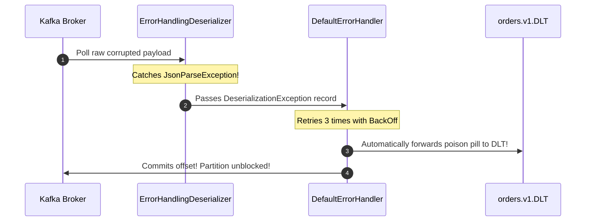
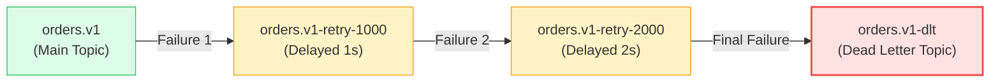

# Spring Boot & Apache Kafka: Enterprise Patterns & Deep Dive

> **Cluster 03 — Module 07**  
> Focus: `KafkaTemplate`, `@KafkaListener`, `ErrorHandlingDeserializer`, non-blocking `@RetryableTopic`, Dead Letter Topics (DLT), AckModes, and Spring Boot Actuator health probes.

---

## 1. Spring for Apache Kafka Architecture

Spring Kafka provides high-level abstractions over the low-level Apache Kafka Java client:

```mermaid
flowchart TD
    subgraph Spring_Producer["Spring Boot Producer (order-service)"]
        Controller["@RestController\nOrderController"] --> Template["KafkaTemplate<String, OrderEvent>\n(Thread-safe async producer)"]
        Template --> Ser["JsonSerializer / StringSerializer"]
    end

    subgraph Kafka_Topic["Kafka Cluster"]
        Topic["Topic: orders.v1\n(3 Partitions)"]
    end

    subgraph Spring_Consumer["Spring Boot Consumer (notification-service)"]
        Factory["ConcurrentKafkaListenerContainerFactory\n• Concurrency: 3\n• AckMode: RECORD\n• DefaultErrorHandler"]
        Deser["ErrorHandlingDeserializer\n(Catches poison pills)"]
        Listener["@KafkaListener\nOrderEventListener"]
        
        Deser --> Factory --> Listener
    end

    Spring_Producer -->|Async send() with CompletableFuture| Topic
    Topic --> Spring_Consumer

    style Spring_Producer fill:#f0fdf4,stroke:#22c55e,stroke-width:2px
    style Kafka_Topic fill:#fffbeb,stroke:#f59e0b,stroke-width:2px
    style Spring_Consumer fill:#eff6ff,stroke:#3b82f6,stroke-width:2px
```

---

## 2. The Poison Pill Trap & `ErrorHandlingDeserializer`

> [!CAUTION]
> **The #1 Spring Kafka Production Pitfall:**  
> If an unparseable or corrupted payload arrives and you only use standard `JsonDeserializer`, the deserialization exception is thrown inside the low-level consumer poll loop **before Spring's listener or error handler ever sees the message**. The consumer repeatedly polls the exact same offset, freezing the partition forever!

### The Solution: `ErrorHandlingDeserializer`
Spring provides `ErrorHandlingDeserializer` which wraps the delegate deserializer. When deserialization fails, it catches the error and passes a `DeserializationException` header to the listener container, allowing your `DefaultErrorHandler` to route it to a **Dead Letter Topic (DLT)**!



---

## 3. Non-Blocking Retries: `@RetryableTopic` & DLT

In traditional Spring Kafka, retrying a failed message blocks the partition thread for subsequent messages.  
Spring Kafka introduces **Non-Blocking Retries** via `@RetryableTopic`:



```java
@RetryableTopic(
    attempts = "3",
    backoff = @Backoff(delay = 1000, multiplier = 2.0),
    autoCreateTopics = "true",
    dltStrategy = DltStrategy.FAIL_ON_ERROR
)
@KafkaListener(topics = "orders.v1")
public void handleOrder(OrderEvent event) {
    // If an exception is thrown, Spring Kafka transparently routes it
    // through retry topics with exponential delay, unblocking other partition messages!
}

@DltHandler
public void processDlt(OrderEvent event, @Header(KafkaHeaders.RECEIVED_TOPIC) String topic) {
    log.error("Order routed to Dead Letter Topic: {}", event.orderId());
}
```

---

## 4. Consumer Acknowledgment Modes (`AckMode`)

Configured via `containerProperties.setAckMode(AckMode)`:

| AckMode | When Offset is Committed | Production Use Case |
| :--- | :--- | :--- |
| **`RECORD`** | Immediately after the listener returns for each record | Balanced safety and throughput; minimizes duplicate processing on crash. |
| **`BATCH` (Default)** | After all records returned by the `poll()` call are processed | Highest throughput, but crash reprocesses entire batch. |
| **`MANUAL`** | In user code via `Acknowledgment.acknowledge()` (queued until batch ends) | Custom business logic gating offset commits. |
| **`MANUAL_IMMEDIATE`** | Immediately when `Acknowledgment.acknowledge()` is called | Critical financial systems requiring immediate sync commit. |

---

## 5. Kubernetes Integration via Spring Boot Actuator

Spring Boot Actuator integrates natively with Kubernetes health checks without custom boilerplate:

```yaml
# application.yml
management:
  endpoint:
    health:
      probes:
        enabled: true
  health:
    livenessstate:
      enabled: true
    readinessstate:
      enabled: true
```

- **Liveness Probe**: `GET http://<pod-ip>:8080/actuator/health/liveness` $\to$ Returns HTTP 200 `{"status":"UP"}` when JVM is running.
- **Readiness Probe**: `GET http://<pod-ip>:8080/actuator/health/readiness` $\to$ Returns HTTP 200 when all components (Kafka connections, database pools) are ready to accept customer traffic.

---

## 6. Top 10 Spring Boot & Kafka Interview Questions

### Q1: What is the purpose of `ErrorHandlingDeserializer` in Spring Kafka?
**Answer:** It wraps delegate deserializers (like `JsonDeserializer`). If a record has malformed bytes, standard deserializers throw exceptions during `KafkaConsumer.poll()`, preventing the message from ever reaching the `@KafkaListener` or Spring error handler and causing an unrecoverable infinite loop. `ErrorHandlingDeserializer` catches the exception and passes null/exception metadata, allowing Spring's `DefaultErrorHandler` or `DeadLetterPublishingRecoverer` to handle or discard the poison pill cleanly.

### Q2: How does `KafkaTemplate` handle asynchronous sends and failures?
**Answer:** `KafkaTemplate.send()` returns a `CompletableFuture<SendResult<K, V>>`. It is completely non-blocking. Developers attach callbacks using `.whenComplete((result, ex) -> { ... })` or `.thenApply()` to inspect `RecordMetadata` (topic, partition, offset) upon success, or log/alert if broker delivery fails.

### Q3: What is the difference between blocking retries and `@RetryableTopic` non-blocking retries?
**Answer:** 
- **Blocking retries (`DefaultErrorHandler`)**: Suspends the consumer thread while sleeping between retry attempts. This halts message processing for all other messages waiting in that partition, increasing consumer lag.
- **Non-blocking retries (`@RetryableTopic`)**: Publishes the failing message to a separate retry topic (e.g. `orders-retry-1000`) and commits the offset on the main topic. The consumer thread immediately moves on to the next message.

### Q4: How does the `concurrency` property in `@KafkaListener` work?
**Answer:** It specifies the number of concurrent `KafkaMessageListenerContainer` threads created inside the JVM. For optimal performance, set concurrency equal to or less than the topic's partition count. For example, a topic with 3 partitions and `concurrency = 3` assigns 1 dedicated thread per partition.

### Q5: How do you achieve transaction atomicity between a database write and a Kafka publish in Spring Boot?
**Answer:** Use Spring's `ChainedKafkaTransactionManager` or configure `KafkaTransactionManager` synchronized with a JPA/DataSource transaction manager (`@Transactional`). Spring coordinates a Two-Phase Commit (2PC): if the database insert fails, the Kafka transaction is aborted, and consumers configured with `isolation.level=read_committed` will never read the uncommitted record.

### Q6: What is `DeadLetterPublishingRecoverer`?
**Answer:** An error handler callback that automatically republishes failed messages to a dead letter topic (default name: `<original_topic>.DLT`) after exhausting configured retry attempts.

### Q7: How do you run integration tests for Spring Kafka microservices in CI/CD?
**Answer:** Using **Testcontainers** (`org.testcontainers:kafka`). It spins up a real, ephemeral Apache Kafka Docker container during `mvn test`, allowing tests to verify real event publishing, serialization, and consumer group rebalances in a pristine sandbox environment.

### Q8: What is the JVM container awareness issue in Docker/Kubernetes and how do you configure Spring Boot for it?
**Answer:** Legacy JVMs inspected host OS `/proc/meminfo` rather than container cgroup limits, causing the JVM heap to allocate memory based on total physical node RAM and triggering the Linux kernel `OOMKiller` (Exit Code 137). In Java 17/21, container awareness is enabled by default via `-XX:+UseContainerSupport`, and heap size is tuned dynamically via `-XX:MaxRAMPercentage=75.0`.

### Q9: How do you gracefully shut down a Spring Kafka consumer in Kubernetes?
**Answer:** Set `server.shutdown=graceful` and configure `spring.lifecycle.timeout-per-shutdown-phase=20s`. On receiving `SIGTERM`, Spring Kafka stops fetching new records, allows in-flight records currently being processed by listener threads to finish and commit their offsets, and calls `consumer.close()` cleanly before the JVM exits.

### Q10: What is the difference between `spring.json.value.default.type` and type headers?
**Answer:** Spring's `JsonSerializer` embeds a header `__TypeId__` containing the fully qualified class name of the produced object. If consumer and producer reside in different packages or microservices, deserialization fails with `ClassNotFoundException`. Setting `spring.json.use.type.headers=false` and configuring `spring.json.value.default.type` decouples the JSON structure from Java package names across services.
