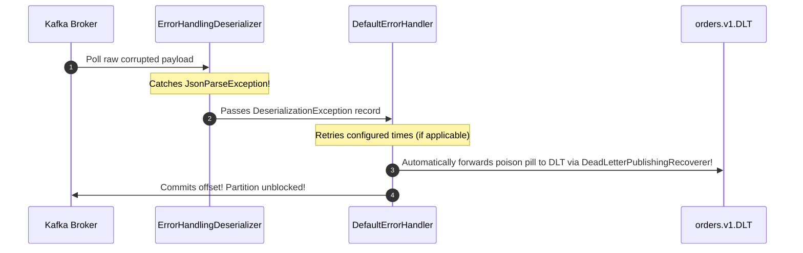
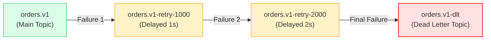
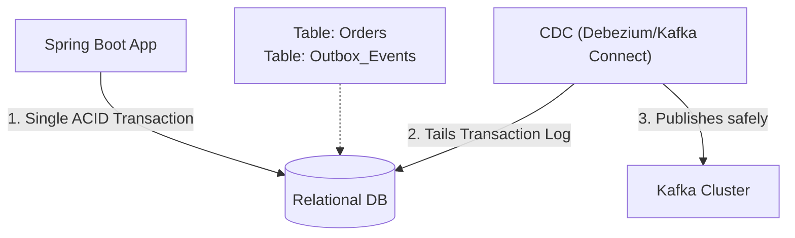

# Spring Boot & Apache Kafka: Enterprise Patterns & Deep Dive

> **Cluster 03 — Module 07**  
> Focus: `KafkaTemplate`, `@KafkaListener`, `ErrorHandlingDeserializer`, non-blocking `@RetryableTopic`, Dead Letter Topics (DLT), AckModes, Transactions, Outbox Pattern, and Spring Boot Actuator health probes.

---

## 1. Spring for Apache Kafka Architecture & Components

Spring Kafka provides robust, high-level abstractions over the low-level Apache Kafka Java client, bringing the familiar Spring programming model to messaging.

```mermaid
flowchart TD
    subgraph Spring_Producer["Spring Boot Producer (order-service)"]
        Controller["@RestController\nOrderController"] --> Template["KafkaTemplate<String, OrderEvent>\n(Thread-safe async producer)"]
        Template --> Ser["JsonSerializer / StringSerializer"]
    end

    subgraph Kafka_Topic["Kafka Cluster"]
        Topic["Topic: orders.v1\n(3 Partitions)"]
    end

    subgraph Spring_Consumer["Spring Boot Consumer (notification-service)"]
        Factory["ConcurrentKafkaListenerContainerFactory\n• Concurrency: 3\n• AckMode: RECORD\n• DefaultErrorHandler"]
        Deser["ErrorHandlingDeserializer\n(Catches poison pills)"]
        Listener["@KafkaListener\nOrderEventListener"]
        
        Deser --> Factory --> Listener
    end

    Spring_Producer -->|Async send() with CompletableFuture| Topic
    Topic --> Spring_Consumer

    style Spring_Producer fill:#f0fdf4,stroke:#22c55e,stroke-width:2px
    style Kafka_Topic fill:#fffbeb,stroke:#f59e0b,stroke-width:2px
    style Spring_Consumer fill:#eff6ff,stroke:#3b82f6,stroke-width:2px
```

### Key Abstractions:
- **`KafkaTemplate`**: A thread-safe, high-level wrapper for producing messages. It handles connection pooling, metric collection, and serialization natively.
- **`MessageListenerContainer`**: The backbone of `@KafkaListener`. It manages consumer threads, offset commits, partition rebalances, and polling loops continuously in the background.
- **`ConcurrentKafkaListenerContainerFactory`**: Factory to create container instances. You configure consumer properties (like concurrency, error handlers, and message converters) here.

---

## 2. The Poison Pill Trap & `ErrorHandlingDeserializer`

> [!CAUTION]
> **The #1 Spring Kafka Production Pitfall:**  
> If an unparseable or corrupted payload arrives (a "Poison Pill") and you only use standard `JsonDeserializer`, the deserialization exception is thrown inside the low-level consumer poll loop **before Spring's listener or error handler ever sees the message**. The consumer repeatedly polls the exact same offset, freezing the partition forever!

### The Solution: `ErrorHandlingDeserializer`
Spring provides `ErrorHandlingDeserializer` which wraps the delegate deserializer. When deserialization fails, it catches the error, wraps it in a `DeserializationException`, and passes it in the record headers to the listener container, allowing your `DefaultErrorHandler` to route it to a **Dead Letter Topic (DLT)**!



---

## 3. Advanced Consumer Resiliency: Non-Blocking Retries & DLT

In traditional Spring Kafka, retrying a failed message blocks the partition thread (via `Thread.sleep()`), preventing subsequent messages from being processed. This is disastrous for high-throughput systems.

Spring Kafka introduced **Non-Blocking Retries** via `@RetryableTopic`. This routes failed messages to separate delayed retry topics, immediately freeing the consumer thread for the next message on the main partition.



### Pro-Level Configuration

```java
@RetryableTopic(
    attempts = "3",
    backoff = @Backoff(delay = 1000, multiplier = 2.0, maxDelay = 5000),
    autoCreateTopics = "true",
    dltStrategy = DltStrategy.FAIL_ON_ERROR,
    include = { RecoverableException.class },
    exclude = { IllegalArgumentException.class } // Fatal errors go straight to DLT
)
@KafkaListener(topics = "orders.v1", groupId = "order-processor-group")
public void handleOrder(OrderEvent event) {
    // Business logic
}

@DltHandler
public void processDlt(OrderEvent event, @Header(KafkaHeaders.RECEIVED_TOPIC) String topic) {
    log.error("Order routed to Dead Letter Topic: {} from topic: {}", event.orderId(), topic);
    // Persist to database for manual intervention
}
```

---

## 4. Consumer Acknowledgment Modes (`AckMode`)

Configured via `containerProperties.setAckMode(AckMode)`:

| AckMode | When Offset is Committed | Production Use Case |
| :--- | :--- | :--- |
| **`RECORD`** | Immediately after the listener returns for each record | Balanced safety and throughput; minimizes duplicate processing on crash. |
| **`BATCH` (Default)** | After all records returned by the `poll()` call are processed | Highest throughput, but crash reprocesses entire batch. |
| **`MANUAL`** | In user code via `Acknowledgment.acknowledge()` (queued until batch ends) | Custom business logic gating offset commits. |
| **`MANUAL_IMMEDIATE`** | Immediately when `Acknowledgment.acknowledge()` is called | Critical financial systems requiring immediate sync commit. |

> [!TIP]
> **Idempotency is Key:** Regardless of `AckMode`, consumers must be idempotent (e.g., using a database `UNIQUE` constraint or Redis key checking on Message ID) because Kafka guarantees **At-Least-Once** delivery by default.

---

## 5. Distributed Transactions & Dual-Write Avoidance

### The Dual-Write Problem
When saving an entity to a DB and publishing an event to Kafka, failure in one system leaves them inconsistent. 

### Solution 1: Chained Transaction Managers
Spring can orchestrate a 1.5 Phase Commit by linking the DB Transaction and Kafka Transaction. 
If the DB commit fails, the Kafka transaction is aborted. Consumers must use `isolation.level=read_committed`.

### Solution 2: The Transactional Outbox Pattern (Enterprise Grade)
Instead of dual-writing, you write the business entity AND an "Outbox Event" to the DB in a **single ACID transaction**. A separate background process (like Debezium CDC or a Spring `@Scheduled` poller) reads the Outbox table and publishes to Kafka.



---

## 6. Tuning Consumer Performance & Liveness

Pro-level Spring Kafka tuning involves matching consumer threads to partitions and preventing unnecessary rebalances.

- **`concurrency`**: If `orders.v1` has 6 partitions, set `@KafkaListener(concurrency="6")` to run 6 parallel threads in the JVM. Setting it to >6 wastes threads; setting it to <6 causes one thread to handle multiple partitions sequentially.
- **`max.poll.interval.ms` (Default: 5 mins)**: Maximum time allowed for your `@KafkaListener` to execute before Kafka assumes the consumer thread is dead and triggers a rebalance. If your processing is slow, increase this!
- **`max.poll.records` (Default: 500)**: Limit the number of records returned per poll to ensure you finish within `max.poll.interval.ms`.
- **`session.timeout.ms`**: How long the broker waits for heartbeat signals from the background thread before assuming the node crashed.

---

## 7. Kubernetes Integration via Spring Boot Actuator

Spring Boot Actuator integrates natively with Kubernetes health checks:

```yaml
# application.yml
management:
  health:
    livenessstate:
      enabled: true
    readinessstate:
      enabled: true
```

- **Liveness Probe**: `GET /actuator/health/liveness` $\to$ Returns `UP` if the JVM is running.
- **Readiness Probe**: `GET /actuator/health/readiness` $\to$ Validates Kafka broker connections. If the broker is unreachable, this returns `DOWN` and Kubernetes will stop routing traffic to this pod.

> [!TIP]
> **Graceful Shutdown**: Set `server.shutdown=graceful` and `spring.lifecycle.timeout-per-shutdown-phase=20s`. On `SIGTERM`, Spring stops fetching new Kafka records, allows in-flight records to finish and commit, and cleanly leaves the consumer group.

---

## 8. Top 15 Spring Boot & Kafka Interview Questions

### Q1: What is the purpose of `ErrorHandlingDeserializer` in Spring Kafka?
**Answer:** It wraps delegate deserializers (like `JsonDeserializer`). If a record has malformed bytes, standard deserializers throw exceptions during `KafkaConsumer.poll()`, preventing the message from reaching the `@KafkaListener` and causing an infinite loop. `ErrorHandlingDeserializer` catches the exception and passes it in headers, allowing `DefaultErrorHandler` to forward the poison pill to a DLT.

### Q2: How does `KafkaTemplate` handle asynchronous sends and failures?
**Answer:** `KafkaTemplate.send()` returns a `CompletableFuture<SendResult<K, V>>`. It is completely non-blocking. Developers attach callbacks using `.whenComplete()` to inspect `RecordMetadata` (topic, partition, offset) upon success, or log/alert if broker delivery fails.

### Q3: What is the difference between blocking retries and `@RetryableTopic` non-blocking retries?
**Answer:** 
- **Blocking retries (`DefaultErrorHandler`)**: Suspends the consumer thread while sleeping between retry attempts. This halts message processing for all other messages waiting in that partition.
- **Non-blocking retries (`@RetryableTopic`)**: Publishes the failing message to a separate retry topic (e.g. `orders-retry-1000`) and commits the offset on the main topic. The consumer thread immediately moves on to the next message.

### Q4: How does the `concurrency` property in `@KafkaListener` work?
**Answer:** It specifies the number of concurrent `KafkaMessageListenerContainer` threads created inside the JVM. For optimal performance, set concurrency equal to or less than the topic's partition count. 

### Q5: How do you achieve transaction atomicity between a database write and a Kafka publish?
**Answer:** Use the **Transactional Outbox Pattern** with Debezium CDC for absolute correctness. Alternatively, use Spring's `ChainedKafkaTransactionManager` for a 1.5PC approach, requiring consumers to set `isolation.level=read_committed`.

### Q6: What is `DeadLetterPublishingRecoverer`?
**Answer:** An error handler callback that automatically republishes failed messages to a dead letter topic (default name: `<original_topic>.DLT`) after exhausting configured retry attempts.

### Q7: How do you run integration tests for Spring Kafka microservices in CI/CD?
**Answer:** Using **Testcontainers** (`org.testcontainers:kafka`). It spins up a real, ephemeral Apache Kafka Docker container during `mvn test`, allowing tests to verify real event publishing and consumer behavior.

### Q8: What causes an infinite rebalance loop, and how do you fix it?
**Answer:** When processing a batch takes longer than `max.poll.interval.ms`, Kafka considers the consumer dead and triggers a rebalance. The fix is to increase `max.poll.interval.ms`, decrease `max.poll.records`, or optimize the listener's processing speed.

### Q9: How do you gracefully shut down a Spring Kafka consumer in Kubernetes?
**Answer:** Configure `server.shutdown=graceful` and a lifecycle timeout. On `SIGTERM`, Spring Kafka stops polling, finishes in-flight processing, commits offsets, and executes a clean `consumer.close()`.

### Q10: What is the difference between `spring.json.value.default.type` and type headers?
**Answer:** Spring's `JsonSerializer` embeds a header `__TypeId__` containing the producer's fully qualified class name. If consumer and producer reside in different packages, deserialization fails. Setting `spring.json.use.type.headers=false` allows the consumer to define its own target class, decoupling the services.

### Q11: How do you implement Exactly-Once Semantics (EOS) in Spring Kafka?
**Answer:** Enable `enable.idempotence=true` on producers to avoid duplicate appends. In Kafka Streams or Consume-Transform-Produce scenarios, set `transactional.id.prefix` on the factory and use `isolation.level=read_committed` on consumers to ensure atomic read-process-write operations.

### Q12: Why might you use `AckMode.MANUAL` instead of `AckMode.RECORD`?
**Answer:** `MANUAL` is useful when you want to batch DB updates for a set of messages, or when processing involves async downstream API calls, allowing you to explicitly call `Acknowledgment.acknowledge()` only when all downstream processing is truly complete.

### Q13: What happens to `@KafkaListener` threads when partitions scale up dynamically?
**Answer:** If you have `concurrency=3` and the topic goes from 3 to 6 partitions, each thread will now be assigned 2 partitions. You would need to deploy more pods (or increase concurrency and restart) to utilize the new partitions fully.

### Q14: How do Consumer Groups ensure scalability and fault tolerance?
**Answer:** Multiple instances with the same `groupId` share the partitions of a topic mutually exclusively. If an instance crashes, Kafka's group coordinator automatically rebalances its partitions among the surviving instances, ensuring continuous fault tolerance.

### Q15: How can you dynamically pause and resume a Spring Kafka consumer?
**Answer:** You can autowire `KafkaListenerEndpointRegistry` to access the `MessageListenerContainer` by its ID, and then call `container.pause()` or `container.resume()`. This is useful for implementing custom backpressure if an external system (like a DB) goes down.
