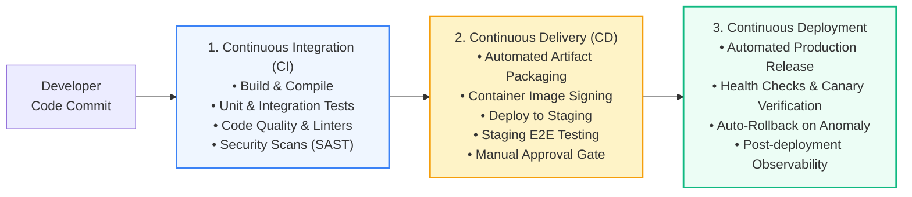
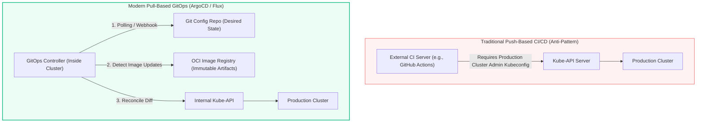

# CI/CD: Fundamentals, GitOps & Pipeline Design (Pro-Level)

> **Cluster 04 — Module 01**  
> Focus: Continuous Integration vs Continuous Delivery vs Continuous Deployment, Trunk-Based Development, Push vs Pull GitOps (ArgoCD, Flux), pipeline stages, and advanced architectural patterns.

---

## 1. The CI/CD/CD Continuum

Understanding the precise boundaries between integration, delivery, and deployment is critical for designing resilient pipelines.

### Advanced Definitions:
1. **Continuous Integration (CI)**: The practice of merging all developer working copies to a shared mainline several times a day. Beyond simple compilation, modern CI encompasses "Shift-Left Security" (SAST, secret scanning) and deep static analysis (SonarQube) to block broken or insecure code from ever reaching an artifact registry.
2. **Continuous Delivery (CD)**: The architectural capability of ensuring every green build is inherently deployable. Delivery ends with a release-ready artifact (e.g., an OCI-compliant Helm chart or Docker image) stored in a secure registry, verified in staging, but gated from production by a deliberate human business decision (approval).
3. **Continuous Deployment**: The holy grail of automation. Every change that passes automated tests is deployed to production automatically. This requires extreme confidence in test coverage, robust observability (Prometheus/Datadog), and automated rollback mechanisms (e.g., Argo Rollouts).

---

## 2. CI/CD Architecture: Push-Based vs Pull-Based GitOps

How does a built artifact reliably and securely transition into a production Kubernetes cluster? 

### The Traditional Push Model (Anti-Pattern for K8s)
In a push model, the CI/CD server (Jenkins, GitHub Actions, GitLab CI) reaches *out* into the target environment. It runs commands like `kubectl apply` or `helm upgrade`.
**Critical Flaw**: This necessitates giving the CI runner cluster-admin credentials, creating a massive attack vector. If the CI tool is compromised, the entire infrastructure is compromised.

### The Modern Pull-Based GitOps Model
GitOps shifts the paradigm by placing an intelligent, state-reconciling agent (operator) *inside* the secure cluster perimeter. 

### Why Pull-Based GitOps is the Industry Standard

| Architectural Aspect | Push-Based (e.g., Jenkins / GitHub Actions) | Pull-Based GitOps (ArgoCD / Flux) |
| :--- | :--- | :--- |
| **Security & Credential Management** | External CI tool requires full cluster credentials stored as external secrets. High risk of exfiltration. | Zero cluster credentials exposed externally. The agent runs inside the cluster, pulling from Git (requires read-only Git access). |
| **Configuration Drift Resolution** | CI server is blind to manual changes. If someone runs `kubectl edit`, drift persists until the next pipeline run. | Operator continuously compares live state to Git (desired state). It automatically detects and overwrites unauthorized manual edits (Self-Healing). |
| **Disaster Recovery (DR)** | Requires complex re-running of pipelines and manual state recreation. | Cluster state can be bootstrapped from scratch by simply pointing a new GitOps controller at the Git repo. |
| **Audit Trail** | Fragmented across pipeline logs, user actions, and shell history. | Git history (`git log`) serves as the single source of truth and immutable audit log for infrastructure changes. |

---

## 3. Advanced Branching Strategies

Choosing how code integrates is just as important as how it deploys.

### GitFlow (Legacy/Heavyweight)
- Relies on long-lived branches (`develop`, `feature/*`, `release/*`).
- Features often take weeks to merge, leading to "Merge Hell".
- Delays the feedback loop; CI is run too late in the lifecycle.

### Trunk-Based Development (Modern Standard)
- Developers work on short-lived branches (hours, not days).
- Code is merged into the mainline (`main`/`trunk`) constantly.
- **Enabler**: Feature Flags (LaunchDarkly, Unleash). Code is deployed to production but hidden from users until ready, decoupling *deployment* from *release*.
- Eliminates integration phases and significantly boosts developer velocity (DORA metrics).

---

## 4. Complex Real-World Pipeline Challenges

### Ephemeral Environments
Modern CI creates isolated, on-demand test environments (e.g., Kubernetes namespaces or VCluster instances) for every Pull Request. Once the PR is merged, the environment is automatically torn down. This ensures complete E2E testing without staging environment bottlenecks.

### Database Schema Migrations
Applying database migrations (Liquibase, Flyway) via CI/CD is notoriously risky. Pro-level pipelines decouple app code from DB schema changes:
1. Run backward-compatible database migrations *first*.
2. Deploy the application code that uses the new schema.
3. Post-deployment, clean up old schema fields in a subsequent release.

---

## 5. Official References & Deep Dives
- [Martin Fowler: Continuous Integration](https://martinfowler.com/articles/continuousIntegration.html)
- [OpenGitOps Principles](https://opengitops.dev/)
- [ArgoCD Architecture Deep Dive](https://argo-cd.readthedocs.io/en/stable/core_concepts/)
- [Trunk Based Development Handbook](https://trunkbaseddevelopment.com/)
- [DORA Metrics & State of DevOps](https://dora.dev/)
