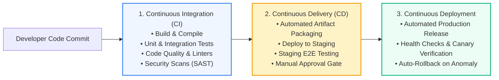
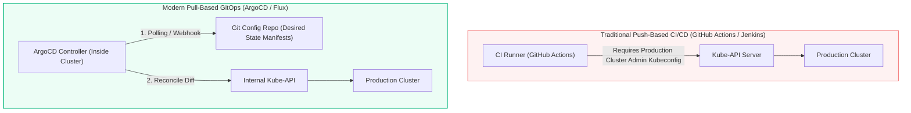
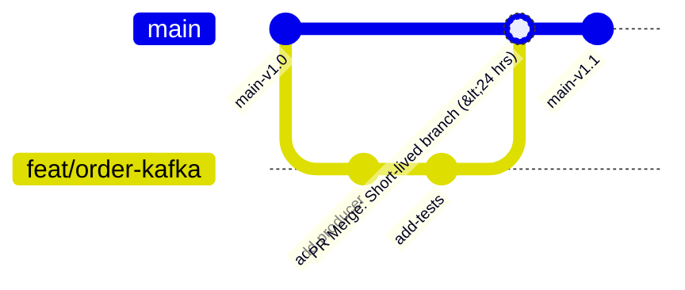

# CI/CD: Fundamentals, GitOps & Pipeline Design

> **Cluster 04 — Module 01**  
> Focus: Continuous Integration vs Continuous Delivery vs Deployment, Trunk-Based Development, Push vs Pull GitOps (ArgoCD), and pipeline stages.

---

## 1. CI vs CD vs Continuous Deployment

### Definitions:
1. **Continuous Integration (CI)**: Developers merge code changes frequently into a shared trunk. Every merge automatically triggers automated builds and test suites to detect regressions early.
2. **Continuous Delivery (CD)**: Extends CI by ensuring every build is packageable and deployable to production at the click of a button after passing staging environments.
3. **Continuous Deployment**: Fully automated path to production where code passing all automated gates is deployed immediately without human intervention.

---

## 2. Push-Based CI/CD vs Pull-Based GitOps

How does an artifact actually make its way into a Kubernetes cluster?

### Why Pull-Based GitOps Wins in Production

| Aspect | Push-Based (e.g. Jenkins / GitHub Actions) | Pull-Based GitOps (ArgoCD / Flux) |
| :--- | :--- | :--- |
| **Cluster Security** | External CI tool requires full cluster-admin credentials stored as repository secrets (huge attack vector). | Zero cluster credentials exposed externally. Agent runs inside the cluster pulling from Git. |
| **Configuration Drift** | If someone runs `kubectl edit` or deletes a pod manually, the CI server never detects the drift. | ArgoCD constantly compares cluster state to Git and automatically reverts unauthorized manual edits. |
| **Rollbacks** | Requires re-running a pipeline build job. | Instant: Just `git revert` a Git commit. |
| **Audit Trail** | Fragmented across pipeline logs. | Git commit log serves as the single immutable audit log for all changes. |

---

## 3. Branching Strategies: Trunk-Based Development vs GitFlow

- **GitFlow (Legacy)**: Heavy branches (`develop`, `feature/*`, `release/*`, `hotfix/*`, `main`). Features take weeks to merge, resulting in painful merge conflicts and delayed feedback loops.
- **Trunk-Based Development (Modern DevOps Standard)**: Developers create short-lived feature branches (< 1 day of work), make small atomic commits, run automated tests, and merge back into `main` frequently behind **Feature Flags**.

---

## 4. Official References
- [Martin Fowler on Continuous Integration](https://martinfowler.com/articles/continuousIntegration.html)
- [OpenGitOps Principles](https://opengitops.dev/)
- [ArgoCD Architecture](https://argo-cd.readthedocs.io/en/stable/core_concepts/)
- [Trunk Based Development Guide](https://trunkbaseddevelopment.com/)
