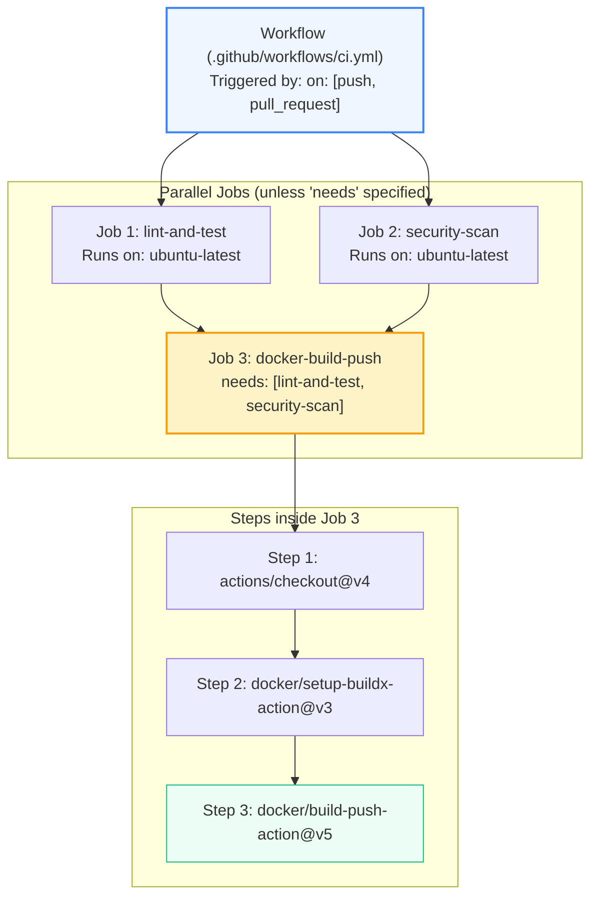
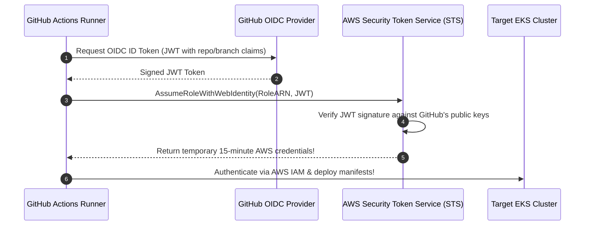

# GitHub Actions: Architecture, Syntax & Advanced Pipelines

> **Cluster 04 — Module 02**  
> Focus: Workflow DAGs, matrix strategies, dependency caching, OIDC cloud federation, and concurrency controls.

---

## 1. GitHub Actions Execution Hierarchy



---

## 2. Advanced Optimization: Dependency Caching & Concurrency

### A. Automatic Concurrency Cancellation
Prevents wasted compute minutes when a developer pushes multiple commits in rapid succession:
```yaml
concurrency:
  group: ${{ github.workflow }}-${{ github.ref }}
  cancel-in-progress: true   # Aborts older in-flight runs of the same branch!
```

### B. Dependency Caching
```yaml
- name: Setup Node.js Environment
  uses: actions/setup-node@v4
  with:
    node-version: 20
    cache: 'npm'   # Automatically hashes package-lock.json and caches ~/.npm
```

---

## 3. Matrix Strategy (Multi-Version & Multi-OS Testing)

Test multiple combinations in parallel without repeating YAML code:

```yaml
jobs:
  test:
    runs-on: ${{ matrix.os }}
    strategy:
      fail-fast: false  # Don't cancel remaining jobs if one fails
      matrix:
        os: [ubuntu-latest, macos-latest]
        node-version: [18.x, 20.x]
    steps:
      - uses: actions/checkout@v4
      - name: Use Node.js ${{ matrix.node-version }}
        uses: actions/setup-node@v4
        with:
          node-version: ${{ matrix.node-version }}
      - run: npm ci
      - run: npm test
```

---

## 4. OIDC (OpenID Connect): Passwordless Cloud Deployment

Storing static, long-lived AWS Access Keys in repository secrets is a severe security risk. If leaked, attackers gain full access to your cloud account.

**OIDC (OpenID Connect)** allows GitHub Actions runners to exchange a short-lived JSON Web Token (JWT) directly with AWS/GCP/Azure IAM to assume a temporary role.



---

## 5. Official References
- [GitHub Actions Workflow Syntax](https://docs.github.com/en/actions/using-workflows/workflow-syntax-for-github-actions)
- [Configuring OpenID Connect (OIDC) in AWS](https://docs.github.com/en/actions/deployment/security-hardening-your-deployments/about-security-hardening-with-openid-connect)
- [Caching Dependencies to Speed Up Workflows](https://docs.github.com/en/actions/using-workflows/caching-dependencies-to-speed-up-workflows)
