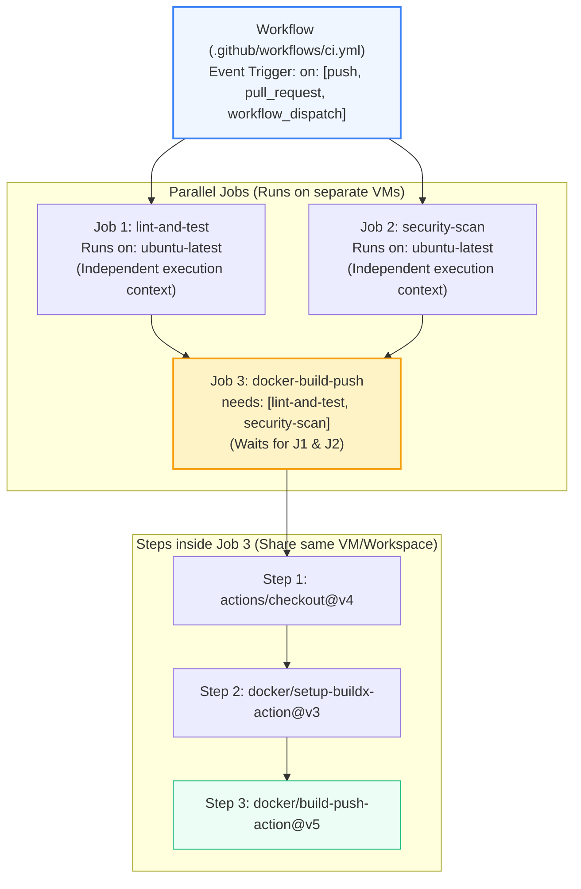
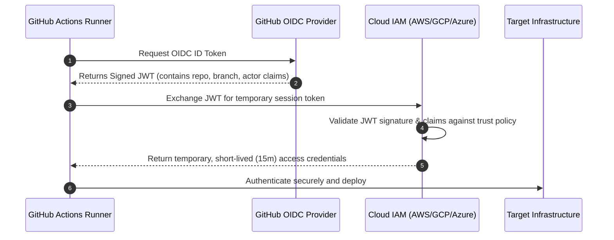

# GitHub Actions: Architecture, Syntax & Advanced Pipelines (Pro-Level)

> **Cluster 04 — Module 02**  
> Focus: Workflow DAGs, matrix strategies, dependency caching, OIDC cloud federation, Reusable Workflows vs Composite Actions, and self-hosted runners.

---

## 1. GitHub Actions Execution Hierarchy & DAGs

GitHub Actions models CI/CD pipelines as Directed Acyclic Graphs (DAGs). Understanding the exact execution context of each component is vital for pipeline optimization and security.



*Pro Tip:* Because Jobs run on separate VMs, they do not share state (files/memory). To pass artifacts between jobs, you MUST use `actions/upload-artifact` and `actions/download-artifact`.

---

## 2. Pipeline DRY Principles: Reusable Workflows vs Composite Actions

To avoid duplicating YAML across dozens of microservices, GitHub provides two distinct abstraction mechanisms.

| Feature | Composite Actions (`action.yml`) | Reusable Workflows (`workflow_call`) |
| :--- | :--- | :--- |
| **Scope of execution** | Runs as a single step *inside* an existing Job. | Runs as entirely separate Jobs/Workflows. |
| **Best used for** | Bundling standard setup scripts (e.g., checkout + setup-java + setup-cache). | Standardizing complete organizational pipelines (e.g., "The Official Microservice CI Pipeline"). |
| **Secret Management** | Cannot directly access secrets without explicit passing. | Can use `secrets: inherit` to seamlessly access org secrets. |

---

## 3. Advanced Optimization Strategies

### A. Automatic Concurrency Cancellation
Prevents wasted compute minutes and race conditions when developers push multiple commits rapidly. 
```yaml
concurrency:
  group: ${{ github.workflow }}-${{ github.ref }}
  cancel-in-progress: true   # Aborts older in-flight runs on the same branch
```

### B. Dependency Caching Deep Dive
Fetching dependencies (NPM, Maven, Go modules) is usually the slowest part of CI. Efficient caching requires robust cache keys based on lockfile hashes.
```yaml
- name: Setup Node.js with Advanced Caching
  uses: actions/setup-node@v4
  with:
    node-version: 20
    cache: 'npm'
    cache-dependency-path: '**/package-lock.json' # Useful in monorepos
```
*Security Note:* Cache poisoning is a risk. Ensure untrusted PRs (from forks) cannot write to the cache of the main branch.

---

## 4. Matrix Strategy & Fail-Fast Mechanics

Test multiple environments concurrently without repeating configuration.

```yaml
jobs:
  e2e-test:
    runs-on: ubuntu-latest
    strategy:
      fail-fast: false  # Crucial: Don't cancel remaining valid jobs if Windows fails
      matrix:
        os: [ubuntu-latest, macos-latest, windows-latest]
        node-version: [18.x, 20.x]
        exclude:
          - os: windows-latest
            node-version: 18.x # Skip this specific combination
    steps:
      - uses: actions/checkout@v4
      - name: Setup Node ${{ matrix.node-version }}
        uses: actions/setup-node@v4
        with: { node-version: '${{ matrix.node-version }}' }
```

---

## 5. Security: OIDC (OpenID Connect) Cloud Federation

Storing static, long-lived Cloud credentials (AWS Access Keys, GCP Service Accounts) as GitHub Secrets is a major security vulnerability (credential rotation nightmare, leakage risk).

**OIDC** replaces static keys with ephemeral, dynamically generated tokens based on cryptographic trust between GitHub and the Cloud Provider.



**Implementation Example (AWS):**
```yaml
permissions:
  id-token: write   # Required to request the JWT
  contents: read

steps:
  - name: Configure AWS Credentials
    uses: aws-actions/configure-aws-credentials@v4
    with:
      role-to-assume: arn:aws:iam::123456789012:role/GitHubActionsDeployRole
      aws-region: us-east-1
```

---

## 6. Enterprise Scale: Actions Runner Controller (ARC)

For enterprise environments, relying on GitHub's hosted runners can lead to IP whitelisting issues and slow builds. 
**ARC** allows you to host runners inside your own Kubernetes clusters. It auto-scales runner pods based on GitHub Webhooks (e.g., scaling up pods instantly when a PR is opened) and ensures runners are isolated and secure within your VPC.

---

## 7. Official References
- [GitHub Actions Security Hardening & OIDC](https://docs.github.com/en/actions/deployment/security-hardening-your-deployments)
- [Managing GitHub Actions at Scale (Reusable Workflows)](https://docs.github.com/en/actions/using-workflows/reusing-workflows)
- [Actions Runner Controller (ARC) Documentation](https://docs.github.com/en/actions/hosting-your-own-runners/managing-self-hosted-runners-with-actions-runner-controller)
