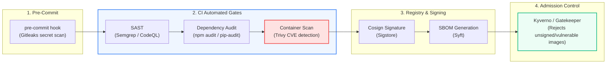

# CI/CD: DevSecOps, Container Scanning & Pipeline Security

> **Cluster 04 — Module 03**  
> Focus: Shift-Left security, Trivy vulnerability scanning, secret detection (Gitleaks), SBOM generation, and Cosign image signing.

---

## 1. The DevSecOps "Shift-Left" Model

In traditional operations, security reviews occurred immediately prior to production release, causing days of delays. **Shift-Left Security** embeds automated security verification directly into every commit and pull request.



---

## 2. Container Vulnerability Scanning with Trivy

**Aqua Security's Trivy** is the industry standard for scanning container images, filesystem directories, and Git repositories for known Common Vulnerabilities and Exposures (CVEs).

### Production GitHub Actions Trivy Step
```yaml
- name: Run Trivy Vulnerability Scanner
  uses: aquasecurity/trivy-action@master
  with:
    image-ref: 'ghcr.io/${{ github.repository }}:${{ github.sha }}'
    format: 'table'
    exit-code: '1'             # Fail the build if vulnerabilities found!
    ignore-unfixed: true      # Only fail on CVEs that have an existing patch
    severity: 'CRITICAL,HIGH'  # Block deployments for Critical and High CVEs
```

---

## 3. Secret Detection: Preventing Leaked Credentials

Accidentally committing credentials (`AWS_SECRET_KEY`, database passwords, private certificates) into Git history is an immediate disaster.

Use **Gitleaks** to catch secrets *before* code is pushed:
```bash
# Run locally before git push
docker run -v ${PWD}:/path zricethezav/gitleaks:latest detect --source="/path" -v
```

In GitHub Actions:
```yaml
- name: Gitleaks Secret Scan
  uses: gitleaks/gitleaks-action@v2
  env:
    GITHUB_TOKEN: ${{ secrets.GITHUB_TOKEN }}
```

---

## 4. Software Supply Chain Security: SBOM & Cosign

1. **SBOM (Software Bill of Materials)**: A comprehensive inventory of every library, dependency, compiler, and license contained inside an image. Generated via tools like `syft`:
   ```bash
   syft ghcr.io/myorg/order-service:latest -o spdx-json > sbom.json
   ```
2. **Cosign (Keyless Container Signing)**: Digitally signs container images using OpenID Connect identity so Kubernetes clusters can cryptographically verify that an image was built by *your* trusted GitHub Actions workflow, not a malicious actor.
   ```bash
   cosign sign --yes ghcr.io/myorg/order-service:latest
   ```

---

## 5. Official References
- [Aqua Security Trivy Documentation](https://aquasecurity.github.io/trivy/)
- [Gitleaks Repository](https://github.com/gitleaks/gitleaks)
- [Sigstore Cosign Guide](https://docs.sigstore.dev/cosign/overview/)
- [OWASP DevSecOps Guideline](https://owasp.org/www-project-devsecops-guideline/)
