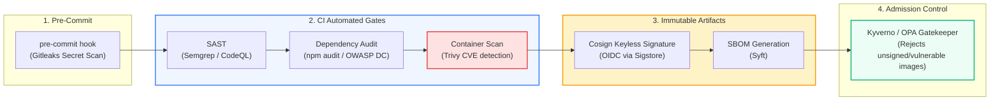

# CI/CD: DevSecOps, Container Scanning & Pipeline Security (Pro-Level)

> **Cluster 04 — Module 03**  
> Focus: Shift-Left security, Trivy vulnerability scanning, secret detection (Gitleaks), SBOM generation, Cosign keyless signing, and the SLSA framework.

---

## 1. The DevSecOps "Shift-Left" Model & SLSA

In traditional operations, security was a gated review just prior to production release, causing massive bottlenecks. **Shift-Left Security** embeds automated security verification directly into every commit, PR, and build step.

To standardize supply chain security, the industry adopts the **SLSA (Supply-chain Levels for Software Artifacts)** framework. Achieving SLSA Level 3/4 requires proving provenance (who built it, when, and from what commit) and ensuring the build environment is ephemeral and isolated.



---

## 2. Deep Dive: Container Vulnerability Scanning with Trivy

**Aqua Security's Trivy** is the industry standard for scanning container images, filesystem directories, and Git repositories for known Common Vulnerabilities and Exposures (CVEs) and IaC misconfigurations.

### Production-Grade GitHub Actions Trivy Integration
In a real enterprise, you don't just "run a scan"; you block deployments dynamically based on CVSS scores while ignoring vulnerabilities that upstream vendors haven't patched yet.

```yaml
- name: Run Trivy Vulnerability Scanner
  uses: aquasecurity/trivy-action@master
  with:
    image-ref: 'ghcr.io/${{ github.repository }}:${{ github.sha }}'
    format: 'sarif'            # Output in SARIF format for GitHub Security Dashboard integration
    output: 'trivy-results.sarif'
    exit-code: '1'             # Fail the build!
    ignore-unfixed: true      # Crucial: Don't fail the pipeline if no patch exists upstream
    severity: 'CRITICAL,HIGH'  # Block deployments for Critical and High CVEs
```

---

## 3. Secret Detection: Preventing Leaked Credentials

Accidentally committing credentials (`AWS_SECRET_KEY`, database passwords, private certificates) into Git history is an immediate disaster. If pushed to a public repo, bots scrape and exploit AWS keys within *seconds*.

Use **Gitleaks** to catch secrets *before* code is pushed via pre-commit hooks, and in CI as a fallback:
```bash
# Developer machine pre-commit testing
docker run -v ${PWD}:/path zricethezav/gitleaks:latest detect --source="/path" -v
```

*Pro Tip:* If a secret is committed, you CANNOT just make a new commit deleting it. The secret lives in the Git history. You must use `git filter-repo` to obliterate it from history and instantly rotate the credential in AWS/GCP.

---

## 4. Software Supply Chain Security: SBOM & Cosign Keyless Signing

How does Kubernetes know that the `nginx:latest` image wasn't swapped in the registry by a hacker?

1. **SBOM (Software Bill of Materials)**: A comprehensive inventory of every library, dependency, compiler, and license contained inside an image. Generated via tools like `syft`:
   ```bash
   syft ghcr.io/myorg/order-service:latest -o spdx-json > sbom.json
   ```

2. **Cosign (Keyless Container Signing)**: Digitally signs container images. Using Sigstore's OIDC integration, GitHub Actions runners authenticate dynamically (keyless) to sign the image. 
   ```bash
   # CI Server signing the image via OIDC
   cosign sign --yes ghcr.io/myorg/order-service:${{ github.sha }}
   ```

3. **Kubernetes Admission Control**: Inside K8s, an engine like **Kyverno** intercepts every Pod creation request, fetches the image signature from the registry, and validates it against the trusted public key. If the signature is invalid or missing, K8s rejects the Pod.

---

## 5. Official References
- [Aqua Security Trivy Documentation](https://aquasecurity.github.io/trivy/)
- [SLSA Framework (Supply-chain Levels for Software Artifacts)](https://slsa.dev/)
- [Sigstore Cosign Guide](https://docs.sigstore.dev/cosign/overview/)
- [Kyverno Policies for Image Verification](https://kyverno.io/policies/software-supply-chain-security/)
