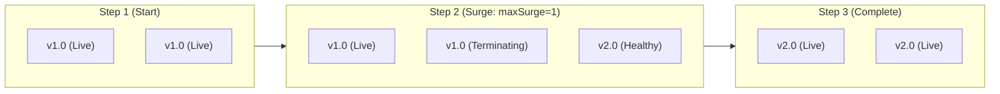
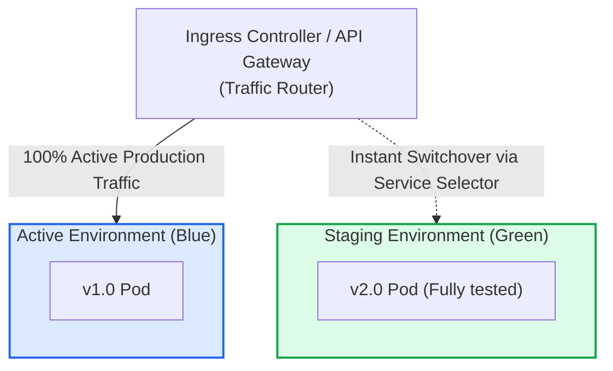
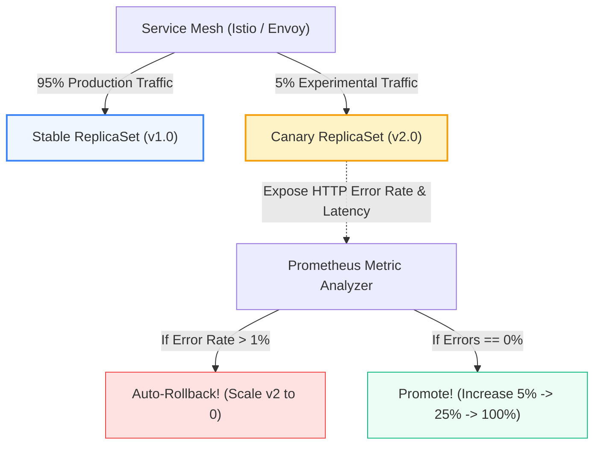

# Deployment Strategies: Rolling, Blue-Green, Canary & A/B (Pro-Level)

> **Cluster 04 — Module 04**  
> Focus: Zero-downtime rollouts, Blue-Green cutovers, Canary metrics analysis via Argo Rollouts & Service Meshes, and backward compatibility in DB patterns.

---

## 1. Advanced Deployment Strategies Comparison Matrix

| Strategy | Downtime | Rollback Speed | Resource Cost | Risk Level | Ideal Use Case |
| :--- | :--- | :--- | :--- | :--- | :--- |
| **Recreate** | Yes (Minutes) | Slow (Re-pull image) | $1.0\times$ (Low) | High | Dev environments, or apps that cannot support multiple versions running concurrently (legacy stateful apps). |
| **Rolling Update** | Zero | Moderate (Reverse roll) | $1.25\times$ (Surge) | Medium | Standard stateless APIs without critical user-facing blast radius concerns. |
| **Blue-Green** | Zero | Instant (< 1 second) | $2.0\times$ (Duplicate) | Low | Major version upgrades requiring extensive final E2E testing in production before traffic cutover. |
| **Canary** | Zero | Instant (< 5 seconds) | $1.1\times$ - $1.2\times$ | Lowest | High-traffic tier-1 services requiring algorithmic verification of error rates/latency. |

---

## 2. Visual Architecture of Strategies & Traffic Control

### A. Rolling Update (Default Kubernetes)
Pods are progressively terminated and replaced by new versions. K8s controls this using `maxSurge` and `maxUnavailable`.

---

### B. Blue-Green Deployment
Two identical environments exist simultaneously. Traffic is switched instantly at the Ingress or Service level.

---

### C. Canary Deployment (Traffic Shifting & Service Meshes)
Requires an intelligent ingress or service mesh (Istio, Linkerd, Envoy) capable of fractional traffic shaping. Argo Rollouts automates this lifecycle based on metrics.

---

## 3. The Crucial Rule of Database Migrations for Zero-Downtime

In Rolling Updates and Canary releases, **version 1.0 and version 2.0 will access the database simultaneously**.

> [!CAUTION]
> **Never run destructive database migrations in lock-step with code deployment!** (e.g., Renaming column `email` to `user_email` or dropping a table). Version 1.0 code will crash instantly when reading the altered schema.

### The Expand-and-Contract (Parallel Run) Pattern
Pro-level engineering teams treat database changes across four distinct CI/CD lifecycles:
1. **Phase 1 (Expand Schema)**: Run a DB migration to add the new column `user_email` as nullable. Deploy code (v1.1) that writes to *both* `email` and `user_email` simultaneously.
2. **Phase 2 (Backfill Data)**: Run an asynchronous background script/job copying historical data from `email` to `user_email`.
3. **Phase 3 (Migrate Readers)**: Deploy version (v2.0) code that reads and writes exclusively from `user_email`.
4. **Phase 4 (Contract Schema)**: Once v1.1 is fully decommissioned from all clusters, run a final DB migration dropping the legacy `email` column.

---

## 4. Official References & Tools
- [Argo Rollouts Documentation](https://argoproj.github.io/argo-rollouts/)
- [Flagger Progressive Delivery Operator](https://flagger.app/)
- [Martin Fowler on Evolutionary Database Design](https://martinfowler.com/articles/evodb.html)
- [Istio Traffic Management (Service Mesh)](https://istio.io/latest/docs/concepts/traffic-management/)
