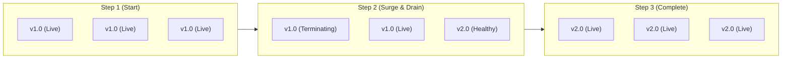
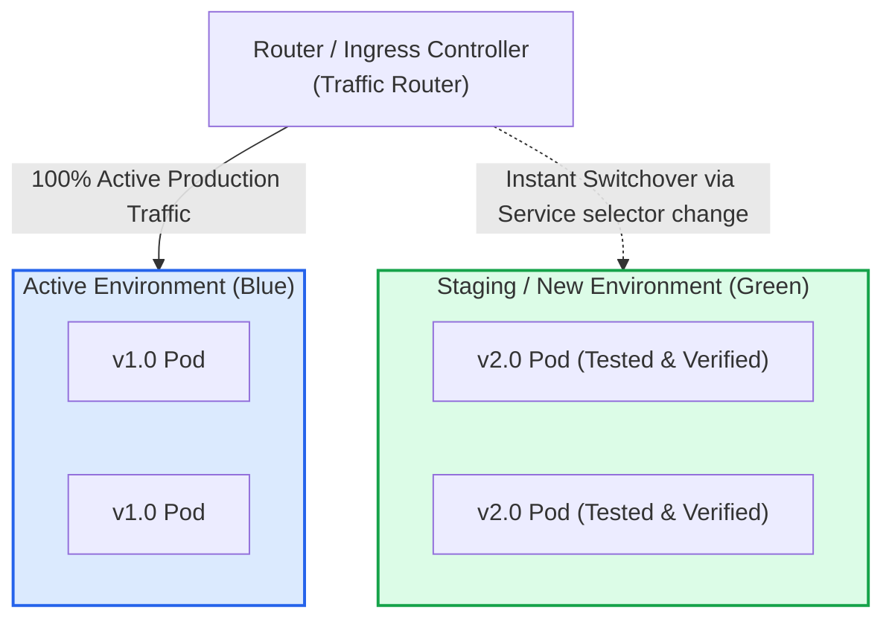
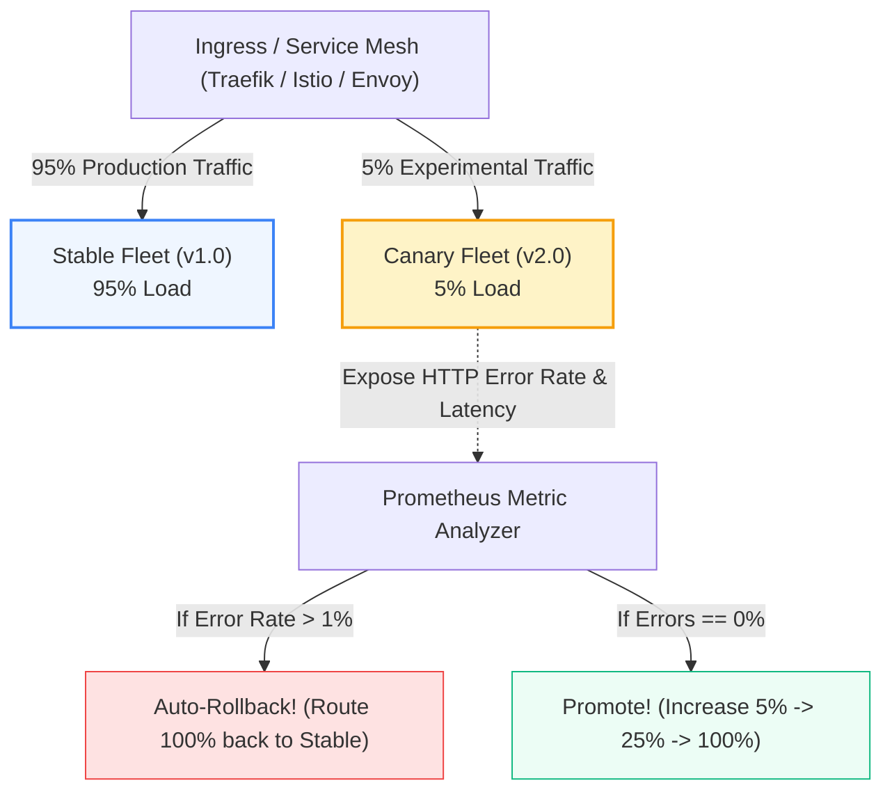

# Deployment Strategies: Rolling, Blue-Green, Canary & A/B

> **Cluster 04 — Module 04**  
> Focus: Zero-downtime rollouts, Blue-Green cutovers, Canary metrics analysis (Argo Rollouts), and backward compatibility.

---

## 1. Deployment Strategies Comparison Matrix

| Strategy | Downtime | Rollback Speed | Resource Cost | Risk Level |
| :--- | :--- | :--- | :--- | :--- |
| **Recreate** | Yes (Minutes) | Slow (Re-pull image) | $1.0\times$ (Low) | High |
| **Rolling Update** | Zero | Moderate (Reverse roll) | $1.25\times$ (Surge buffer) | Medium (v1 & v2 run concurrently) |
| **Blue-Green** | Zero | Instant (< 1 second) | $2.0\times$ (Full duplicate stack) | Low |
| **Canary** | Zero | Instant (< 5 seconds) | $1.1\times$ to $1.2\times$ | Lowest (Blast radius confined to 5% users) |

---

## 2. Visual Architecture of Strategies

### A. Rolling Update (Default Kubernetes)
Pods are progressively terminated and replaced by new versions one-by-one:

---

### B. Blue-Green Deployment
Two identical environments exist simultaneously. Traffic is switched at the router or service selector level:

---

### C. Canary Deployment (Traffic Shifting & Metric Gates)
Exposes the new version to a small subset of live users while monitoring error rates via Prometheus:

---

## 3. Database Migration Rule for Zero-Downtime Deployments

In both Rolling Updates and Canary releases, **version 1.0 and version 2.0 will access the database at the exact same time**.

> [!CAUTION]
> **Never run destructive database migrations in lock-step with code deployment!** (e.g. Renaming column `email` to `user_email`). Version 1.0 code will crash instantly when reading the renamed column.

### The Expand-and-Contract (Parallel Run) Pattern:
1. **Phase 1 (Expand)**: Add the new column `user_email` as nullable. Deploy code that writes to *both* `email` and `user_email`.
2. **Phase 2 (Backfill)**: Run an asynchronous background script copying historical data from `email` to `user_email`.
3. **Phase 3 (Migrate Readers)**: Deploy version 2.0 code that reads exclusively from `user_email`.
4. **Phase 4 (Contract)**: Drop the legacy `email` column once version 1.0 is completely decommissioned.

---

## 4. Official References
- [Argo Rollouts Documentation](https://argoproj.github.io/argo-rollouts/)
- [Flagger Progressive Delivery Operator](https://flagger.app/)
- [Martin Fowler on Evolutionary Database Design](https://martinfowler.com/articles/evodb.html)
