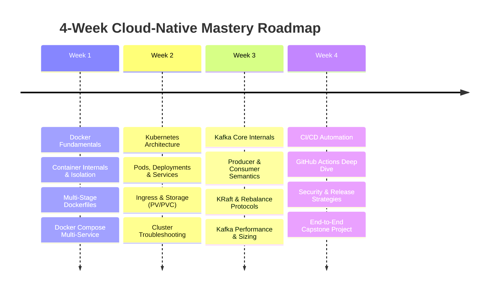

# Cloud-Native Mastery: Docker, Kubernetes, Apache Kafka & CI/CD Pipelines

> **A Comprehensive, Production-Grade Engineering Curriculum & Interview Preparation Guide**

Welcome to your structured repository for mastering the core pillars of modern distributed systems, cloud-native infrastructure, and DevOps engineering. This repository is architected to take you from foundational understanding to senior-level architectural intuition, complete with production trade-offs, internal mechanics, visual flow diagrams, interview question banks, and an end-to-end hands-on capstone project.

---

## 🗺️ Learning Path & System Architecture Overview

Modern enterprise systems rely on these four pillars working in synchrony:

```mermaid
flowchart TD
    subgraph Developer_Workflow["1. Developer & CI/CD Workflow"]
        Dev["Developer Code Push"] -->|git push| GH["Git Repository"]
        GH -->|Webhook Trigger| CI["CI Pipeline: Lint / Test / Build"]
        CI -->|Container Scan (Trivy)| Sec["Security & Quality Gates"]
        Sec -->|Push Image| Reg["Container Registry (Docker Hub / GHCR)"]
        Reg -->|GitOps / CD Trigger| CD["CD Pipeline / ArgoCD"]
    end

    subgraph Kubernetes_Cluster["2. Kubernetes Orchestration"]
        CD -->|Deploy Manifests| K8sAPI["Kube-API Server"]
        K8sAPI -->|Schedule Pods| Nodes["Worker Nodes"]
        Ingress["Ingress Controller (NGINX/Traefik)"] -->|Route HTTP Traffic| SvcA["Order Service Pods (Deployment)"]
    end

    subgraph Messaging_Fabric["3. Event-Driven Messaging (Apache Kafka)"]
        SvcA -->|Publish Event: OrderPlaced| KafkaTopic["Kafka Cluster (KRaft Quorum)\nTopic: orders.v1\n(Partitioned & Replicated)"]
        KafkaTopic -->|Consume Events| SvcB["Payment Service Pods"]
        KafkaTopic -->|Consume Events| SvcC["Notification Service Pods"]
    end

    subgraph Storage_Layer["4. State & Persistence"]
        SvcA -.-> PVC1["PersistentVolumeClaim (Database)"]
        KafkaTopic -.-> PVC2["Kafka Log Storage (NVMe/SSD)"]
    end

    style Developer_Workflow fill:#f9fbfd,stroke:#3b82f6,stroke-width:2px
    style Kubernetes_Cluster fill:#fbfcfd,stroke:#10b981,stroke-width:2px
    style Messaging_Fabric fill:#fffbf5,stroke:#f59e0b,stroke-width:2px
    style Storage_Layer fill:#fdfbf7,stroke:#8b5cf6,stroke-width:2px
```

---

## 📂 Repository Structure & Study Clusters

The curriculum is divided into five dedicated clusters. Each cluster contains deep conceptual breakdowns, internals, interview problem sets, cheat sheets, and hands-on exercises:

| Cluster | Topic | Focus Areas | Key Output |
| :--- | :--- | :--- | :--- |
| **[`01-Docker`](./01-Docker/)** | Containerization | Linux Namespaces, cgroups, UnionFS/Overlay2, Multi-stage builds, Distroless, Docker networking & volumes | Production Dockerfiles, OOM debug guides, multi-container compose stacks |
| **[`02-Kubernetes`](./02-Kubernetes/)** | Container Orchestration | Control Plane internals, Pod lifecycle, Deployments, Services, Ingress, PV/PVC, NetworkPolicies, Scheduling | Declarative YAMLs, Zero-downtime rolling updates, production incident triage |
| **[`03-Apache-Kafka`](./03-Apache-Kafka/)** | Distributed Streaming | Commit log, Zero-copy `sendfile()`, Partitions, ISR, Controller (KRaft), Producer semantics (`acks=all`), Consumer rebalances | High-throughput producers/consumers, lag monitoring, disaster recovery playbook |
| **[`04-CICD-Pipelines`](./04-CICD-Pipelines/)** | Continuous Delivery | GitOps, GitHub Actions workflows, SAST/DAST, Container scanning (Trivy), Blue-Green & Canary strategies | Production CI/CD YAML pipelines with automated tests, security scans, and K8s deploy |
| **[`05-Hands-On-Capstone-Project`](./05-Hands-On-Capstone-Project/)** | End-to-End System | Order Management & Event-Driven Notification System tying all 4 pillars together | Fully runnable microservice application with Docker, Compose, K8s manifests & CI/CD workflow |

---

## 🎯 Recommended 4-Week Study Schedule



### Week 1: Docker (Containerization)
- **Day 1-2**: How containers work under the hood (`chroot`, `namespaces`, `cgroups`, `overlay2`).
- **Day 3-4**: Writing optimized Dockerfiles (layer caching order, multi-stage builds, non-root users).
- **Day 5**: Container networking (bridge, host, overlay) and data persistence (volumes vs bind mounts).
- **Weekend**: Practice Docker interview questions and build multi-container stacks with `docker compose`.

### Week 2: Kubernetes (Orchestration)
- **Day 1-2**: Control Plane components (`kube-apiserver`, `etcd`, `kube-scheduler`, `kube-controller-manager`) & Worker Node components (`kubelet`, `kube-proxy`, container runtime).
- **Day 3**: Workload primitives (`Pods`, `Deployments`, `StatefulSets`, `DaemonSets`, `Jobs`).
- **Day 4**: Networking: Service types (`ClusterIP`, `NodePort`, `LoadBalancer`), Ingress controllers, and DNS resolution.
- **Day 5**: Storage (`StorageClass`, `PV`, `PVC`) and Configs/Secrets (`ConfigMap`, `Secret`).
- **Weekend**: Master troubleshooting scenarios (`CrashLoopBackOff`, `ImagePullBackOff`, `OOMKilled`) and interview questions.

### Week 3: Apache Kafka (Distributed Messaging)
- **Day 1-2**: Distributed commit log fundamentals, topics, partitions, broker architecture, and Zero-Copy I/O.
- **Day 3**: Producer internals: batching, `RecordAccumulator`, `acks=0/1/all`, idempotent producers, and delivery guarantees.
- **Day 4**: Consumer internals: consumer groups, offset commits (`__consumer_offsets`), rebalance protocols (Eager vs Cooperative Sticky).
- **Day 5**: Modern Kafka: KRaft (ZooKeeper removal), Schema Registry (Avro/Protobuf), and log compaction.
- **Weekend**: Kafka failure recovery scenarios, partition skew resolution, and interview drill-downs.

### Week 4: CI/CD & The Capstone Project
- **Day 1-2**: CI/CD best practices, GitHub Actions syntax, runners, caching, and secret management.
- **Day 3**: Automated security gates: SAST, Secret Scanning, and Container Vulnerability scanning with Trivy.
- **Day 4**: Modern deployment strategies: Rolling Update vs Blue/Green vs Canary deployments.
- **Day 5-Weekend**: Build and deploy the [Capstone Project](./05-Hands-On-Capstone-Project/) locally and simulate real-world failure scenarios!

---

## 📌 Interview Preparation Checklist

Before heading into cloud engineering, DevOps, or distributed backend system interviews, ensure you can answer:
- [ ] *Can you explain the exact difference between a process, a container, and a virtual machine?*
- [ ] *What happens under the hood when a pod gets scheduled from `kubectl apply -f` to running on a node?*
- [ ] *Why does Kafka achieve orders of magnitude higher throughput than traditional message brokers like RabbitMQ?*
- [ ] *How do you achieve exactly-once processing (EOS) semantics in an Apache Kafka pipeline?*
- [ ] *How do you design a zero-downtime deployment pipeline with automated canary rollbacks?*

*(Every single one of these questions is comprehensively answered with architecture diagrams and production failure postmortems in the dedicated topic folders!)*
